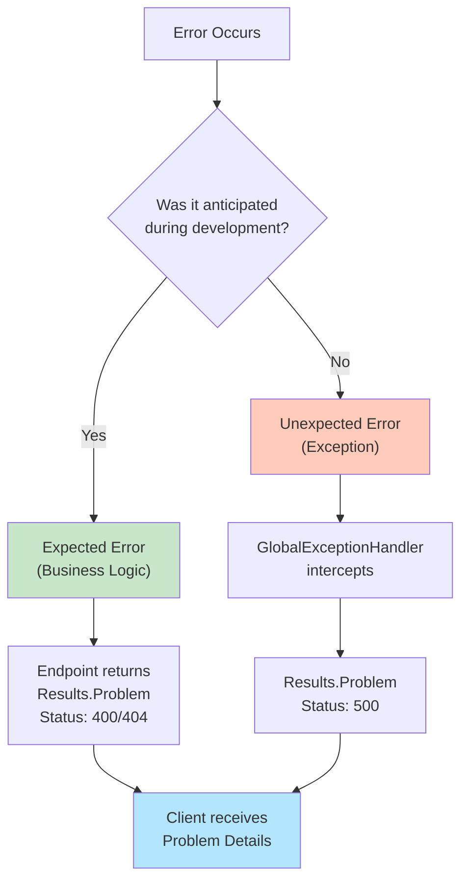
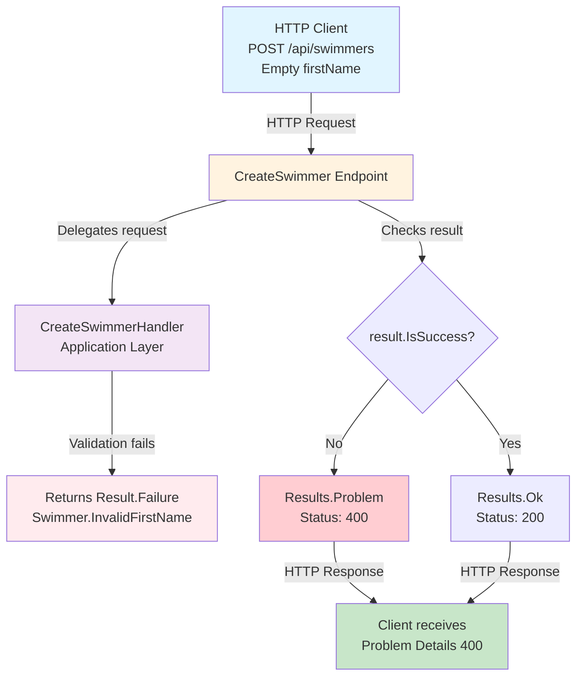
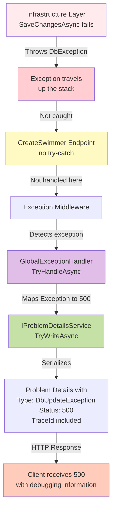
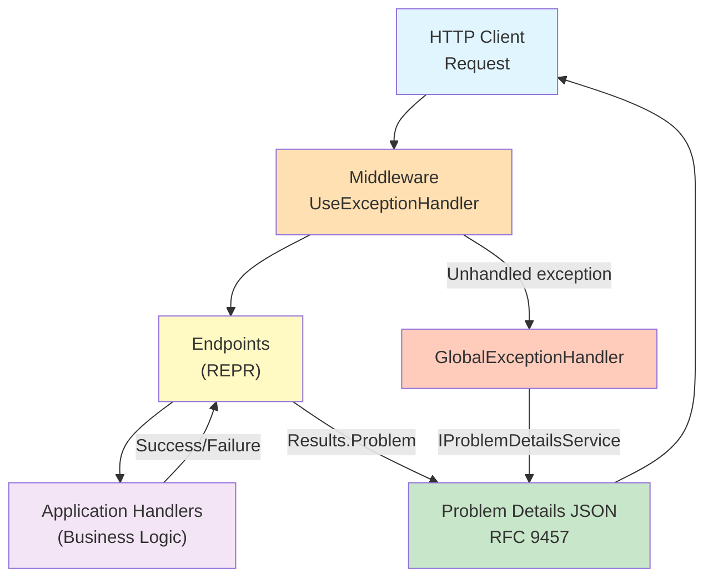

# Implementing Problem Details in ASP.NET Core

## Introduction

In modern REST APIs, error handling constitutes a critical responsibility. For years, ASP.NET Core developers have returned HTTP status codes with different response structures: in some cases, simple text messages; in others, custom objects that vary depending on the controller or endpoint.

However, there is an industry standard that elegantly and consistently solves this problem: **Problem Details** (RFC 9457). Published in 2023, RFC 9457 replaces and updates the previous specification RFC 7807, maintaining backward compatibility while refining certain aspects of the standard. This pattern defines a standardized JSON format for representing errors in HTTP APIs, significantly improving the experience of API consumers.

In this practical guide, we will explore how to implement a **robust error handling system** using Problem Details in an ASP.NET Core API. We will use **SwimTracker**, the same REST API for managing swimming clubs and swimmers presented in previous articles, extending its architecture with error handling capabilities.

The API structure is familiar:

- **Architecture**:
  - `Domain`: Business entities (Club, Swimmer), domain logic
  - `Application`: Use cases, handlers, application services
  - `Infrastructure`: Persistence, technical implementations
  - `API`: Presentation layer (Endpoints)

- **Implemented Patterns**:
  - **Result Pattern**: Error handling pattern used internally in the application layer (will be explored in detail in a dedicated article)
  - **REPR Pattern**: Individual endpoints instead of monolithic controllers
  - **Problem Details (RFC 9457)**: Standardized format for HTTP errors ← *subject of this article*

- **Technology**: PostgreSQL with Entity Framework Core

---

## What is Problem Details?

Problem Details is a standardized format defined in RFC 9457 for transmitting information about errors in HTTP APIs. Instead of returning inconsistent responses, errors are communicated through a JSON object with a predefined structure:

```json
{
  "type": "https://example.com/errors/validation-failed",
  "status": 400,
  "title": "Validation Failed",
  "detail": "The request contains invalid data",
  "instance": "POST /api/swimmers"
}
```

### Problem Details Structure

| Property | C# Type | Description |
|----------|---------|-------------|
| `type` | `string` (URI) | Reference to problem documentation. Can be a URL or unique identifier |
| `status` | `int` | HTTP status code (200, 400, 404, 500, etc.) |
| `title` | `string` | Brief and readable title of the problem |
| `detail` | `string` | Detailed explanation of the specific problem |
| `instance` | `string` (URI) | Specific path of the request that generated the error |

### Advantages of Problem Details

**Consistency** - All errors follow the same JSON format, regardless of error type  
**Clarity** - Structured information makes it easier for client applications to process errors programmatically  
**Debugging** - Includes details like `requestId` and `traceId` for tracking problems in production  
**Industry Standard** - RFC 9457 is widely adopted and recognized in the industry  
**Extensibility** - The format allows adding custom properties according to domain needs  

---

## Distinction Between Expected and Unexpected Errors

Before implementing Problem Details, it is important to differentiate between two categories of errors:

### Expected Errors (Controlled)

Those that are anticipated during development and form part of normal business logic. Examples:

- A user tries to create a club with an empty name
- Attempting to query a swimmer that does not exist
- Duplicate data that would violate unique constraints

**Handling**: They are handled in the application layer through a result pattern that encapsulates success or failure. The endpoint checks the result and returns an appropriate HTTP response with Problem Details (400 Bad Request, 404 Not Found, etc.).

### Unexpected Errors (Uncontrolled)

Those that are not expected and represent exceptional situations. Examples:

- A database connection fails unexpectedly
- Division by zero in a calculation
- An external resource does not respond

**Handling**: They are captured through a central `GlobalExceptionHandler` that automatically returns Problem Details.

### Error Classification and Handling



---

## Implementation Step by Step

### Step 1: Register Problem Details in Program.cs

The first step is to activate Problem Details support in ASP.NET Core. This is done in the dependency injection container configuration:

```csharp
using SwimTracker.Api.ProblemDetails.Exceptions;
using SwimTracker.Api.ProblemDetails.Extensions;
using SwimTracker.Application;
using SwimTracker.Infrastructure;

var builder = WebApplication.CreateBuilder(args);

// Enable Problem Details support
builder.Services.AddProblemDetails();

// Register other services...
builder.Services.AddApplication();
builder.Services.AddInfrastructure(builder.Configuration);

var app = builder.Build();

// Use the exception handling middleware
app.UseExceptionHandler();

app.Run();
```

**What does `AddProblemDetails()` do?**

- Registers `IProblemDetailsService` in the DI container
- Configures ASP.NET Core to automatically serialize exceptions to Problem Details format
- Enables the `UseExceptionHandler()` middleware to work with RFC 9457 format

**Note**: In this step, we configure basic support. Later we will see how to customize responses to add traceability properties.

### Step 2: Create the GlobalExceptionHandler

The global exception handler captures all unhandled exceptions and transforms them into Problem Details. It is created as a class that implements `IExceptionHandler`:

```csharp
using System.Diagnostics;
using Microsoft.AspNetCore.Diagnostics;
using Microsoft.AspNetCore.Http.Features;

namespace SwimTracker.Api.ProblemDetails.Exceptions;

/// <summary>
/// Global exception handler that captures unhandled exceptions and converts them to Problem Details.
/// </summary>
public class GlobalExceptionHandler : IExceptionHandler
{
    private readonly IProblemDetailsService _problemDetailsService;
    private readonly ILogger<GlobalExceptionHandler> _logger;
    private readonly IHostEnvironment _environment;

    /// <summary>
    /// Initializes a new instance of the GlobalExceptionHandler class.
    /// </summary>
    /// <param name="problemDetailsService">Service for creating Problem Details responses.</param>
    /// <param name="logger">Logger for structured logging.</param>
    /// <param name="environment">Host environment information.</param>
    public GlobalExceptionHandler(
        IProblemDetailsService problemDetailsService,
        ILogger<GlobalExceptionHandler> logger,
        IHostEnvironment environment)
    {
        _problemDetailsService = problemDetailsService;
        _logger = logger;
        _environment = environment;
    }

    /// <summary>
    /// Handles an exception by converting it to a Problem Details response.
    /// </summary>
    /// <param name="httpContext">The HTTP context.</param>
    /// <param name="exception">The exception to handle.</param>
    /// <param name="cancellationToken">The cancellation token.</param>
    /// <returns>True if the exception was handled; otherwise, false.</returns>
    public async ValueTask<bool> TryHandleAsync(
        HttpContext httpContext,
        Exception exception,
        CancellationToken cancellationToken)
    {
        // Determine status code based on exception type
        httpContext.Response.StatusCode = exception switch
        {
            ArgumentException => StatusCodes.Status400BadRequest,
            KeyNotFoundException => StatusCodes.Status404NotFound,
            ApplicationException => StatusCodes.Status400BadRequest,
            _ => StatusCodes.Status500InternalServerError
        };

        // Get traceability information for debugging
        Activity? activity = httpContext.Features.Get<IHttpActivityFeature>()?.Activity;

        // Structured logging of the exception
        _logger.LogError(
            exception,
            "Unhandled exception occurred. TraceId: {TraceId}, RequestId: {RequestId}, Path: {Path}, Method: {Method}, StatusCode: {StatusCode}",
            activity?.TraceId.ToString() ?? "N/A",
            httpContext.TraceIdentifier,
            httpContext.Request.Path,
            httpContext.Request.Method,
            httpContext.Response.StatusCode);

        // Create Problem Details with all information
        return await _problemDetailsService.TryWriteAsync(
            new ProblemDetailsContext
            {
                HttpContext = httpContext,
                Exception = exception,
                ProblemDetails = new Microsoft.AspNetCore.Mvc.ProblemDetails
                {
                    // Error type (can be a URL or unique identifier)
                    Type = exception.GetType().FullName,
                    
                    // HTTP status code
                    Status = httpContext.Response.StatusCode,
                    
                    // Problem title
                    Title = "An unexpected error occurred.",
                    
                    // Error details (only in development)
                    Detail = _environment.IsDevelopment() 
                        ? exception.Message 
                        : "An error occurred while processing your request."
                    // Instance and Extensions are added automatically in CustomizeProblemDetails
                }
            });
    }
}
```

#### Understanding the Injected Dependencies

The constructor receives three key dependencies:

**1. IProblemDetailsService** - Introduced in **ASP.NET Core 7.0**

An interface that allows writing Problem Details responses in the HTTP context. This is a fundamental architectural decision:

- **Decoupling**: The handler doesn't need to know internal details about how JSON is serialized or HTTP responses are written
- **Testability**: Facilitates creating mocks of the interface in unit tests
- **Flexibility**: Allows changing the implementation without modifying the handler
- **Consistency**: Uses the same mechanisms that ASP.NET Core uses internally for Problem Details

**2. ILogger<GlobalExceptionHandler>** - Structured Logging

Allows centralized logging of exceptions with complete context:

- **Traceability**: Logs TraceId, RequestId, Path, Method, StatusCode
- **Correlation**: Facilitates finding related errors in logging systems
- **Alerts**: Allows configuring alerts based on error patterns
- **Audit**: Maintains historical record of unhandled exceptions

```csharp
_logger.LogError(
    exception,
    "Unhandled exception occurred. TraceId: {TraceId}, RequestId: {RequestId}",
    activity?.TraceId,
    httpContext.TraceIdentifier);
```

**3. IHostEnvironment** - Environment Information

Allows adjusting behavior according to the execution environment:

- **Development**: Exposes complete exception details for debugging
- **Production**: Hides sensitive details, returns generic messages
- **Environment name**: Included in Problem Details extensions to identify origin

```csharp
Detail = _environment.IsDevelopment() 
    ? exception.Message  // Development: complete message
    : "An error occurred while processing your request."  // Production: generic message
```

**Purpose of IProblemDetailsService**:

The interface provides the `TryWriteAsync()` method that:
1. Receives a context with the exception and HTTP details
2. Serializes the information to Problem Details format
3. Writes the response directly to the HTTP stream
4. Returns `true` if successful, `false` if another handler should process it

```csharp
// Internally, IProblemDetailsService does something like this:
await response.WriteAsJsonAsync(new ProblemDetails
{
    Type = "...",
    Title = "...",
    Detail = "...",
    Status = 500,
    Instance = "..."
}, cancellationToken);
```

**Handler Features**:

- **Dynamic exception to HTTP code mapping**: Different exception types generate different status codes
- **Structured logging**: Automatically logs all exceptions with complete context (TraceId, RequestId, Path, Method, StatusCode)
- **Environment-sensitive messages**: In development exposes complete `exception.Message`; in production hides sensitive information
- **Maximum simplicity**: Does not define Instance or Extensions - relies completely on `CustomizeProblemDetails`
- **Serialization abstraction**: Delegates writing to `IProblemDetailsService` for maximum compatibility

**Key architecture**: The handler focuses solely on logging and message configuration. Instance and traceability properties (`requestId`, `traceId`, `timestamp`, `exceptionType`) are added **automatically** through `CustomizeProblemDetails` in Program.cs, which means that:
- All Problem Details responses have traceability (not just exceptions)
- There is no code duplication
- The handler remains simple and focused

**Example of complete response in Development**:
```json
{
  "type": "System.ArgumentException",
  "title": "An unexpected error occurred.",
  "status": 400,
  "detail": "Value cannot be null. (Parameter 'name')",
  "instance": "POST /api/swimmers",
  "requestId": "0HN1GGHC75B24:00000001",
  "traceId": "4d79c6f5c5e8e947c8e1f4e...",
  "timestamp": "2026-05-18T10:30:45.1234567Z",
  "exceptionType": "System.ArgumentException"
}
```

**Example of complete response in Production**:
```json
{
  "type": "System.ArgumentException",
  "title": "An unexpected error occurred.",
  "status": 400,
  "detail": "An error occurred while processing your request.",
  "instance": "POST /api/swimmers",
  "requestId": "0HN1GGHC75B24:00000001",
  "traceId": "4d79c6f5c5e8e947c8e1f4e...",
  "timestamp": "2026-05-18T10:30:45.1234567Z"
}
```

**Note about properties**: In Production, `requestId`, `traceId`, `timestamp` are ALWAYS present. Only `exceptionType` is omitted for security.

**Key traceability properties**:
- **Instance**: URI of the request that caused the problem (added automatically by CustomizeProblemDetails)
- **requestId**: Unique identifier of the HTTP request in ASP.NET Core (added automatically by CustomizeProblemDetails)
- **traceId**: Distributed trace ID (**correlationId**) - allows following the request through multiple services (added automatically)
- **timestamp**: Exact moment of the error for temporal correlation (added automatically)
- **exceptionType**: Type of exception in Development (added automatically when there is an exception)

**Separation of concerns**:
- **GlobalExceptionHandler**: Logging, HTTP code mapping, messages by environment
- **CustomizeProblemDetails**: Instance + ALL traceability properties (requestId, traceId, timestamp, exceptionType)
- **Result**: Traceability properties in ALL Problem Details automatically, not just exceptions

### Step 3: Register the GlobalExceptionHandler in Program.cs

Once the handler is created, it must be registered in the DI container:

```csharp
using SwimTracker.Api.ProblemDetails.Exceptions;
using SwimTracker.Api.ProblemDetails.Extensions;
using SwimTracker.Application;
using SwimTracker.Infrastructure;

var builder = WebApplication.CreateBuilder(args);

// Enable Problem Details support
builder.Services.AddProblemDetails();

// Register the global exception handler
builder.Services.AddExceptionHandler<GlobalExceptionHandler>();

// Other services...
builder.Services.AddEndpointsApiExplorer();
builder.Services.AddSwaggerGen();
builder.Services.AddApplication();
builder.Services.AddInfrastructure(builder.Configuration);
builder.Services.AddEndpoints();

var app = builder.Build();

if (app.Environment.IsDevelopment())
{
    app.UseSwagger();
    app.UseSwaggerUI();
}

app.UseHttpsRedirection();

// Map custom endpoints
app.MapEndpoints();

// Use the exception handling middleware (must be after MapEndpoints)
app.UseExceptionHandler();

app.Run();
```

**Important order**: `UseExceptionHandler()` should be placed after `MapEndpoints()` so it captures exceptions from the endpoints.

### Step 4: Customize Problem Details for ALL Responses

So far, we have configured basic Problem Details support and the global exception handler. However, for production environments, it is essential to add **traceability properties** that allow rapid problem diagnosis.

ASP.NET Core provides the `CustomizeProblemDetails` callback that executes for **ALL** Problem Details responses, not just exceptions. This includes:
- Unhandled exceptions (captured by GlobalExceptionHandler)
- Controlled errors (Results.Problem() from endpoints)
- Automatic framework validations
- Any other Problem Details response

#### Implementation of Centralized Customization

Update `Program.cs` to add traceability properties:

```csharp
using System.Diagnostics;
using Microsoft.AspNetCore.Http.Features;
using SwimTracker.Api.ProblemDetails.Exceptions;
using SwimTracker.Api.ProblemDetails.Extensions;
using SwimTracker.Application;
using SwimTracker.Infrastructure;

var builder = WebApplication.CreateBuilder(args);

// Configure Problem Details with custom options
builder.Services.AddProblemDetails(options =>
{
    // Customize Problem Details response for ALL responses
    options.CustomizeProblemDetails = context =>
    {
        var httpContext = context.HttpContext;
        var activity = httpContext.Features.Get<IHttpActivityFeature>()?.Activity;
        
        // Instance: URI that identifies the specific occurrence of the problem
        context.ProblemDetails.Instance ??= $"{httpContext.Request.Method} {httpContext.Request.Path}";
        
        // Traceability properties in Extensions
        context.ProblemDetails.Extensions["requestId"] = httpContext.TraceIdentifier;
        context.ProblemDetails.Extensions["traceId"] = activity?.TraceId.ToString() ?? "N/A";
        context.ProblemDetails.Extensions["timestamp"] = DateTime.UtcNow.ToString("O");
        
        // In development, include exception type for quick debugging
        if (builder.Environment.IsDevelopment() && context.Exception != null)
        {
            context.ProblemDetails.Extensions["exceptionType"] = context.Exception.GetType().FullName;
        }
    };
});

// Register the global exception handler
builder.Services.AddExceptionHandler<GlobalExceptionHandler>();

// Other services...
builder.Services.AddEndpointsApiExplorer();
builder.Services.AddSwaggerGen();
builder.Services.AddApplication();
builder.Services.AddInfrastructure(builder.Configuration);
builder.Services.AddEndpoints();

var app = builder.Build();

if (app.Environment.IsDevelopment())
{
    app.UseSwagger();
    app.UseSwaggerUI();
}

app.UseHttpsRedirection();

app.MapEndpoints();
app.UseExceptionHandler();

app.Run();
```

#### Traceability Properties Added

**Instance** (standard RFC 9457 property):
- URI that identifies the specific occurrence of the problem
- Example: `POST /api/swimmers`
- Use of `??=` operator: If an endpoint customizes Instance, it is not overwritten

**requestId** (custom extension):
- Unique identifier of the HTTP request in ASP.NET Core
- Automatically generated by the framework
- Useful for correlating logs within the same application

**traceId** (custom extension):
- Distributed trace ID (**correlationId**)
- Allows following a request through multiple services and microservices
- Essential for distributed architectures

**timestamp** (custom extension):
- Exact moment of the error in ISO 8601 format (`"O"`)
- Facilitates temporal correlation in centralized logging systems
- Example: `2026-05-18T10:30:45.1234567Z`

**exceptionType** (conditional extension):
- Only in Development for quick debugging
- Full type of the exception (Example: `System.ArgumentException`)
- **Excluded in Production** for security

#### Advantages of this Architecture

**Centralization**: All properties are configured in a single location

**Consistency**: ALL Problem Details responses have the same traceability properties

**No duplication**: You don't need to add requestId, traceId, timestamp in each endpoint

**Endpoint simplicity**: Endpoints only return `Results.Problem()` with Type, Title, Detail

**GlobalExceptionHandler simplicity**: The handler focuses on logging and HTTP code mapping

#### Example of Complete Response in Development

```json
{
  "type": "System.ArgumentException",
  "title": "An unexpected error occurred.",
  "status": 400,
  "detail": "Value cannot be null. (Parameter 'name')",
  "instance": "POST /api/swimmers",
  "requestId": "0HN1GGHC75B24:00000001",
  "traceId": "4d79c6f5c5e8e947c8e1f4e...",
  "timestamp": "2026-05-18T10:30:45.1234567Z",
  "exceptionType": "System.ArgumentException"
}
```

#### Example of Complete Response in Production

```json
{
  "type": "System.ArgumentException",
  "title": "An unexpected error occurred.",
  "status": 400,
  "detail": "An error occurred while processing your request.",
  "instance": "POST /api/swimmers",
  "requestId": "0HN1GGHC75B24:00000001",
  "traceId": "4d79c6f5c5e8e947c8e1f4e...",
  "timestamp": "2026-05-18T10:30:45.1234567Z"
}
```

**Note about properties**: In Production, `requestId`, `traceId`, `timestamp` are ALWAYS present. Only `exceptionType` is omitted for security.

#### Use in Centralized Logging Systems

These properties are fundamental for debugging in production:

- **Application Insights**: Search by `traceId` (correlationId) or `requestId`
- **Seq**: Filter by `timestamp` and correlate with `traceId`
- **Elasticsearch/Kibana**: Track distributed requests with `traceId`
- **Grafana Loki**: Correlate between multiple services using `traceId` as correlationId

### Step 5: Return Problem Details in Case of Failure

Instead of returning simple error messages like `BadRequest()`, endpoints return Problem Details with detailed structure:

```csharp
using Microsoft.AspNetCore.Mvc;
using SwimTracker.Api.ProblemDetails.Endpoints;
using SwimTracker.Application.Swimmers.CreateSwimmer;

namespace SwimTracker.Api.ProblemDetails.Endpoints.Swimmers;

/// <summary>
/// Endpoint for creating a new swimmer.
/// </summary>
public class CreateSwimmer : IEndpoint
{
    /// <summary>
    /// Maps the endpoint for creating a swimmer.
    /// </summary>
    /// <param name="app">The endpoint route builder.</param>
    public void MapEndpoint(IEndpointRouteBuilder app)
    {
        app.MapPost("api/swimmers", HandleAsync)
            .WithTags("Swimmers");
    }

    /// <summary>
    /// Handles the HTTP POST request to create a swimmer.
    /// </summary>
    /// <param name="context">The HTTP context.</param>
    /// <param name="request">The create swimmer request.</param>
    /// <param name="requestHandler">The request handler for creating a swimmer.</param>
    /// <param name="cancellationToken">The cancellation token.</param>
    /// <returns>The result of the operation as an IResult.</returns>
    private async Task<IResult> HandleAsync(
        HttpContext context,
        [FromBody] CreateSwimmerRequest request,
        IRequestHandler<CreateSwimmerRequest, CreateSwimmerResponse> requestHandler,
        CancellationToken cancellationToken)
    {
        // Process the request through the use case
        var result = await requestHandler.HandleAsync(request, cancellationToken);

        // If the operation was successful, return 200 OK
        if (result.IsSuccess)
        {
            return Results.Ok(result.Value);
        }
        
        // If it failed, return Problem Details instead of BadRequest
        return Results.Problem(new Microsoft.AspNetCore.Mvc.ProblemDetails
        {
            // Type of error (unique identifier of the problem)
            Type = result.Error.Code,
            
            // Readable title of the problem
            Title = "Swimmer creation failed",
            
            // Specific error detail
            Detail = result.Error.Description,
            
            // Appropriate HTTP code
            Status = StatusCodes.Status400BadRequest,
            
            // Route that generated the error
            Instance = context.Request.Path
        });
    }
}
```

**Advantages of this approach**:

- All errors have consistent format
- Clients can process `Type` and `Code` programmatically
- The information is complete and useful for debugging
- Follows RFC 9457 standard
- **Traceability properties added automatically**: requestId, traceId, timestamp come from `CustomizeProblemDetails` without additional code

### Step 6: Apply Across All Endpoints

The same pattern applies to all endpoints. For example, `GetSwimmer` returns 404 when the swimmer does not exist:

```csharp
using SwimTracker.Api.ProblemDetails.Endpoints;
using SwimTracker.Application.Swimmers.GetSwimmer;

namespace SwimTracker.Api.ProblemDetails.Endpoints.Swimmers;

public class GetSwimmer : IEndpoint
{
    public void MapEndpoint(IEndpointRouteBuilder app)
    {
        app.MapGet("api/swimmers/{id:guid}", HandleAsync)
            .WithTags("Swimmers");
    }

    private async Task<IResult> HandleAsync(
        HttpContext context,
        Guid id,
        IRequestHandler<GetSwimmerRequest, GetSwimmerResponse> requestHandler,
        CancellationToken cancellationToken)
    {
        var request = new GetSwimmerRequest(id);
        var result = await requestHandler.HandleAsync(request, cancellationToken);

        if (result.IsSuccess)
        {
            return Results.Ok(result.Value);
        }

        return Results.Problem(new Microsoft.AspNetCore.Mvc.ProblemDetails
        {
            Type = result.Error.Code,
            Title = "Swimmer not found",
            Detail = result.Error.Description,
            Status = StatusCodes.Status404NotFound,
            Instance = context.Request.Path
        });
    }
}
```

---

## Complete Flow: Request → Handler → Problem Details

The following diagram shows how an expected error flows from the client to the Problem Details response:

**Expected Error Flow:**



---

## Unhandled Exceptions: The Role of GlobalExceptionHandler

The following handler correctly handles **expected errors** with `Result.Failure`, but a genuinely unexpected exception escapes from the persistence layer:

```csharp
public class CreateSwimmerHandler : IRequestHandler<CreateSwimmerRequest, CreateSwimmerResponse>
{
    private readonly IClubRepository _clubRepository;
    private readonly ISwimmerRepository _swimmerRepository;
    private readonly IUnitOfWork _unitOfWork;
    private readonly IValidator<CreateSwimmerRequest> _validator;

    public async Task<Result<CreateSwimmerResponse>> HandleAsync(
        CreateSwimmerRequest request,
        CancellationToken cancellationToken)
    {
        // Expected error: validation failures return Result.Failure (no exception thrown)
        var validationErrors = _validator.ValidateRequest(request);
        if (validationErrors.Any())
        {
            return Result.Failure<CreateSwimmerResponse>(
                new Error("Swimmer.ValidationFailed", string.Join("; ", validationErrors)));
        }

        // Expected error: club not found returns Result.Failure (no exception thrown)
        var club = await _clubRepository.GetByIdAsync(request.ClubId, cancellationToken);
        if (club is null)
        {
            return Result.Failure<CreateSwimmerResponse>(ClubErrors.NotFound);
        }

        var swimmer = Swimmer.Create(request.ClubId, request.FirstName, request.LastName, ...);

        _swimmerRepository.Add(swimmer);

        // Unexpected exception: database failure propagates upward without being caught
        await _unitOfWork.SaveChangesAsync(cancellationToken);

        return Result.Success(new CreateSwimmerResponse(...));
    }
}
```

If `SaveChangesAsync` throws an exception due to a database failure, it will propagate uncaught up to the `GlobalExceptionHandler`. The flow is:

**Unexpected Exception Flow:**



**Simplified Alternative Flow**:

```json
{
  "type": "Microsoft.EntityFrameworkCore.DbUpdateException",
  "title": "An unexpected error occurred.",
  "detail": "An error occurred while processing your request.",
  "status": 500,
  "instance": "POST /api/swimmers",
  "requestId": "0HN1GGHC75B24:00000001",
  "traceId": "4d79c6f5c5e8e947c8e1f4e...",
  "timestamp": "2026-05-18T10:30:45.1234567Z"
}
```

The `traceId` allows correlating the error in the server logs for investigation and debugging.

---

## Best Practices

### 1. Differentiate Between Layers

**Application Layer**:
- Handle business logic errors without throwing exceptions
- Return success or failure indicators so the endpoint responds appropriately

**Presentation Layer** (Problem Details):
- Convert business errors to HTTP responses with Problem Details
- Allow genuine exceptions to be captured by `GlobalExceptionHandler`
- Keep endpoints focused on orchestration

### 2. Meaningful Error Codes

Use error codes that identify the domain:

```csharp
// Good: Clear and specific
Type = "Swimmer.InvalidFirstName"
Type = "Club.NotFound"
Type = "License.Expired"

// Avoid: Too generic
Type = "Error"
Type = "BadRequest"
```

### 3. Sensitive Information

In production, do not expose internal details:

```csharp
// Don't do: Exposes implementation details
Detail = "Foreign key violation: FK_Swimmer_Club_ClubId"

// Do: Generic message
Detail = "The specified club does not exist"
```

### 4. Traceability and Logging

Always include information for debugging and log correlation. The recommended strategy is to separate responsibilities:

**In GlobalExceptionHandler - Only structured logging**:
```csharp
_logger.LogError(
    exception,
    "Unhandled exception occurred. TraceId: {TraceId}, RequestId: {RequestId}, Path: {Path}, Method: {Method}, StatusCode: {StatusCode}",
    activity?.TraceId.ToString() ?? "N/A",
    httpContext.TraceIdentifier,
    httpContext.Request.Path,
    httpContext.Request.Method,
    httpContext.Response.StatusCode);
```

**In Program.cs - CustomizeProblemDetails (traceability in ALL Problem Details responses)**:
```csharp
builder.Services.AddProblemDetails(options =>
{
    options.CustomizeProblemDetails = context =>
    {
        var httpContext = context.HttpContext;
        var activity = httpContext.Features.Get<IHttpActivityFeature>()?.Activity;

        context.ProblemDetails.Instance ??= $"{httpContext.Request.Method} {httpContext.Request.Path}";

        context.ProblemDetails.Extensions["requestId"] = httpContext.TraceIdentifier;
        context.ProblemDetails.Extensions["traceId"] = activity?.TraceId.ToString() ?? "N/A";
        context.ProblemDetails.Extensions["timestamp"] = DateTime.UtcNow.ToString("O");

        if (builder.Environment.IsDevelopment() && context.Exception != null)
        {
            context.ProblemDetails.Extensions["exceptionType"] = context.Exception.GetType().FullName;
        }
    };
});
```

**Final combined result in Development**:
```json
{
  "requestId": "0HN1...",
  "traceId": "4d79c6f5...",
  "timestamp": "2026-05-18T10:30:45Z",
  "exceptionType": "System.ArgumentException"
}
```

**Benefits of this configuration**:

- **Instance**: URI that identifies the request that caused the error (added by CustomizeProblemDetails)
- **requestId**: Unique identifier of the HTTP request in ASP.NET Core (added by CustomizeProblemDetails)
- **traceId**: Distributed trace ID (**correlationId**) - allows following the request through multiple services and microservices (added by CustomizeProblemDetails)
- **timestamp**: Exact moment of the error (ISO 8601 format) for temporal correlation in logs (added by CustomizeProblemDetails)
- **exceptionType**: Only in development, quickly identifies the type without consulting server logs (added by CustomizeProblemDetails when there is an exception)

**Key architecture**:

- **CustomizeProblemDetails**: Adds Instance + requestId, traceId, timestamp, exceptionType to **ALL** Problem Details responses (not just exceptions)
- **GlobalExceptionHandler**: Focuses on logging and HTTP code mapping
- **Result**: Automatic traceability in controlled and uncontrolled errors without duplicating code

**Use in centralized logging systems**:
- Application Insights: Search by `traceId` (correlationId) or `requestId`
- Seq: Filter by `timestamp` and correlate with `traceId`
- Elasticsearch/Kibana: Track distributed requests with `traceId`
- Grafana Loki: Correlate between multiple services using `traceId` as correlationId

---

## Error Handling System Architecture

The following diagram illustrates how the components of the error handling system integrate:



**Control Flow**:

1. **Middleware** captures the request and routes to the endpoint
2. **Endpoint** processes orchestration logic
3. **Handler** executes business logic
4. **Two possible paths**:
   - Expected errors: Endpoint returns `Results.Problem()` with business details
   - Unexpected exceptions: `GlobalExceptionHandler` captures them and converts to Problem Details
5. **Response** is serialized to JSON following RFC 9457

---

## Architectural Summary

The error handling system with Problem Details is structured as follows:

```
SwimTracker.Api.ProblemDetails/
│
├── Program.cs
│   ├── AddProblemDetails()              ← Enable support
│   ├── AddExceptionHandler<>()          ← Register handler
│   └── UseExceptionHandler()            ← Middleware
│
├── Exceptions/
│   └── GlobalExceptionHandler.cs        ← Capture unexpected exceptions
│
├── Endpoints/
│   ├── Clubs/
│   │   ├── GetClub.cs                   ← Result.Problem() for failures
│   │   ├── CreateClub.cs                ← Result.Problem() for failures
│   │   └── GetClubs.cs                  ← Result.Problem() for failures
│   │
│   └── Swimmers/
│       ├── GetSwimmer.cs                ← Result.Problem() for failures
│       ├── CreateSwimmer.cs             ← Result.Problem() for failures
│       └── GetSwimmers.cs               ← Result.Problem() for failures
│
└── Extensions/
    └── EndpointExtensions.cs            ← Automatic registration and mapping
```

**Expected error flow**:
- Error occurs in handler → Returns `Result.Failure()`
- Endpoint checks → Returns `Results.Problem()`
- Client receives Problem Details

**Unexpected error flow**:
- Exception is thrown → Travels to `GlobalExceptionHandler`
- Global handler converts → To Problem Details with Status 500
- Client receives Problem Details with `traceId` for investigation

---

## Conclusion

The Problem Details pattern provides a standardized, consistent, and professional way to communicate errors in REST APIs. Combined with a centralized `GlobalExceptionHandler`, it creates a robust error handling system that:

- **Improves client experience**: Predictable and well-structured responses
- **Facilitates debugging**: Complete traceability with `traceId` and `requestId`
- **Maintains security**: Avoids exposing unnecessary internal details
- **Follows standards**: RFC 9457 is widely recognized and documented
- **Scales well**: The same pattern works for small and large applications

The implementation in SwimTracker demonstrates how to apply these principles in a real architecture, balancing clarity, security, and maintainability.

### Next Steps

To dive deeper into the topics covered:

1. **Study RFC 9457**: Read the official specification to understand all the details of the format
2. **Explore ASP.NET Core 7.0+**: Take advantage of the new capabilities of `IExceptionHandler`
3. **Implement Testing**: Create unit and integration tests to validate error handling
4. **Monitoring**: Integrate distributed tracing tools to track errors in production
5. **API Documentation**: Use Swagger/OpenAPI to document Problem Details responses
6. **Deepen into Result Pattern**: In the next article we will explore how the Result pattern works internally, its functional implementation without exceptions, and how it integrates perfectly with Problem Details to create a robust error handling system from end to end

---

## Additional Resources

- **RFC 9457 - Problem Details for HTTP APIs**: [IETF RFC 9457](https://www.rfc-editor.org/rfc/rfc9457)
- **Source code of the project**: [SwimTracker.Api.ProblemDetails on GitHub](https://github.com/alexicaballero/swim-tracker/tree/main/src/SwimTracker.Api.ProblemDetails)
- **ASP.NET Core Error Handling**: [Microsoft Docs](https://docs.microsoft.com/en-us/aspnet/core/web-api/handle-errors)
- **IExceptionHandler Interface**: [Microsoft Docs](https://docs.microsoft.com/en-us/dotnet/api/microsoft.aspnetcore.diagnostics.iexceptionhandler)
- **Related article - REPR Pattern**: [ARTICLE_REPR_ENG.md](ARTICLE_REPR_ENG.md)
