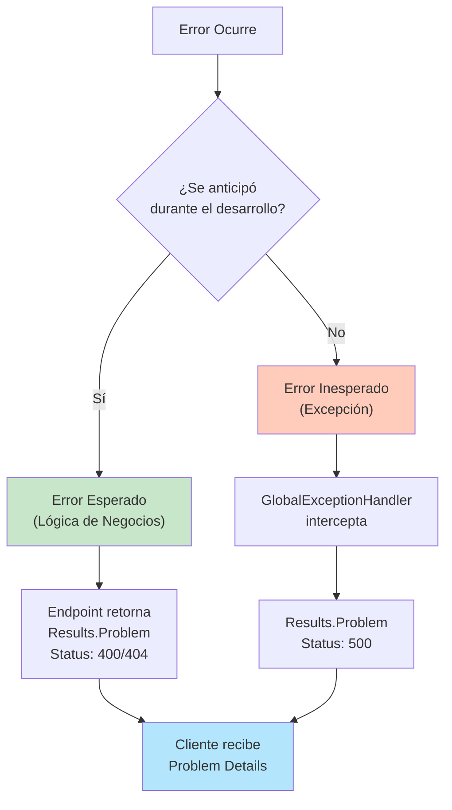
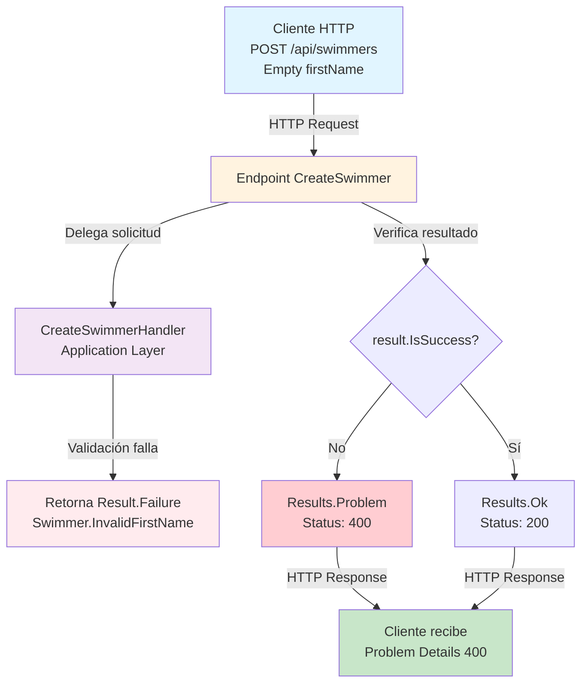
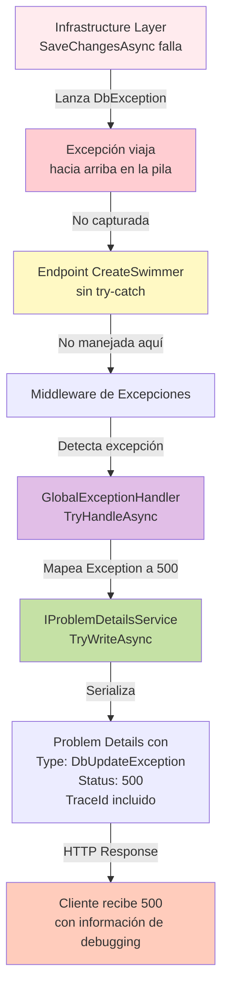
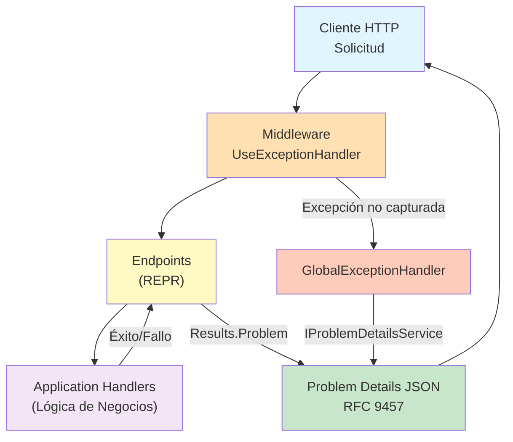

# Implementando Problem Details en ASP.NET Core

## Introducción

En las APIs REST modernas, el manejo de errores constituye una responsabilidad crítica. Durante años, los desarrolladores de ASP.NET Core han retornado códigos HTTP con diferentes estructuras de respuesta: en algunos casos, simples mensajes de texto; en otros, objetos personalizados que varían según el controlador o el endpoint.

Sin embargo, existe un estándar industria que resuelve este problema de manera elegante y consistente: **Problem Details** (RFC 9457). Publicado en 2023, RFC 9457 reemplaza y actualiza la especificación anterior RFC 7807, manteniendo compatibilidad retroactiva mientras refina ciertos aspectos del estándar. Este patrón define un formato JSON estandarizado para representar errores en APIs HTTP, mejorando significativamente la experiencia de los consumidores de la API.

En esta guía práctica, se explorará cómo implementar un **sistema de manejo de errores robusto** utilizando Problem Details en una API ASP.NET Core. Se utilizará **SwimTracker**, la misma API REST para gestionar clubes de natación y nadadores presentada en artículos anteriores, extendiendo su arquitectura con capacidades de manejo de errores.

La estructura de la API es familiar:

- **Arquitectura**: Clean Architecture / Arquitectura Hexagonal
  - `Domain`: Entidades de negocio (Club, Swimmer), lógica del dominio
  - `Application`: Casos de uso, handlers, servicios de aplicación
  - `Infrastructure`: Persistencia, implementaciones técnicas
  - `API`: Capa de presentación (Endpoints)

- **Patrones implementados**:
  - **Result Pattern**: Patrón de manejo de errores usado internamente en la capa de aplicación (se explorará en detalle en un artículo dedicado)
  - **Problem Details (RFC 9457)**: Formato estandarizado de errores en HTTP
  - **Global Exception Handler**: Captura centralizada de excepciones no controladas
  - **REPR Pattern**: Endpoints individuales en lugar de controladores monolíticos

- **Tecnología**: PostgreSQL con Entity Framework Core

---

## ¿Qué es Problem Details?

Problem Details es un formato estandarizado definido en la RFC 9457 para transmitir información sobre errores en APIs HTTP. En lugar de retornar respuestas inconsistentes, los errores se comunican mediante un objeto JSON con estructura predefinida:

```json
{
  "type": "https://example.com/errors/validation-failed",
  "status": 400,
  "title": "Validation Failed",
  "detail": "The request contains invalid data",
  "instance": "POST /api/swimmers"
}
```

### Estructura de Problem Details

| Propiedad | Tipo C# | Descripción |
|-----------|---------|-------------|
| `type` | `string` (URI) | Referencia a la documentación del problema. Puede ser una URL o un identificador único |
| `status` | `int` | Código HTTP de estado (200, 400, 404, 500, etc.) |
| `title` | `string` | Título breve y legible del problema |
| `detail` | `string` | Explicación detallada del problema específico |
| `instance` | `string` (URI) | Ruta específica de la solicitud que generó el error |

### Ventajas de Problem Details

**Consistencia** - Todos los errores siguen el mismo formato JSON, independientemente del tipo de error  
**Claridad** - Información estructura facilita que las aplicaciones cliente procesen errores programáticamente  
**Debugging** - Incluye detalles como `requestId` y `traceId` para rastrear problemas en producción  
**Estándar Industrial** - RFC 9457 es ampliamente adoptado y reconocido en la industria  
**Extensibilidad** - El formato permite agregar propiedades personalizadas según las necesidades del dominio  

---

## Distinción Entre Errores Esperados e Inesperados

Antes de implementar Problem Details, es importante diferenciar dos categorías de errores:

### Errores Esperados (Controlados)

Son aquellos que se anticipan durante el desarrollo y forman parte de la lógica de negocios normal. Ejemplos:

- Un usuario intenta crear un club con un nombre vacío
- Se intenta consultar un nadador que no existe
- Datos duplicados que violarían restricciones únicas

**Manejo**: Se manejan en la capa de aplicación mediante un patrón de resultado que encapsula éxito o fallo. El endpoint verifica el resultado y retorna una respuesta HTTP apropiada con Problem Details (400 Bad Request, 404 Not Found, etc.).

### Errores Inesperados (No Controlados)

Son aquellos que no se esperan y representan situaciones excepcionales. Ejemplos:

- Una conexión a la base de datos falla inesperadamente
- Se divide por cero en un cálculo
- Un recurso externo no responde

**Manejo**: Se capturan mediante un `GlobalExceptionHandler` central que retorna Problem Details automáticamente.

### Clasificación y Manejo de Errores



---

## Implementación Paso a Paso

### Paso 1: Registrar Problem Details en Program.cs

El primer paso es activar el soporte para Problem Details en ASP.NET Core. Esto se realiza en la configuración del contenedor de inyección de dependencias:

```csharp
using SwimTracker.Api.ProblemDetails.Exceptions;
using SwimTracker.Api.ProblemDetails.Extensions;
using SwimTracker.Application;
using SwimTracker.Infrastructure;

var builder = WebApplication.CreateBuilder(args);

// Activar soporte para Problem Details
builder.Services.AddProblemDetails();

// Registrar otros servicios...
builder.Services.AddApplication();
builder.Services.AddInfrastructure(builder.Configuration);

var app = builder.Build();

// Usar el middleware de manejo de excepciones
app.UseExceptionHandler();

app.Run();
```

**¿Qué hace `AddProblemDetails()`?**

- Registra `IProblemDetailsService` en el contenedor DI
- Configura ASP.NET Core para serializar automáticamente excepciones a formato Problem Details
- Habilita el middleware `UseExceptionHandler()` para trabajar con el formato RFC 9457

**Nota**: En este paso, configuramos el soporte básico. Más adelante veremos cómo personalizar las respuestas para agregar propiedades de trazabilidad.

### Paso 2: Crear el GlobalExceptionHandler

El manejador global de excepciones captura todas las excepciones no controladas y las transforma en Problem Details. Se crea como una clase que implementa `IExceptionHandler`:

```csharp
using System.Diagnostics;
using Microsoft.AspNetCore.Diagnostics;
using Microsoft.AspNetCore.Http.Features;

namespace SwimTracker.Api.ProblemDetails.Exceptions;

/// <summary>
/// Global exception handler that captures unhandled exceptions and converts them to Problem Details.
/// </summary>
public class GlobalExceptionHandler : IExceptionHandler
{
    private readonly IProblemDetailsService _problemDetailsService;
    private readonly ILogger<GlobalExceptionHandler> _logger;
    private readonly IHostEnvironment _environment;

    /// <summary>
    /// Initializes a new instance of the GlobalExceptionHandler class.
    /// </summary>
    /// <param name="problemDetailsService">Service for creating Problem Details responses.</param>
    /// <param name="logger">Logger for structured logging.</param>
    /// <param name="environment">Host environment information.</param>
    public GlobalExceptionHandler(
        IProblemDetailsService problemDetailsService,
        ILogger<GlobalExceptionHandler> logger,
        IHostEnvironment environment)
    {
        _problemDetailsService = problemDetailsService;
        _logger = logger;
        _environment = environment;
    }

    /// <summary>
    /// Handles an exception by converting it to a Problem Details response.
    /// </summary>
    /// <param name="httpContext">The HTTP context.</param>
    /// <param name="exception">The exception to handle.</param>
    /// <param name="cancellationToken">The cancellation token.</param>
    /// <returns>True if the exception was handled; otherwise, false.</returns>
    public async ValueTask<bool> TryHandleAsync(
        HttpContext httpContext,
        Exception exception,
        CancellationToken cancellationToken)
    {
        // Determinar el código de estado basado en el tipo de excepción
        httpContext.Response.StatusCode = exception switch
        {
            ArgumentException => StatusCodes.Status400BadRequest,
            KeyNotFoundException => StatusCodes.Status404NotFound,
            ApplicationException => StatusCodes.Status400BadRequest,
            _ => StatusCodes.Status500InternalServerError
        };

        // Obtener información de trazabilidad para debugging
        Activity? activity = httpContext.Features.Get<IHttpActivityFeature>()?.Activity;

        // Logging estructurado de la excepción
        _logger.LogError(
            exception,
            "Unhandled exception occurred. TraceId: {TraceId}, RequestId: {RequestId}, Path: {Path}, Method: {Method}, StatusCode: {StatusCode}",
            activity?.TraceId.ToString() ?? "N/A",
            httpContext.TraceIdentifier,
            httpContext.Request.Path,
            httpContext.Request.Method,
            httpContext.Response.StatusCode);

        // Crear el Problem Details con toda la información
        return await _problemDetailsService.TryWriteAsync(
            new ProblemDetailsContext
            {
                HttpContext = httpContext,
                Exception = exception,
                ProblemDetails = new Microsoft.AspNetCore.Mvc.ProblemDetails
                {
                    // Tipo de error (puede ser una URL o un identificador único)
                    Type = exception.GetType().FullName,
                    
                    // Código HTTP
                    Status = httpContext.Response.StatusCode,
                    
                    // Título del problema
                    Title = "An unexpected error occurred.",
                    
                    // Detalles específicos del error (solo en desarrollo)
                    Detail = _environment.IsDevelopment() 
                        ? exception.Message 
                        : "An error occurred while processing your request."
                    // Instance y Extensions se agregan automáticamente en CustomizeProblemDetails
                }
            });
    }
}
```

#### Entendiendo las Dependencias Inyectadas

El constructor recibe tres dependencias clave:

**1. IProblemDetailsService** - Introducida en **ASP.NET Core 7.0**

Una interfaz que permite escribir respuestas Problem Details en el contexto HTTP. Esta es una decisión arquitectónica fundamental:

- **Desacoplamiento**: El manejador no necesita conocer detalles internos sobre cómo se serializa JSON o se escriben respuestas HTTP
- **Testabilidad**: Facilita crear mocks de la interfaz en pruebas unitarias
- **Flexibilidad**: Permite cambiar la implementación sin modificar el manejador
- **Coherencia**: Utiliza los mismos mecanismos que ASP.NET Core usa internamente para Problem Details

**2. ILogger<GlobalExceptionHandler>** - Logging estructurado

Permite registrar excepciones de forma centralizada con contexto completo:

- **Trazabilidad**: Registra TraceId, RequestId, Path, Method, StatusCode
- **Correlación**: Facilita buscar errores relacionados en sistemas de logging
- **Alertas**: Permite configurar alertas basadas en patrones de errores
- **Auditoría**: Mantiene registro histórico de excepciones no controladas

```csharp
_logger.LogError(
    exception,
    "Unhandled exception occurred. TraceId: {TraceId}, RequestId: {RequestId}",
    activity?.TraceId,
    httpContext.TraceIdentifier);
```

**3. IHostEnvironment** - Información del entorno

Permite ajustar el comportamiento según el entorno de ejecución:

- **Development**: Expone detalles completos de la excepción para debugging
- **Production**: Oculta detalles sensibles, retorna mensajes genéricos
- **Environment name**: Se incluye en las extensiones de Problem Details para identificar origen

```csharp
Detail = _environment.IsDevelopment() 
    ? exception.Message  // Desarrollo: mensaje completo
    : "An error occurred while processing your request."  // Producción: mensaje genérico
```

**Propósito de IProblemDetailsService**:

La interfaz proporciona el método `TryWriteAsync()` que:
1. Recibe un contexto con la excepción y detalles del HTTP
2. Serializa la información a formato Problem Details
3. Escribe la respuesta directamente en el stream HTTP
4. Retorna `true` si fue exitoso, `false` si otro handler debe procesarlo

```csharp
// Internamente, IProblemDetailsService hace algo similar a esto:
await response.WriteAsJsonAsync(new ProblemDetails
{
    Type = "...",
    Title = "...",
    Detail = "...",
    Status = 500,
    Instance = "..."
}, cancellationToken);
```

**Características del manejador**:

- **Mapeo dinámico de excepciones a códigos HTTP**: Diferentes tipos de excepciones generan diferentes códigos de estado
- **Logging estructurado**: Registra automáticamente todas las excepciones con contexto completo (TraceId, RequestId, Path, Method, StatusCode)
- **Mensajes sensibles al entorno**: En desarrollo expone `exception.Message` completo; en producción oculta información sensible
- **Simplicidad máxima**: No define Instance ni Extensions - confía completamente en `CustomizeProblemDetails`
- **Abstracción de serialización**: Delega la escritura a `IProblemDetailsService` para máxima compatibilidad

**Arquitectura clave**: El handler se enfoca únicamente en logging y configuración del mensaje. Instance y propiedades de trazabilidad (`requestId`, `traceId`, `timestamp`, `exceptionType`) se agregan **automáticamente** mediante `CustomizeProblemDetails` en Program.cs, lo que significa que:
- Todas las respuestas Problem Details tienen trazabilidad (no solo excepciones)
- No hay duplicación de código
- El handler se mantiene simple y enfocado

**Ejemplo de respuesta completa en Development**:
```json
{
  "type": "System.ArgumentException",
  "title": "An unexpected error occurred.",
  "status": 400,
  "detail": "Value cannot be null. (Parameter 'name')",
  "instance": "POST /api/swimmers",
  "requestId": "0HN1GGHC75B24:00000001",
  "traceId": "4d79c6f5c5e8e947c8e1f4e...",
  "timestamp": "2026-05-18T10:30:45.1234567Z",
  "exceptionType": "System.ArgumentException"
}
```

**Ejemplo de respuesta completa en Production**:
```json
{
  "type": "System.ArgumentException",
  "title": "An unexpected error occurred.",
  "status": 400,
  "detail": "An error occurred while processing your request.",
  "instance": "POST /api/swimmers",
  "requestId": "0HN1GGHC75B24:00000001",
  "traceId": "4d79c6f5c5e8e947c8e1f4e...",
  "timestamp": "2026-05-18T10:30:45.1234567Z"
}
```

**Nota sobre las propiedades**: En Production, `requestId`, `traceId`, `timestamp` SIEMPRE están presentes. Solo se omite `exceptionType` por seguridad.

**Propiedades clave para trazabilidad**:
- **Instance**: URI de la solicitud que causó el problema (agregado automáticamente por CustomizeProblemDetails)
- **requestId**: Identificador único de la solicitud HTTP en ASP.NET Core (agregado automáticamente por CustomizeProblemDetails)
- **traceId**: ID de rastreo distribuido (correlationId) - permite seguir la solicitud a través de múltiples servicios (agregado automáticamente)
- **timestamp**: Momento exacto del error para correlación temporal (agregado automáticamente)
- **exceptionType**: Tipo de excepción en Development (agregado automáticamente cuando hay excepción)

**Separación de responsabilidades**:
- **GlobalExceptionHandler**: Logging, mapeo de códigos HTTP, mensajes según ambiente
- **CustomizeProblemDetails**: Instance + TODAS las propiedades de trazabilidad (requestId, traceId, timestamp, exceptionType)
- **Resultado**: Propiedades de trazabilidad en TODOS los Problem Details automáticamente, no solo en excepciones

### Paso 3: Registrar el GlobalExceptionHandler en Program.cs

Una vez creado el manejador, debe registrarse en el contenedor DI:

```csharp
using SwimTracker.Api.ProblemDetails.Exceptions;
using SwimTracker.Api.ProblemDetails.Extensions;
using SwimTracker.Application;
using SwimTracker.Infrastructure;

var builder = WebApplication.CreateBuilder(args);

// Activar soporte para Problem Details
builder.Services.AddProblemDetails();

// Registrar el manejador global de excepciones
builder.Services.AddExceptionHandler<GlobalExceptionHandler>();

// Otros servicios...
builder.Services.AddEndpointsApiExplorer();
builder.Services.AddSwaggerGen();
builder.Services.AddApplication();
builder.Services.AddInfrastructure(builder.Configuration);
builder.Services.AddEndpoints();

var app = builder.Build();

if (app.Environment.IsDevelopment())
{
    app.UseSwagger();
    app.UseSwaggerUI();
}

app.UseHttpsRedirection();

// Mapear endpoints personalizados
app.MapEndpoints();

// Usar el middleware de manejo de excepciones (debe estar después de MapEndpoints)
app.UseExceptionHandler();

app.Run();
```

**Orden importante**: `UseExceptionHandler()` debe colocarse después de `MapEndpoints()` para que capture excepciones de los endpoints.

### Paso 4: Personalizar Problem Details para TODAS las Respuestas

Hasta ahora, hemos configurado el soporte básico de Problem Details y el manejador global de excepciones. Sin embargo, para entornos de producción, es fundamental agregar **propiedades de trazabilidad** que permitan diagnosticar problemas rápidamente.

ASP.NET Core proporciona el callback `CustomizeProblemDetails` que se ejecuta para **TODAS** las respuestas Problem Details, no solo excepciones. Esto incluye:
- Excepciones no manejadas (capturadas por GlobalExceptionHandler)
- Errores controlados (Results.Problem() desde endpoints)
- Validaciones automáticas del framework
- Cualquier otra respuesta Problem Details

#### Implementación de Personalización Centralizada

Actualiza `Program.cs` para agregar propiedades de trazabilidad:

```csharp
using System.Diagnostics;
using Microsoft.AspNetCore.Http.Features;
using SwimTracker.Api.ProblemDetails.Exceptions;
using SwimTracker.Api.ProblemDetails.Extensions;
using SwimTracker.Application;
using SwimTracker.Infrastructure;

var builder = WebApplication.CreateBuilder(args);

// Configurar Problem Details con opciones personalizadas
builder.Services.AddProblemDetails(options =>
{
    // Personalizar la respuesta de Problem Details para TODAS las respuestas
    options.CustomizeProblemDetails = context =>
    {
        var httpContext = context.HttpContext;
        var activity = httpContext.Features.Get<IHttpActivityFeature>()?.Activity;
        
        // Instance: URI que identifica la ocurrencia específica del problema
        context.ProblemDetails.Instance ??= $"{httpContext.Request.Method} {httpContext.Request.Path}";
        
        // Propiedades de trazabilidad en Extensions
        context.ProblemDetails.Extensions["requestId"] = httpContext.TraceIdentifier;
        context.ProblemDetails.Extensions["traceId"] = activity?.TraceId.ToString() ?? "N/A";
        context.ProblemDetails.Extensions["timestamp"] = DateTime.UtcNow.ToString("O");
        
        // En desarrollo, incluir tipo de excepción para debugging rápido
        if (builder.Environment.IsDevelopment() && context.Exception != null)
        {
            context.ProblemDetails.Extensions["exceptionType"] = context.Exception.GetType().FullName;
        }
    };
});

// Registrar el manejador global de excepciones
builder.Services.AddExceptionHandler<GlobalExceptionHandler>();

// Otros servicios...
builder.Services.AddEndpointsApiExplorer();
builder.Services.AddSwaggerGen();
builder.Services.AddApplication();
builder.Services.AddInfrastructure(builder.Configuration);
builder.Services.AddEndpoints();

var app = builder.Build();

if (app.Environment.IsDevelopment())
{
    app.UseSwagger();
    app.UseSwaggerUI();
}

app.UseHttpsRedirection();

app.MapEndpoints();
app.UseExceptionHandler();

app.Run();
```

#### Propiedades de Trazabilidad Agregadas

**Instance** (propiedad estándar RFC 9457):
- URI que identifica la ocurrencia específica del problema
- Ejemplo: `POST /api/swimmers`
- Uso del operador `??=`: Si un endpoint personaliza Instance, no se sobreescribe

**requestId** (Extension personalizada):
- Identificador único de la solicitud HTTP en ASP.NET Core
- Generado automáticamente por el framework
- Útil para correlacionar logs dentro de la misma aplicación

**traceId** (Extension personalizada):
- ID de rastreo distribuido (**correlationId**)
- Permite seguir una solicitud a través de múltiples servicios y microservicios
- Esencial para arquitecturas distribuidas

**timestamp** (Extension personalizada):
- Momento exacto del error en formato ISO 8601 (`"O"`)
- Facilita correlación temporal en sistemas de logging centralizados
- Ejemplo: `2026-05-18T10:30:45.1234567Z`

**exceptionType** (Extension condicional):
- Solo en Development para debugging rápido
- Tipo completo de la excepción (Ejemplo: `System.ArgumentException`)
- **Excluido en Production** por seguridad

#### Ventajas de esta Arquitectura

**Centralización**: Todas las propiedades se configuran en un único lugar

**Consistencia**: TODAS las respuestas Problem Details tienen las mismas propiedades de trazabilidad

**Sin duplicación**: No necesitas agregar requestId, traceId, timestamp en cada endpoint

**Simplicidad en endpoints**: Los endpoints solo retornan `Results.Problem()` con Type, Title, Detail

**Simplicidad en GlobalExceptionHandler**: El handler se enfoca en logging y mapeo de códigos HTTP

#### Ejemplo de Respuesta Completa en Development

```json
{
  "type": "System.ArgumentException",
  "title": "An unexpected error occurred.",
  "status": 400,
  "detail": "Value cannot be null. (Parameter 'name')",
  "instance": "POST /api/swimmers",
  "requestId": "0HN1GGHC75B24:00000001",
  "traceId": "4d79c6f5c5e8e947c8e1f4e...",
  "timestamp": "2026-05-18T10:30:45.1234567Z",
  "exceptionType": "System.ArgumentException"
}
```

#### Ejemplo de Respuesta Completa en Production

```json
{
  "type": "System.ArgumentException",
  "title": "An unexpected error occurred.",
  "status": 400,
  "detail": "An error occurred while processing your request.",
  "instance": "POST /api/swimmers",
  "requestId": "0HN1GGHC75B24:00000001",
  "traceId": "4d79c6f5c5e8e947c8e1f4e...",
  "timestamp": "2026-05-18T10:30:45.1234567Z"
}
```

**Nota sobre las propiedades**: En Production, `requestId`, `traceId`, `timestamp` SIEMPRE están presentes. Solo se omite `exceptionType` por seguridad.

#### Uso en Sistemas de Logging Centralizados

Estas propiedades son fundamentales para debugging en producción:

- **Application Insights**: Buscar por `traceId` (correlationId) o `requestId`
- **Seq**: Filtrar por `timestamp` y correlacionar con `traceId`
- **Elasticsearch/Kibana**: Rastrear requests distribuidas con `traceId`
- **Grafana Loki**: Correlacionar entre múltiples servicios usando `traceId` como correlationId

### Paso 5: Retornar Problem Details en Casos de Fallo

En lugar de retornar simples mensajes de error como `BadRequest()`, los endpoints retornan Problem Details con estructura detallada:

```csharp
using Microsoft.AspNetCore.Mvc;
using SwimTracker.Api.ProblemDetails.Endpoints;
using SwimTracker.Application.Swimmers.CreateSwimmer;

namespace SwimTracker.Api.ProblemDetails.Endpoints.Swimmers;

/// <summary>
/// Endpoint for creating a new swimmer.
/// </summary>
public class CreateSwimmer : IEndpoint
{
    /// <summary>
    /// Maps the endpoint for creating a swimmer.
    /// </summary>
    /// <param name="app">The endpoint route builder.</param>
    public void MapEndpoint(IEndpointRouteBuilder app)
    {
        app.MapPost("api/swimmers", HandleAsync)
            .WithTags("Swimmers");
    }

    /// <summary>
    /// Handles the HTTP POST request to create a swimmer.
    /// </summary>
    /// <param name="context">The HTTP context.</param>
    /// <param name="request">The create swimmer request.</param>
    /// <param name="requestHandler">The request handler for creating a swimmer.</param>
    /// <param name="cancellationToken">The cancellation token.</param>
    /// <returns>The result of the operation as an IResult.</returns>
    private async Task<IResult> HandleAsync(
        HttpContext context,
        [FromBody] CreateSwimmerRequest request,
        IRequestHandler<CreateSwimmerRequest, CreateSwimmerResponse> requestHandler,
        CancellationToken cancellationToken)
    {
        // Procesar la solicitud mediante el caso de uso
        var result = await requestHandler.HandleAsync(request, cancellationToken);

        // Si la operación fue exitosa, retornar 200 OK
        if (result.IsSuccess)
        {
            return Results.Ok(result.Value);
        }
        
        // Si falló, retornar Problem Details en lugar de BadRequest
        return Results.Problem(new Microsoft.AspNetCore.Mvc.ProblemDetails
        {
            // Tipo del error (identificador único del problema)
            Type = result.Error.Code,
            
            // Título legible del problema
            Title = "Swimmer creation failed",
            
            // Detalle específico del error
            Detail = result.Error.Description,
            
            // Código HTTP apropiado
            Status = StatusCodes.Status400BadRequest,
            
            // Ruta que generó el error
            Instance = context.Request.Path
        });
    }
}
```

**Ventajas de este enfoque**:

- Todos los errores tienen formato consistente
- Los clientes pueden procesar `Type` y `Code` programáticamente
- La información es completa y útil para debugging
- Sigue el estándar RFC 9457
- **Propiedades de trazabilidad agregadas automáticamente**: requestId, traceId, timestamp vienen de `CustomizeProblemDetails` sin código adicional

### Paso 6: Aplicar Transversalmente en Todos los Endpoints

El mismo patrón se aplica a todos los endpoints. Por ejemplo, `GetSwimmer` retorna 404 cuando el nadador no existe:

```csharp
using SwimTracker.Api.ProblemDetails.Endpoints;
using SwimTracker.Application.Swimmers.GetSwimmer;

namespace SwimTracker.Api.ProblemDetails.Endpoints.Swimmers;

public class GetSwimmer : IEndpoint
{
    public void MapEndpoint(IEndpointRouteBuilder app)
    {
        app.MapGet("api/swimmers/{id:guid}", HandleAsync)
            .WithTags("Swimmers");
    }

    private async Task<IResult> HandleAsync(
        HttpContext context,
        Guid id,
        IRequestHandler<GetSwimmerRequest, GetSwimmerResponse> requestHandler,
        CancellationToken cancellationToken)
    {
        var request = new GetSwimmerRequest(id);
        var result = await requestHandler.HandleAsync(request, cancellationToken);

        if (result.IsSuccess)
        {
            return Results.Ok(result.Value);
        }

        return Results.Problem(new Microsoft.AspNetCore.Mvc.ProblemDetails
        {
            Type = result.Error.Code,
            Title = "Swimmer not found",
            Detail = result.Error.Description,
            Status = StatusCodes.Status404NotFound,
            Instance = context.Request.Path
        });
    }
}
```

---

## Flujo Completo: Request → Handler → Problem Details

El siguiente diagrama muestra cómo fluye un error esperado desde el cliente hasta la respuesta Problem Details:

**Flujo de Error Esperado:**



---

## Excepciones No Controladas: El Papel del GlobalExceptionHandler

El siguiente handler maneja correctamente los **errores esperados** con `Result.Failure`, pero una excepción genuinamente inesperada escapa desde la capa de persistencia:

```csharp
public class CreateSwimmerHandler : IRequestHandler<CreateSwimmerRequest, CreateSwimmerResponse>
{
    private readonly IClubRepository _clubRepository;
    private readonly ISwimmerRepository _swimmerRepository;
    private readonly IUnitOfWork _unitOfWork;
    private readonly IValidator<CreateSwimmerRequest> _validator;

    public async Task<Result<CreateSwimmerResponse>> HandleAsync(
        CreateSwimmerRequest request,
        CancellationToken cancellationToken)
    {
        // Expected error: validation failures return Result.Failure (no exception thrown)
        var validationErrors = _validator.ValidateRequest(request);
        if (validationErrors.Any())
        {
            return Result.Failure<CreateSwimmerResponse>(
                new Error("Swimmer.ValidationFailed", string.Join("; ", validationErrors)));
        }

        // Expected error: club not found returns Result.Failure (no exception thrown)
        var club = await _clubRepository.GetByIdAsync(request.ClubId, cancellationToken);
        if (club is null)
        {
            return Result.Failure<CreateSwimmerResponse>(ClubErrors.NotFound);
        }

        var swimmer = Swimmer.Create(request.ClubId, request.FirstName, request.LastName, ...);

        _swimmerRepository.Add(swimmer);

        // Unexpected exception: database failure propagates upward without being caught
        await _unitOfWork.SaveChangesAsync(cancellationToken);

        return Result.Success(new CreateSwimmerResponse(...));
    }
}
```

Si `SaveChangesAsync` lanza una excepción por una falla en la base de datos, esta se propagará sin captura hasta el `GlobalExceptionHandler`. El flujo es:

**Flujo de Excepción Inesperada:**



**Flujo Alternativo - Vista Simplificada**:

```json
{
  "type": "Microsoft.EntityFrameworkCore.DbUpdateException",
  "title": "An unexpected error occurred.",
  "detail": "An error occurred while processing your request.",
  "status": 500,
  "instance": "POST /api/swimmers",
  "requestId": "0HN1GGHC75B24:00000001",
  "traceId": "4d79c6f5c5e8e947c8e1f4e...",
  "timestamp": "2026-05-18T10:30:45.1234567Z"
}
```

El `traceId` permite correlacionar el error en los logs del servidor para investigación y debugging.

---

## Mejores Prácticas

### 1. Diferenciar Entre Capas

**Capa de Aplicación**:
- Manejar errores de lógica de negocios sin lanzar excepciones
- Retornar indicadores de éxito o fallo para que el endpoint responda apropiadamente

**Capa de Presentación** (Problem Details):
- Convertir errores de negocio a respuestas HTTP con Problem Details
- Permitir que excepciones genuinas sean capturadas por `GlobalExceptionHandler`
- Mantener los endpoints enfocados en orchestración

### 2. Códigos de Error Significativos

Usar códigos de error que identifiquen el dominio:

```csharp
// Bien: Claro y específico
Type = "Swimmer.InvalidFirstName"
Type = "Club.NotFound"
Type = "License.Expired"

// Evitar: Demasiado genérico
Type = "Error"
Type = "BadRequest"
```

### 3. Información Sensible

En producción, no exponer detalles internos:

```csharp
// No hacer: Expone detalles de implementación
Detail = "Foreign key violation: FK_Swimmer_Club_ClubId"

// Hacer: Mensaje genérico
Detail = "The specified club does not exist"
```

### 4. Trazabilidad y Logging

Siempre incluir información para debugging y correlación de logs. La estrategia recomendada es separar responsabilidades:

**En GlobalExceptionHandler - Solo logging estructurado**:
```csharp
_logger.LogError(
    exception,
    "Unhandled exception occurred. TraceId: {TraceId}, RequestId: {RequestId}, Path: {Path}, Method: {Method}, StatusCode: {StatusCode}",
    activity?.TraceId.ToString() ?? "N/A",
    httpContext.TraceIdentifier,
    httpContext.Request.Path,
    httpContext.Request.Method,
    httpContext.Response.StatusCode);
```

**En Program.cs - CustomizeProblemDetails (trazabilidad en TODAS las respuestas Problem Details)**:
```csharp
builder.Services.AddProblemDetails(options =>
{
    options.CustomizeProblemDetails = context =>
    {
        var httpContext = context.HttpContext;
        var activity = httpContext.Features.Get<IHttpActivityFeature>()?.Activity;

        context.ProblemDetails.Instance ??= $"{httpContext.Request.Method} {httpContext.Request.Path}";

        context.ProblemDetails.Extensions["requestId"] = httpContext.TraceIdentifier;
        context.ProblemDetails.Extensions["traceId"] = activity?.TraceId.ToString() ?? "N/A";
        context.ProblemDetails.Extensions["timestamp"] = DateTime.UtcNow.ToString("O");

        if (builder.Environment.IsDevelopment() && context.Exception != null)
        {
            context.ProblemDetails.Extensions["exceptionType"] = context.Exception.GetType().FullName;
        }
    };
});
```

**Resultado final combinado en Development**:
```json
{
  "requestId": "0HN1...",
  "traceId": "4d79c6f5...",
  "timestamp": "2026-05-18T10:30:45Z",
  "exceptionType": "System.ArgumentException"
}
```

**Beneficios de esta configuración**:

- **Instance**: URI que identifica la solicitud que causó el error (agregado por CustomizeProblemDetails)
- **requestId**: Identificador único de la solicitud HTTP en ASP.NET Core (agregado por CustomizeProblemDetails)
- **traceId**: ID de rastreo distribuido (**correlationId**) - permite seguir la solicitud a través de múltiples servicios y microservicios (agregado por CustomizeProblemDetails)
- **timestamp**: Momento exacto del error (formato ISO 8601) para correlación temporal en logs (agregado por CustomizeProblemDetails)
- **exceptionType**: Solo en desarrollo, identifica rápidamente el tipo sin consultar logs del servidor (agregado por CustomizeProblemDetails cuando hay excepción)

**Arquitectura clave**:

- **CustomizeProblemDetails**: Agrega Instance + requestId, traceId, timestamp, exceptionType a **TODAS** las respuestas Problem Details (no solo excepciones)
- **GlobalExceptionHandler**: Se enfoca en logging y mapeo de códigos HTTP
- **Resultado**: Trazabilidad automática en errores controlados y no controlados sin duplicar código

**Uso en sistemas de logging centralizados**:
- Application Insights: Buscar por `traceId` (correlationId) o `requestId`
- Seq: Filtrar por `timestamp` y correlacionar con `traceId`
- Elasticsearch/Kibana: Rastrear requests distribuidas con `traceId`
- Grafana Loki: Correlacionar entre múltiples servicios usando `traceId` como correlationId

---

## Arquitectura del Sistema de Manejo de Errores

El siguiente diagrama ilustra cómo se integran los componentes del sistema de manejo de errores:



**Flujo de Control**:

1. **Middleware** captura la solicitud y ruta al endpoint
2. **Endpoint** procesa la lógica de orchestración
3. **Handler** ejecuta la lógica de negocios
4. **Dos caminos posibles**:
   - Errores esperados: Endpoint retorna `Results.Problem()` con detalles de negocio
   - Excepciones inesperadas: `GlobalExceptionHandler` las captura y convierte a Problem Details
5. **Respuesta** se serializa a JSON siguiendo RFC 9457

---

## Resumen Arquitectónico

El sistema de manejo de errores con Problem Details se estructura así:

```
SwimTracker.Api.ProblemDetails/
│
├── Program.cs
│   ├── AddProblemDetails()              ← Activar soporte
│   ├── AddExceptionHandler<>()          ← Registrar manejador
│   └── UseExceptionHandler()            ← Middleware
│
├── Exceptions/
│   └── GlobalExceptionHandler.cs        ← Captura excepciones inesperadas
│
├── Endpoints/
│   ├── Clubs/
│   │   ├── GetClub.cs                   ← Result.Problem() para fallos
│   │   ├── CreateClub.cs                ← Result.Problem() para fallos
│   │   └── GetClubs.cs                  ← Result.Problem() para fallos
│   │
│   └── Swimmers/
│       ├── GetSwimmer.cs                ← Result.Problem() para fallos
│       ├── CreateSwimmer.cs             ← Result.Problem() para fallos
│       └── GetSwimmers.cs               ← Result.Problem() para fallos
│
└── Extensions/
    └── EndpointExtensions.cs            ← Registro y mapeo automático
```

**Flujo de errores esperados**:
- Error ocurre en handler → Retorna `Result.Failure()`
- Endpoint verifica → Retorna `Results.Problem()`
- Cliente recibe Problem Details

**Flujo de errores inesperados**:
- Excepción se lanza → Viaja hasta `GlobalExceptionHandler`
- Manejador global convierte → A Problem Details con Status 500
- Cliente recibe Problem Details con `traceId` para investigación

---

## Conclusión

El patrón Problem Details proporciona una forma estandarizada, consistente y profesional de comunicar errores en APIs REST. Combinado con un `GlobalExceptionHandler` centralizado, crea un sistema robusto de manejo de errores que:

- **Mejora la experiencia del cliente**: Respuestas predecibles y bien estructuradas
- **Facilita el debugging**: Trazabilidad completa con `traceId` y `requestId`
- **Mantiene la seguridad**: Evita exponer detalles internos innecesarios
- **Sigue estándares**: RFC 9457 es ampliamente reconocido y documentado
- **Escala bien**: El mismo patrón funciona para aplicaciones pequeñas y grandes

La implementación en SwimTracker demuestra cómo aplicar estos principios en una arquitectura real, equilibrando claridad, seguridad y mantenibilidad.

### Próximos Pasos

Para profundizar en los temas tratados:

1. **Estudiar RFC 9457**: Leer la especificación oficial para comprender todos los detalles del formato
2. **Explorar ASP.NET Core 7.0+**: Aprovechar las nuevas capacidades de `IExceptionHandler`
3. **Implementar Testing**: Crear pruebas unitarias y de integración para validar manejo de errores
4. **Monitoreo**: Integrar herramientas de distributed tracing para rastrear errores en producción
5. **Documentación API**: Usar Swagger/OpenAPI para documentar las respuestas Problem Details
6. **Profundizar en Result Pattern**: En el siguiente artículo exploraremos cómo funciona internamente el patrón Result, su implementación funcional sin excepciones, y cómo se integra perfectamente con Problem Details para crear un sistema de manejo de errores robusto de principio a fin

---

## Recursos Adicionales

- **RFC 9457 - Problem Details for HTTP APIs**: [IETF RFC 9457](https://www.rfc-editor.org/rfc/rfc9457)
- **Código fuente del proyecto**: [SwimTracker.Api.ProblemDetails en GitHub](https://github.com/alexicaballero/swim-tracker/tree/main/src/SwimTracker.Api.ProblemDetails)
- **ASP.NET Core Error Handling**: [Microsoft Docs](https://docs.microsoft.com/en-us/aspnet/core/web-api/handle-errors)
- **IExceptionHandler Interface**: [Microsoft Docs](https://docs.microsoft.com/en-us/dotnet/api/microsoft.aspnetcore.diagnostics.iexceptionhandler)
- **Artículo relacionado - REPR Pattern**: [ARTICLE_REPR_ESP.md](ARTICLE_REPR_ESP.md)
