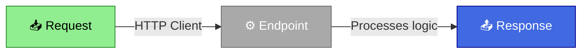
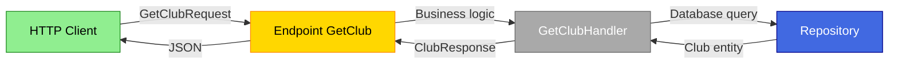

# Migrate from Controllers to REPR: Two Practical Approaches

## Introduction

For years, ASP.NET developers have relied on **Controllers** as the cornerstone for building REST APIs. However, there is an alternative pattern gaining traction in the community: **REPR** (**Re**quest-**E**nd**P**oint-**R**esponse).

In this practical guide, we will explore **two different ways** to implement **REPR**:

1. **Using the FastEndpoints library** - Fast and feature-rich out of the box
2. **With a custom implementation** - No third-party dependencies, total control

In this article, we will migrate two complete controllers (`ClubsController` and `SwimmersController`), removing each endpoint from the controller as we progress, until we achieve a REPR-based architecture.

For this guide we will use **SwimTracker**, a REST API to manage information about swimming clubs and their swimmers. It is an application built with ASP.NET Core following **Clean Architecture** principles:

- **Architecture**: Clean Architecture / Hexagonal Architecture
  - `Domain`: Business entities (Club, Swimmer), domain logic
  - `Application`: Use cases, abstractions (handlers, repositories)
  - `Infrastructure`: Concrete implementations (EF Core, persistence)
  - `API`: Presentation layer (Controllers/Endpoints)

- **Implemented patterns**:
  - **Result Pattern**: Functional error handling without exceptions
  - **Repository Pattern**: Data layer abstraction
  - **Unit of Work**: Transaction management
  - **Handler Pattern**: Simplified CQRS for commands and queries
  - **Domain Events**: Domain events on entities

- **Technology**: PostgreSQL with Entity Framework Core

- **Functional domains**:
  - **Clubs**: Swimming club management (create, list, query)
  - **Swimmers**: Swimmer management (create, list, query)

This structure is representative of real production APIs, which makes the examples applicable to many projects.

---

## What is the REPR Pattern?

REPR is a modern architectural pattern that organizes API code around **individual endpoints** rather than **controllers**. Each endpoint is an independent class that encapsulates all the logic needed to handle a specific operation.



In practice, the structure is organized like this:

```
// Traditional structure (Controllers)
ClubsController.cs      ← One class with multiple methods
├─ GetClub()
├─ CreateClub()
└─ GetClubs()

// REPR structure (Endpoints)
Endpoints/Clubs/        ← One folder with one class per method
├─ GetClub.cs           ← One class = One responsibility
├─ CreateClub.cs        ← One class = One responsibility
└─ GetClubs.cs          ← One class = One responsibility
```

### Why Consider REPR?

**Single Responsibility Principle (SRP)** - Each class has a single reason to change  
**Better Testability** - Smaller endpoints tend to be easier to test in isolation  
**Scalability** - Teams can work in parallel with fewer merge conflicts  
**Maintainability** - Makes locating the logic for each operation easier  
**Flexible Configuration** - Each endpoint can have its own authorization policy, validation, etc.

---

## Traditional Controllers

For this example, we start with a Web API with two typical controllers that have multiple responsibilities:

### ClubsController.cs

```csharp
using Microsoft.AspNetCore.Mvc;
using SwimTracker.Application.Clubs.CreateClub;
using SwimTracker.Application.Clubs.GetClub;
using SwimTracker.Application.Clubs.GetClubs;

namespace SwimTracker.Api.REPR.Controllers;

[ApiController]
[Route("api/[controller]")]
public class ClubsController : ControllerBase
{
    [HttpGet("{id:guid}")]
    public async Task<IActionResult> GetClub(
        Guid id,
        IRequestHandler<GetClubRequest, ClubResponse> requestHandler,
        CancellationToken cancellationToken)
    {
        var request = new GetClubRequest(id);
        var result = await requestHandler.HandleAsync(request, cancellationToken);

        if (result.IsSuccess)
        {
            return Ok(result.Value);
        }
        else
        {
            return NotFound();
        }
    }

    [HttpPost]
    public async Task<IActionResult> CreateClub(
        [FromBody] CreateClubRequest request,
        IRequestHandler<CreateClubRequest> requestHandler,
        CancellationToken cancellationToken)
    {
        var result = await requestHandler.HandleAsync(request, cancellationToken);

        if (result.IsSuccess)
        {
            return Created($"api/clubs/{request.Name}", request);
        }
        else
        {
            return BadRequest(result.Error);
        }
    }

    [HttpGet]
    public async Task<IActionResult> GetClubs(
        IHandler<List<GetClubsResponse>> requestHandler,
        CancellationToken cancellationToken)
    {
        var result = await requestHandler.HandleAsync(cancellationToken);

        if (result.IsSuccess)
        {
            return Ok(result.Value);
        }
        else
        {
            return NotFound();
        }
    }
}
```

### SwimmersController.cs

```csharp
using Microsoft.AspNetCore.Mvc;
using SwimTracker.Application.Swimmers.CreateSwimmer;
using SwimTracker.Application.Swimmers.GetSwimmer;
using SwimTracker.Application.Swimmers.GetSwimmers;

namespace SwimTracker.Api.REPR.Controllers;

[ApiController]
[Route("api/[controller]")]
public class SwimmersController : ControllerBase
{
    [HttpGet("{id:guid}")]
    public async Task<IActionResult> GetSwimmer(
        Guid id,
        IRequestHandler<GetSwimmerRequest, GetSwimmerResponse> requestHandler,
        CancellationToken cancellationToken)
    {
        var request = new GetSwimmerRequest(id);
        var result = await requestHandler.HandleAsync(request, cancellationToken);

        if (result.IsSuccess)
        {
            return Ok(result.Value);
        }
        else
        {
            return NotFound();
        }
    }

    [HttpPost]
    public async Task<IActionResult> CreateSwimmer(
        [FromBody] CreateSwimmerRequest request,
        IRequestHandler<CreateSwimmerRequest, CreateSwimmerResponse> requestHandler,
        CancellationToken cancellationToken)
    {
        var result = await requestHandler.HandleAsync(request, cancellationToken);

        if (result.IsSuccess)
        {
            return Ok(result.Value);
        }
        else
        {
            return BadRequest(result.Error);
        }
    }

    [HttpGet]
    public async Task<IActionResult> GetSwimmers(
        IHandler<List<GetSwimmersResponse>> requestHandler,
        CancellationToken cancellationToken)
    {
        var result = await requestHandler.HandleAsync(cancellationToken);

        if (result.IsSuccess)
        {
            return Ok(result.Value);
        }
        else
        {
            return NotFound();
        }
    }
}
```

**Objective**: Migrate `ClubsController` using **FastEndpoints**, and `SwimmersController` using a **custom implementation**, to compare both approaches in practice.

---

## Data Contracts: Request and Response

Before migrating the controllers, it is fundamental to understand the **data contracts** that define how information flows in our API. The **REPR** pattern is not just about endpoints — it's **Re**quest-**E**ndpoint-**R**esponse, where each piece has a specific role:

- **Request**: Defines what data the endpoint receives from the client
- **Response**: Defines what data the endpoint returns to the client
- **Endpoint**: Orchestrates the logic between both

In **Clean Architecture**, these contracts live in the **Application layer** (use cases), not in the presentation layer (API). This allows reusing the same contracts regardless of whether you use Controllers, FastEndpoints, or Minimal APIs.

### Project Structure

```
SwimTracker.Application/
└── Clubs/
    ├── GetClub/
    │   ├── GetClubRequest.cs      ← Input model
    │   ├── ClubResponse.cs        ← Output model
    │   └── GetClubHandler.cs      ← Business logic
    ├── CreateClub/
    │   ├── CreateClubRequest.cs
    │   └── CreateClubHandler.cs
    └── GetClubs/
        ├── GetClubsResponse.cs
        └── GetClubsHandler.cs
```

This **feature-based** organization rather than by file type facilitates code navigation and maintenance.

### Contracts for Clubs

#### GetClubRequest.cs

```csharp
using SwimTracker.Application.Abstractions.Messaging;

namespace SwimTracker.Application.Clubs.GetClub;

public sealed record GetClubRequest(Guid id) : IRequest<ClubResponse>;
```

**Purpose**: Request a specific club by its ID.

#### ClubResponse.cs

```csharp
namespace SwimTracker.Application.Clubs.GetClub;

public sealed record ClubResponse(
    Guid Id,
    string Name,
    string Acronym,
    string CountryCode,
    string City,
    string? Address,
    string? Phone,
    string Email,
    string? FederationMemberId,
    string? LogoUrl);
```

**Purpose**: Return the complete details of a club.

#### CreateClubRequest.cs

```csharp
using SwimTracker.Application.Abstractions.Messaging;

namespace SwimTracker.Application.Clubs.CreateClub;

public record CreateClubRequest(
    string Name,
    string Acronym,
    string CountryCode,
    string City,
    string Email) : IRequest;
```

**Purpose**: Create a new club with the minimum required data.

**Note**: This request implements `IRequest` without a response type because it returns an empty `Result` (success/failure only).

#### GetClubsResponse.cs

```csharp
namespace SwimTracker.Application.Clubs.GetClubs;

public record GetClubsResponse(
    Guid Id,
    string Name,
    string Acronym,
    string CountryCode,
    string City,
    string? Address,
    string? Phone,
    string Email,
    string? FederationMemberId,
    string? LogoUrl);
```

**Purpose**: Return a summary of a club in a list. In this case, it is identical to `ClubResponse`, but could differ if the list required fewer fields.

### Contracts for Swimmers

#### GetSwimmerRequest.cs

```csharp
using SwimTracker.Application.Abstractions.Messaging;

namespace SwimTracker.Application.Swimmers.GetSwimmer;

public record GetSwimmerRequest(Guid Id) : IRequest<GetSwimmerResponse>;
```

**Purpose**: Request a specific swimmer by their ID.

#### GetSwimmerResponse.cs

```csharp
namespace SwimTracker.Application.Swimmers.GetSwimmer;

public record GetSwimmerResponse(
    Guid Id,
    Guid ClubId,
    string FirstName,
    string LastName,
    DateOnly DateOfBirth,
    string Gender,
    string Nationality,
    string? Email,
    string? Phone,
    string? LicenseNumber,
    string? LicenseStatus,
    DateOnly? LicenseExpiresAt);
```

**Purpose**: Return all data of a swimmer, including their license information.

#### CreateSwimmerRequest.cs

```csharp
using SwimTracker.Application.Abstractions.Messaging;

namespace SwimTracker.Application.Swimmers.CreateSwimmer;

public sealed record CreateSwimmerRequest(
    Guid ClubId,
    string FirstName,
    string LastName,
    DateOnly DateOfBirth,
    string Gender,
    string Nationality,
    string? Email,
    string? Phone,
    string? LicenseNumber,
    string? LicenseStatus,
    DateOnly? LicenseExpiresAt) : IRequest<CreateSwimmerResponse>;
```

**Purpose**: Create a new swimmer associated with an existing club.

#### CreateSwimmerResponse.cs

```csharp
namespace SwimTracker.Application.Swimmers.CreateSwimmer;

public sealed record CreateSwimmerResponse(
    Guid ClubId,
    string FirstName,
    string LastName,
    DateOnly DateOfBirth,
    string Gender,
    string Nationality,
    string? Email,
    string? Phone,
    string? LicenseNumber,
    string? LicenseStatus,
    DateOnly? LicenseExpiresAt);
```

**Purpose**: Confirm the data of the created swimmer.

**Note**: In a REST API, you would typically return the `Id` of the created resource. This model could be improved by including the `Guid Id` field.

#### GetSwimmersResponse.cs

```csharp
namespace SwimTracker.Application.Swimmers.GetSwimmers;

public record GetSwimmersResponse(
    Guid Id,
    Guid ClubId,
    string FirstName,
    string LastName,
    DateOnly DateOfBirth,
    string Gender,
    string Nationality,
    string? Email,
    string? Phone,
    string? LicenseNumber,
    string? LicenseStatus,
    DateOnly? LicenseExpiresAt);
```

**Purpose**: Return a summary of a swimmer in a list.

### Benefits of Using Records

All these models are defined as **records** in C# because:

- **Immutability by default** - Data cannot be modified after creation
- **Value comparison** - Two records with the same data are equal
- **Concise syntax** - Less repetitive code
- **Ideal for DTOs** - Data Transfer Objects should be immutable

### Complete Flow: Request → Endpoint → Response



With this solid foundation of data contracts, we are ready to migrate the endpoints.

---

## Part 1: Migration with FastEndpoints

**FastEndpoints** is a library that simplifies REPR pattern implementation, providing a fluent API and many ready-to-use features.

### Step 1: Install FastEndpoints

```bash
# Install the main library
dotnet add .\src\SwimTracker.Api.REPR\SwimTracker.Api.REPR.csproj package FastEndpoints

# Install the Swagger integration
dotnet add .\src\SwimTracker.Api.REPR\SwimTracker.Api.REPR.csproj package FastEndpoints.Swagger
```

#### Note on Swagger: Why FastEndpoints.Swagger Instead of Swashbuckle

Traditionally in ASP.NET Core we would use **Swashbuckle** + **Swagger UI** to document our APIs:

```bash
dotnet add package Swashbuckle.AspNetCore
```

However, when working with **FastEndpoints**, the library provides its own `FastEndpoints.Swagger` package that offers significant advantages:

**Native integration** - Understands FastEndpoints structure without additional manual configuration  
**Automatic discovery** - FastEndpoints endpoints are automatically documented in Swagger  
**Fewer dependencies** - Single specialized library vs. multiple generic packages  
**Simplified configuration** - Just two lines in Program.cs (`AddFastEndpoints()` and `SwaggerDocument()`)  
**Consistency** - Documentation reflects exactly how FastEndpoints works internally  
**Fluent API** - FastEndpoints helper methods (`.WithTags()`, `.WithDescription()`, `.Produces()`) generate correct documentation automatically  

In this guide we opt for **FastEndpoints.Swagger** due to its cleaner, more direct and natural integration with the **REPR** pattern implemented through FastEndpoints.

---

### Step 2: Configure FastEndpoints in Program.cs

```csharp
using FastEndpoints;
using FastEndpoints.Swagger;
using SwimTracker.Application;
using SwimTracker.Infrastructure;

var builder = WebApplication.CreateBuilder(args);

builder.Services.AddControllers();
builder.Services.AddEndpointsApiExplorer();

// Register FastEndpoints
builder.Services.AddFastEndpoints();
builder.Services.SwaggerDocument();

builder.Services.AddApplication();
builder.Services.AddInfrastructure(builder.Configuration);

var app = builder.Build();

app.UseHttpsRedirection();
app.UseAuthorization();

app.MapControllers();

// Activate FastEndpoints with route prefix
app.UseFastEndpoints(c => c.Endpoints.RoutePrefix = "api");
app.UseSwaggerGen();

app.Run();
```

### Step 3: Migrate GetClub with FastEndpoints

Next, we create the `Endpoints/Clubs/` directory and the `GetClub.cs` file:

```csharp
using FastEndpoints;
using SwimTracker.Application.Clubs.GetClub;

namespace SwimTracker.Api.REPR.Endpoints.Clubs;

/// <summary>
/// Endpoint for retrieving a club by its ID.
/// </summary>
public class GetClub : Endpoint<GetClubRequest, ClubResponse>
{
    private readonly IRequestHandler<GetClubRequest, ClubResponse> _requestHandler;

    /// <summary>
    /// Initializes a new instance of the <see cref="GetClub"/> class.
    /// </summary>
    /// <param name="requestHandler">The request handler for processing the get club request.</param>
    public GetClub(IRequestHandler<GetClubRequest, ClubResponse> requestHandler)
    {
        _requestHandler = requestHandler;
    }

    /// <summary>
    /// Configures the endpoint.
    /// </summary>
    public override void Configure()
    {
        Get("/clubs/{id:guid}");
        AllowAnonymous();
    }

    /// <summary>
    /// Handles the incoming request to retrieve a club by its ID.
    /// </summary>
    /// <param name="req">The request containing the club ID.</param>
    /// <param name="ct">The cancellation token.</param>
    public override async Task HandleAsync(GetClubRequest req, CancellationToken ct)
    {
        var result = await _requestHandler.HandleAsync(req, ct);

        if (result.IsSuccess)
        {
            await Send.OkAsync(result.Value, ct);
        }
        else
        {
            await Send.NotFoundAsync(ct);
        }
    }
}
```

**FastEndpoints features**:
- Inherits from `Endpoint<TRequest, TResponse>`
- The `Configure()` method defines the route and configuration
- `HandleAsync()` automatically receives the deserialized request
- Helper methods like `SendOkAsync()`, `SendNotFoundAsync()`

**Next step**: Remove the `GetClub` method from `ClubsController`.

### Step 4: Migrate CreateClub with FastEndpoints

Now we create `Endpoints/Clubs/CreateClub.cs`:

```csharp
using FastEndpoints;
using SwimTracker.Application.Clubs.CreateClub;

namespace SwimTracker.Api.REPR.Endpoints.Clubs;

/// <summary>
/// Endpoint for creating a new club.
/// </summary>
public class CreateClub : Endpoint<CreateClubRequest>
{
    private readonly IRequestHandler<CreateClubRequest> _requestHandler;

    /// <summary>
    /// Initializes a new instance of the <see cref="CreateClub"/> class.
    /// </summary>
    /// <param name="requestHandler">The request handler for processing the create club request.</param>
    public CreateClub(IRequestHandler<CreateClubRequest> requestHandler)
    {
        _requestHandler = requestHandler;
    }

    /// <summary>
    /// Configures the endpoint.
    /// </summary>
    public override void Configure()
    {
        Post("/clubs");
        AllowAnonymous();
    }

    /// <summary>
    /// Handles the incoming request to create a new club.
    /// </summary>
    /// <param name="req">The request containing the club details.</param>
    /// <param name="ct">The cancellation token.</param>
    public override async Task HandleAsync(CreateClubRequest req, CancellationToken ct)
    {
        var result = await _requestHandler.HandleAsync(req, ct);

        if (result.IsSuccess)
        {
            await Send.CreatedAtAsync<CreateClub>($"/api/clubs/{req.Name}", req, cancellation: ct);
        }
        else
        {
            await Send.StatusCodeAsync(statusCode: 500, ct);
        }
    }
}
```

**Note**: `SendCreatedAtAsync<GetClub>()` automatically generates the location URL using the GetClub endpoint.

**Next step**: Remove the `CreateClub` method from `ClubsController`.

### Step 5: Migrate GetClubs with FastEndpoints

Finally, we create `Endpoints/Clubs/GetClubs.cs`:

```csharp
using FastEndpoints;
using SwimTracker.Application.Clubs.GetClubs;

namespace SwimTracker.Api.REPR.Endpoints.Clubs;

/// <summary>
/// Endpoint for retrieving a list of all clubs.
/// </summary>
public class GetClubs : EndpointWithoutRequest<List<GetClubsResponse>>
{
    private readonly IHandler<List<GetClubsResponse>> _handler;

    /// <summary>
    /// Initializes a new instance of the <see cref="GetClubs"/> class.
    /// </summary>
    /// <param name="handler">The handler for processing the get clubs request.</param>
    public GetClubs(IHandler<List<GetClubsResponse>> handler)
    {
        _handler = handler;
    }

    /// <summary>
    /// Configures the endpoint.
    /// </summary>
    public override void Configure()
    {
        Get("/clubs");
        Tags("Clubs");
        AllowAnonymous();
    }

    /// <summary>
    /// Handles the incoming request to retrieve a list of all clubs.
    /// </summary>
    /// <param name="ct">The cancellation token.</param>
    public override async Task HandleAsync(CancellationToken ct)
    {
        var result = await _handler.HandleAsync(ct);

        if (result.IsSuccess)
        {
            await Send.OkAsync(result.Value, ct);
        }
        else
        {
            await Send.NotFoundAsync(ct);
        }
    }
}
```

**Next step**: Remove the last method from `ClubsController`.

### Result: ClubsController Completely Migrated

```
Endpoints/Clubs/
   ├─ GetClub.cs      (using FastEndpoints)
   ├─ CreateClub.cs   (using FastEndpoints)
   └─ GetClubs.cs     (using FastEndpoints)

Controllers/ClubsController.cs  (now empty, can be deleted)
```

**Test endpoints**: We can test the endpoints in Swagger:
```bash
dotnet run --project .\src\SwimTracker.Api.REPR\SwimTracker.Api.REPR.csproj

# You can verify at http://localhost:5000/swagger:
GET    /api/clubs
GET    /api/clubs/{id}
POST   /api/clubs
```

---

## Part 2: Custom Implementation without Libraries

Now we will see how to implement **REPR** **without third-party dependencies**, giving you total control over the pattern. We will migrate `SwimmersController` using this approach.

### Step 1: Create the IEndpoint Interface

We start by creating `Endpoints/IEndpoint.cs`:

```csharp
namespace SwimTracker.Api.REPR.Endpoints;

/// <summary>
/// Interface for defining an API endpoint.
/// </summary>
public interface IEndpoint
{
    /// <summary>
    /// Maps the endpoint to the specified route builder.
    /// </summary>
    /// <param name="app">The endpoint route builder.</param>
    void MapEndpoint(IEndpointRouteBuilder app);
}
```

This simple interface allows each endpoint to define its own route configuration.

### Step 2: Migrate GetSwimmers (Custom Implementation)

Now we create `Endpoints/Swimmers/GetSwimmers.cs`:

```csharp
using SwimTracker.Application.Swimmers.GetSwimmers;

namespace SwimTracker.Api.REPR.Endpoints.Swimmers;

/// <summary>
/// Endpoint for retrieving a list of all swimmers in the system.
/// </summary>
public class GetSwimmers : IEndpoint
{
    /// <summary>
    /// Maps the endpoint to the specified route builder.
    /// </summary>
    /// <param name="app">The endpoint route builder.</param>   
    public void MapEndpoint(IEndpointRouteBuilder app)
    {
        app.MapGet("/api/swimmers", HandleAsync)
        .WithTags("Swimmers")        
        .WithName("GetSwimmers")
        .WithDescription("Gets a list of all swimmers.")
        .AllowAnonymous()
        .Produces<List<GetSwimmersResponse>>(StatusCodes.Status200OK)
        .Produces(StatusCodes.Status404NotFound)
        .AllowAnonymous();
    }

    /// <summary>
    /// Handles the incoming request to retrieve a list of all swimmers in the system.
    /// </summary>
    /// <param name="requestHandler">The request handler for retrieving swimmers.</param>
    /// <param name="cancellationToken">The cancellation token.</param>
    /// <returns>The result of the request.</returns>
    private async Task<IResult> HandleAsync(
        IHandler<List<GetSwimmersResponse>> requestHandler,
        CancellationToken cancellationToken)
    {
        var result = await requestHandler.HandleAsync(cancellationToken);

        if (result.IsSuccess)
        {
            return Results.Ok(result.Value);
        }
        else
        {
            return Results.NotFound();
        }
    }
}
```

In this custom endpoint you can see how ASP.NET Core's Minimal API is leveraged:

- Uses `app.MapGet()` from ASP.NET Core Minimal API
- `HandleAsync` is a private method, not public (encapsulation)
- Returns `IResult` instead of `IActionResult`
- Dependency injection works automatically in the method parameters

**Next step**: Remove the `GetSwimmers` method from `SwimmersController`.

### Step 3: Migrate GetSwimmer (Custom Implementation)

We continue by creating `Endpoints/Swimmers/GetSwimmer.cs`:

```csharp
using SwimTracker.Application.Swimmers.GetSwimmer;

namespace SwimTracker.Api.REPR.Endpoints.Swimmers;

/// <summary>
/// Endpoint for retrieving a swimmer by their unique identifier.
/// </summary>
public class GetSwimmer : IEndpoint
{
    /// <summary>
    /// Maps the endpoint to the specified route builder.
    /// </summary>
    /// <param name="app">The endpoint route builder.</param>
    public void MapEndpoint(IEndpointRouteBuilder app)
    {
        app.MapGet("/api/swimmers/{id:guid}", HandleAsync)
           .WithTags("Swimmers")
           .WithName("GetSwimmer")
           .WithDescription("Gets a swimmer by their unique identifier.")
           .Produces<GetSwimmerResponse>(StatusCodes.Status200OK)
           .Produces(StatusCodes.Status404NotFound)
           .AllowAnonymous();
    }

    /// <summary>
    /// Handles the incoming request to retrieve a swimmer by their unique identifier.
    /// </summary>
    /// <param name="id">The unique identifier of the swimmer.</param>
    /// <param name="requestHandler">The request handler for retrieving a swimmer.</param>
    /// <param name="cancellationToken">The cancellation token.</param>
    /// <returns>The result of the request.</returns>
    private async Task<IResult> HandleAsync(
        Guid id,
        IRequestHandler<GetSwimmerRequest, GetSwimmerResponse> requestHandler,
        CancellationToken cancellationToken)
    {
        var request = new GetSwimmerRequest(id);
        var result = await requestHandler.HandleAsync(request, cancellationToken);

        if (result.IsSuccess)
        {
            return Results.Ok(result.Value);
        }
        else
        {
            return Results.NotFound();
        }
    }
}
```

**Note**: The `Guid id` parameter is automatically extracted from the route `/api/swimmers/{id:guid}`. ASP.NET Core performs the binding automatically.

**Next step**: Remove the `GetSwimmer` method from `SwimmersController`.

### Step 4: Migrate CreateSwimmer (Custom Implementation)

Finally, we create `Endpoints/Swimmers/CreateSwimmer.cs`:

```csharp
using SwimTracker.Application.Swimmers.CreateSwimmer;

namespace SwimTracker.Api.REPR.Endpoints.Swimmers;

/// <summary>
/// Endpoint for creating a new swimmer in the system.
/// </summary>
public class CreateSwimmer : IEndpoint
{
    /// <summary>
    /// Maps the endpoint to the specified route builder.
    /// </summary>
    /// <param name="app">The endpoint route builder.</param>
    public void MapEndpoint(IEndpointRouteBuilder app)
    {
        app.MapPost("/api/swimmers", HandleAsync)
        .WithTags("Swimmers")
        .WithDescription("Creates a new swimmer.")
        .WithName("CreateSwimmer")
        .Produces<CreateSwimmerResponse>(StatusCodes.Status200OK)
        .Produces(StatusCodes.Status400BadRequest)
        .AllowAnonymous();
    }

    /// <summary>
    /// Handles the incoming request to create a new swimmer in the system.
    /// </summary>
    /// <param name="request">The request to create a new swimmer.</param>
    /// <param name="requestHandler">The request handler for creating a new swimmer.</param>
    /// <param name="cancellationToken">The cancellation token.</param>
    /// <returns>The result of the request.</returns>
    private async Task<IResult> HandleAsync(
        CreateSwimmerRequest request,
        IRequestHandler<CreateSwimmerRequest, CreateSwimmerResponse> requestHandler,
        CancellationToken cancellationToken)
    {
        var result = await requestHandler.HandleAsync(request, cancellationToken);

        if (result.IsSuccess)
        {
            return Results.Ok(result.Value);
        }
        else
        {
            return Results.BadRequest(result.Error);
        }
    }
}
```

**Note**: The `CreateSwimmerRequest request` parameter is automatically deserialized from the JSON body of the HTTP request.

**Next step**: Remove the last method from `SwimmersController` and the complete file.

### Step 5: Create the Automatic Registration System

With the three endpoints created, the next step is to implement a system to automatically register them in the DI container. For this, we create `Extensions/EndpointExtensions.cs`:

```csharp
using SwimTracker.Api.REPR.Endpoints;
using SwimTracker.Api.REPR.Endpoints.Swimmers;

namespace SwimTracker.Api.REPR.Extensions;

/// <summary>
/// Extension methods for registering and mapping API endpoints.
/// </summary>
public static class EndpointExtensions
{
    /// <summary>
    /// Registers the API endpoints with the dependency injection container.
    /// </summary>
    /// <param name="services">The service collection.</param>
    /// <returns>The updated service collection.</returns>
    public static IServiceCollection AddEndpoints(this IServiceCollection services)
    {
        services.AddTransient<IEndpoint, GetSwimmers>();    // GET /api/swimmers
        services.AddTransient<IEndpoint, GetSwimmer>();     // GET /api/swimmers/{id}
        services.AddTransient<IEndpoint, CreateSwimmer>();  // POST /api/swimmers

        return services;
    }

    /// <summary>
    /// Maps the registered API endpoints to the specified route builder.
    /// 
    /// How it works:
    /// 1. Gets all instances of IEndpoint from the DI container
    /// 2. Iterates over each endpoint
    /// 3. Calls MapEndpoint() on each one, allowing it to self-configure
    /// 
    /// This eliminates the need to manually configure each route.
    /// </summary>
    /// <param name="app">The application builder.</param>
    /// <param name="routeGroupBuilder">An optional route group builder.</param>
    /// <returns>The updated application builder.</returns>
    public static IApplicationBuilder MapEndpoints(
     this WebApplication app,
     RouteGroupBuilder? routeGroupBuilder = null)
    {
        IEndpointRouteBuilder builder = routeGroupBuilder is null ? app : routeGroupBuilder;

        IEnumerable<IEndpoint> endpoints = app.Services.GetRequiredService<IEnumerable<IEndpoint>>();

        foreach (IEndpoint endpoint in endpoints)
        {
            endpoint.MapEndpoint(builder);
        }

        return app;
    }
}
```

### Step 6: Register the System in Program.cs

The next step is to update `Program.cs` to include the custom endpoints:

```csharp
using FastEndpoints;
using FastEndpoints.Swagger;
using SwimTracker.Api.REPR.Extensions;  // New
using SwimTracker.Application;
using SwimTracker.Infrastructure;

var builder = WebApplication.CreateBuilder(args);

builder.Services.AddControllers();
builder.Services.AddFastEndpoints();
builder.Services.SwaggerDocument();
builder.Services.AddEndpointsApiExplorer();

builder.Services.AddApplication();
builder.Services.AddInfrastructure(builder.Configuration);


builder.Services.AddEndpoints(); // Register custom endpoints

var app = builder.Build();

app.UseHttpsRedirection();
app.UseAuthorization();

app.MapControllers();
app.UseFastEndpoints(c => c.Endpoints.RoutePrefix = "api");
app.UseSwaggerGen();


app.MapEndpoints(); // Map custom endpoints

app.Run();
```

**With this configuration, both systems work simultaneously**: FastEndpoints for Clubs and custom endpoints for Swimmers.

### Result: SwimmersController Completely Migrated

```
Endpoints/Swimmers/
   ├─ GetSwimmers.cs   (custom implementation)
   ├─ GetSwimmer.cs    (custom implementation)
   └─ CreateSwimmer.cs (custom implementation)

Controllers/SwimmersController.cs  (completely deleted)
```

**Test endpoints**: To verify the functionality:
```bash
dotnet run --project .\src\SwimTracker.Api.REPR\SwimTracker.Api.REPR.csproj

# You can verify in Swagger:
GET    /api/swimmers
GET    /api/swimmers/{id}
POST   /api/swimmers
```

---

### When to Consider Each Approach

**Consider FastEndpoints if**:
- You need advanced features (validation, complex authentication, versioning)
- You value immediate productivity
- You don't mind adding an external dependency
- You value an opinionated and consistent API

**Consider a Custom Implementation if**:
- You prefer zero third-party dependencies
- You value complete control over the code
- Your team is already familiar with ASP.NET Core Minimal API
- You want an extremely lightweight solution

---

## Final Project State

After completing both migrations, the project structure is:

```
SwimTracker.Api.REPR/
│
├── Program.cs                    ← Configured with FastEndpoints + Custom Endpoints
├── appsettings.json
│
├── Controllers/                  ← Empty directory (can be deleted)
│
├── Endpoints/
│   ├── IEndpoint.cs              ← Interface for custom endpoints
│   │
│   ├── Clubs/                    ← Using FastEndpoints
│   │   ├── GetClubs.cs           Migrated with FastEndpoints
│   │   ├── GetClub.cs            Migrated with FastEndpoints
│   │   └── CreateClub.cs         Migrated with FastEndpoints
│   │
│   └── Swimmers/                 ← Custom implementation
│       ├── GetSwimmers.cs        Migrated with custom implementation
│       ├── GetSwimmer.cs         Migrated with custom implementation
│       └── CreateSwimmer.cs      Migrated with custom implementation
│
└── Extensions/
    └── EndpointExtensions.cs     ← Automatic registration and mapping of custom endpoints
```

### Final Verification

```bash
# Start the database
docker compose up

# Run the application
dotnet run --project .\src\SwimTracker.Api.REPR\SwimTracker.Api.REPR.csproj

# Check in Swagger (http://localhost:5000/swagger):

# CLUBS (FastEndpoints)
GET    /api/clubs                    ← Get all clubs
GET    /api/clubs/{id}               ← Get a club by ID
POST   /api/clubs                    ← Create a new club

# SWIMMERS (Custom Implementation)
GET    /api/swimmers                 ← Get all swimmers
GET    /api/swimmers/{id}            ← Get a swimmer by ID
POST   /api/swimmers                 ← Create a new swimmer
```

---

## Conclusion

In this guide we have explored **two different ways** to implement the REPR pattern in ASP.NET Core:

**FastEndpoints** - Fast productivity with a feature-rich library  
**Custom Implementation** - Complete control without external dependencies

Both approaches provide:
- **Scalable architecture** that grows seamlessly
- **More testable code** - each endpoint is an isolated unit
- **Teams working in parallel** without merge conflicts
- **Granular configuration** - each operation has its own policy
- **Simplified maintenance** - immediate location of logic

**Which approach to choose?** The choice depends on the specific needs of each project:
- **FastEndpoints** can be a good option if you value productivity and advanced features
- **Custom implementation** may be preferable if you want complete control and zero dependencies

With these tools, it is possible to **modernize APIs** and apply the **Single Responsibility** principle at the endpoint level.

---

## Additional Resources

- **REPR Design Pattern**: [DevIQ - REPR Pattern Guide](https://deviq.com/design-patterns/repr-design-pattern/)
- **Project Repository**: [github.com/your-user/swim-tracker](https://github.com/)
- **FastEndpoints Documentation**: [https://fast-endpoints.com/](https://fast-endpoints.com/)
- **ASP.NET Core Minimal APIs**: [Microsoft Docs](https://learn.microsoft.com/en-us/aspnet/core/fundamentals/minimal-apis)
- **REPR Pattern Discussion**: [Reddit r/dotnet](https://www.reddit.com/r/dotnet/)
