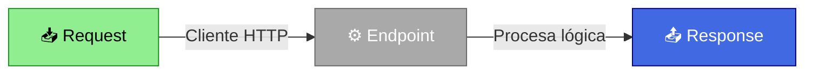
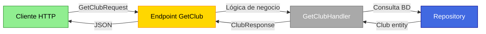

# Migra de Controllers a REPR: Dos Enfoques Prácticos

## Introducción

Durante años, los desarrolladores de ASP.NET hemos confiado en los **Controllers** como la piedra angular para construir APIs REST. Sin embargo, existe un patrón alternativo que está ganando tracción en la comunidad: **REPR** (**Re**quest-**E**nd**P**oint-**R**esponse).

En esta guía práctica, exploraremos **dos formas diferentes** de implementar **REPR**:

1. **Usando la librería FastEndpoints** - Rápido y con muchas características incluidas
2. **Con una implementación propia** - Sin dependencias de terceros, total control

En este artículo, migraremos dos controladores completos (`ClubsController` y `SwimmersController`), eliminando cada endpoint del controlador conforme avanzamos, hasta lograr una arquitectura basada en REPR.

Para esta guía utilizaremos **SwimTracker**, una API REST para gestionar información de clubes de natación y sus nadadores. Es una aplicación construida con ASP.NET Core siguiendo principios de **Clean Architecture**:

- **Arquitectura**: Clean Architecture / Arquitectura Hexagonal
  - `Domain`: Entidades de negocio (Club, Swimmer), lógica del dominio
  - `Application`: Casos de uso, abstracciones (handlers, repositorios)
  - `Infrastructure`: Implementaciones concretas (EF Core, persistencia)
  - `API`: Capa de presentación (Controllers/Endpoints)

- **Patrones implementados**:
  - **Result Pattern**: Manejo funcional de errores sin excepciones
  - **Repository Pattern**: Abstracción de la capa de datos
  - **Unit of Work**: Gestión de transacciones
  - **Handler Pattern**: CQRS simplificado para comandos y consultas
  - **Domain Events**: Eventos de dominio en las entidades

- **Tecnología**: PostgreSQL con Entity Framework Core

- **Dominios funcionales**:
  - **Clubs**: Gestión de clubes de natación (crear, listar, consultar)
  - **Swimmers**: Gestión de nadadores (crear, listar, consultar)

Esta estructura es representativa de APIs reales en producción, lo que puede hacer que los ejemplos sean aplicables a muchos proyectos.

---

## ¿Qué es el Patrón REPR?

REPR es un patrón arquitectónico moderno que organiza el código de una API alrededor de **endpoints individuales** en lugar de **controladores**. Cada endpoint es una clase independiente que encapsula toda la lógica necesaria para manejar una operación específica.



En la práctica, la estructura se organiza así:

```
// Estructura tradicional (Controllers)
ClubsController.cs      ← Una clase con múltiples métodos
├─ GetClub()
├─ CreateClub()
└─ GetClubs()

// Estructura REPR (Endpoints)
Endpoints/Clubs/        ← Una carpeta con una clase por método
├─ GetClub.cs           ← Una clase = Una responsabilidad
├─ CreateClub.cs        ← Una clase = Una responsabilidad
└─ GetClubs.cs          ← Una clase = Una responsabilidad
```

### ¿Por Qué considerar REPR?

**Single Responsibility Principle (SRP)** - Cada clase tiene una única razón para cambiar  
**Mejor Testabilidad** - Los endpoints más pequeños tienden a ser más fáciles de probar aisladamente  
**Escalabilidad** - Los equipos pueden trabajar en paralelo con menos conflictos de merge  
**Mantenibilidad** - Facilita la localización de la lógica de cada operación  
**Configuración Flexible** - Cada endpoint puede tener su propia política de autorización, validación, etc.

---

## Controladores Tradicionales

Para este ejemplo, partimos de una Web API con dos controladores típicos que tienen múltiples responsabilidades:

### ClubsController.cs

```csharp
using Microsoft.AspNetCore.Mvc;
using SwimTracker.Application.Clubs.CreateClub;
using SwimTracker.Application.Clubs.GetClub;
using SwimTracker.Application.Clubs.GetClubs;

namespace SwimTracker.Api.Controllers.Controllers;

[ApiController]
[Route("api/[controller]")]
public class ClubsController : ControllerBase
{
    [HttpGet("{id:guid}")]
    public async Task<IActionResult> GetClub(
        Guid id,
        IRequestHandler<GetClubRequest, GetClubResponse> requestHandler,
        CancellationToken cancellationToken)
    {
        var request = new GetClubRequest(id);
        var result = await requestHandler.HandleAsync(request, cancellationToken);

        if (result.IsSuccess)
        {
            return Ok(result.Value);
        }
        else
        {
            return NotFound();
        }
    }

    [HttpPost]
    public async Task<IActionResult> CreateClub(
        [FromBody] CreateClubRequest request,
        IRequestHandler<CreateClubRequest> requestHandler,
        CancellationToken cancellationToken)
    {
        var result = await requestHandler.HandleAsync(request, cancellationToken);

        if (result.IsSuccess)
        {
            return Created($"api/clubs/{request.Name}", request);
        }
        else
        {
            return BadRequest(result.Error);
        }
    }

    [HttpGet]
    public async Task<IActionResult> GetClubs(
        IHandler<List<GetClubsResponse>> requestHandler,
        CancellationToken cancellationToken)
    {
        var result = await requestHandler.HandleAsync(cancellationToken);

        if (result.IsSuccess)
        {
            return Ok(result.Value);
        }
        else
        {
            return NotFound();
        }
    }
}
```

### SwimmersController.cs

```csharp
using Microsoft.AspNetCore.Mvc;
using SwimTracker.Application.Swimmers.CreateSwimmer;
using SwimTracker.Application.Swimmers.GetSwimmer;
using SwimTracker.Application.Swimmers.GetSwimmers;

namespace SwimTracker.Api.REPR.Controllers;

[ApiController]
[Route("api/[controller]")]
public class SwimmersController : ControllerBase
{
    [HttpGet("{id:guid}")]
    public async Task<IActionResult> GetSwimmer(
        Guid id,
        IRequestHandler<GetSwimmerRequest, GetSwimmerResponse> requestHandler,
        CancellationToken cancellationToken)
    {
        var request = new GetSwimmerRequest(id);
        var result = await requestHandler.HandleAsync(request, cancellationToken);

        if (result.IsSuccess)
        {
            return Ok(result.Value);
        }
        else
        {
            return NotFound();
        }
    }

    [HttpPost]
    public async Task<IActionResult> CreateSwimmer(
        [FromBody] CreateSwimmerRequest request,
        IRequestHandler<CreateSwimmerRequest, CreateSwimmerResponse> requestHandler,
        CancellationToken cancellationToken)
    {
        var result = await requestHandler.HandleAsync(request, cancellationToken);

        if (result.IsSuccess)
        {
            return Ok(result.Value);
        }
        else
        {
            return BadRequest(result.Error);
        }
    }

    [HttpGet]
    public async Task<IActionResult> GetSwimmers(
        IHandler<List<GetSwimmersResponse>> requestHandler,
        CancellationToken cancellationToken)
    {
        var result = await requestHandler.HandleAsync(cancellationToken);

        if (result.IsSuccess)
        {
            return Ok(result.Value);
        }
        else
        {
            return NotFound();
        }
    }
}
```

**Objetivo**: Migrar `ClubsController` usando **FastEndpoints**, y `SwimmersController` usando una **implementación personalizada**, para comparar ambos enfoques de forma práctica.

---

## Contratos de Datos: Request y Response

Antes de migrar los controladores, es fundamental entender los **contratos de datos** que definen cómo fluye la información en nuestra API. El patrón **REPR** no es solo sobre endpoints, es **Re**quest-**E**ndpoint-**R**esponse, donde cada pieza tiene un rol específico:

- **Request**: Define qué datos recibe el endpoint del cliente
- **Response**: Define qué datos devuelve el endpoint al cliente
- **Endpoint**: Orquesta la lógica entre ambos

En **Clean Architecture**, es una **práctica recomendada** ubicar estos contratos en la **capa de Application** (casos de uso), no en la capa de presentación (API). Esta decisión arquitectónica ofrece ventajas significativas:

- **Reutilización**: Los mismos contratos funcionan con Controllers, FastEndpoints, o Minimal APIs
- **Desacoplamiento**: La presentación no depende de los detalles internos
- **Testabilidad**: Facilita testear la lógica sin la capa de presentación

Sin embargo, esta no es una "verdad absoluta". En algunos contextos (como proyectos pequeños, equipos independientes, o cuando cada API tiene casos de uso muy específicos) puede ser válido mantener los contratos en la capa de presentación. La decisión debe tomarse considerando la complejidad, escala y necesidades reales del proyecto.

### Estructura en el Proyecto

```
SwimTracker.Application/
└── Clubs/
    ├── GetClub/
    │   ├── GetClubRequest.cs      ← Modelo de entrada
    │   ├── ClubResponse.cs        ← Modelo de salida
    │   └── GetClubHandler.cs      ← Lógica de negocio
    ├── CreateClub/
    │   ├── CreateClubRequest.cs
    │   └── CreateClubHandler.cs
    └── GetClubs/
        ├── GetClubsResponse.cs
        └── GetClubsHandler.cs
```

Esta organización por **característica** (feature-based) en lugar de por tipo de archivo facilita la navegación y mantenimiento del código.

### Contratos para Clubs

#### GetClubRequest.cs

```csharp
using SwimTracker.Application.Abstractions.Messaging;

namespace SwimTracker.Application.Clubs.GetClub;

public sealed record GetClubRequest(Guid Id) : IRequest<GetClubResponse>;
```

**Propósito**: Solicitar un club específico por su ID.

#### CreateClubRequest.cs

```csharp
using SwimTracker.Application.Abstractions.Messaging;

namespace SwimTracker.Application.Clubs.CreateClub;

public record CreateClubRequest(
    string Name,
    string Acronym,
    string CountryCode,
    string City,
    string Email) : IRequest;
```

**Propósito**: Crear un nuevo club con los datos mínimos requeridos.

**Nota**: Este request implementa `IRequest` sin tipo de respuesta porque devuelve un `Result` vacío (solo éxito/fallo).

#### GetClubsResponse.cs

```csharp
namespace SwimTracker.Application.Clubs.GetClub;

public sealed record GetClubResponse(
    Guid Id,
    string Name,
    string Acronym,
    string CountryCode,
    string City,
    string? Address,
    string? Phone,
    string Email,
    string? FederationMemberId,
    string? LogoUrl);
```

**Propósito**: Devolver un resumen de un club en una lista. En este caso, es idéntico a `ClubResponse`, pero podrían diferir si la lista requiriera menos campos.

### Contratos para Swimmers

#### GetSwimmerRequest.cs

```csharp
using SwimTracker.Application.Abstractions.Messaging;

namespace SwimTracker.Application.Swimmers.GetSwimmer;

public record GetSwimmerRequest(Guid Id) : IRequest<GetSwimmerResponse>;
```

**Propósito**: Solicitar un nadador específico por su ID.

#### GetSwimmerResponse.cs

```csharp
namespace SwimTracker.Application.Swimmers.GetSwimmer;

public record GetSwimmerResponse(
    Guid Id,
    Guid ClubId,
    string FirstName,
    string LastName,
    DateOnly DateOfBirth,
    string Gender,
    string Nationality,
    string? Email,
    string? Phone,
    string? LicenseNumber,
    string? LicenseStatus,
    DateOnly? LicenseExpiresAt);
```

**Propósito**: Devolver todos los datos de un nadador, incluyendo su información de licencia.

#### CreateSwimmerRequest.cs

```csharp
using SwimTracker.Application.Abstractions.Messaging;

namespace SwimTracker.Application.Swimmers.CreateSwimmer;

public sealed record CreateSwimmerRequest(
    Guid ClubId,
    string FirstName,
    string LastName,
    DateOnly DateOfBirth,
    string Gender,
    string Nationality,
    string? Email,
    string? Phone,
    string? LicenseNumber,
    string? LicenseStatus,
    DateOnly? LicenseExpiresAt) : IRequest<CreateSwimmerResponse>;
```

**Propósito**: Crear un nuevo nadador asociado a un club existente.

#### CreateSwimmerResponse.cs

```csharp
namespace SwimTracker.Application.Swimmers.CreateSwimmer;

public sealed record CreateSwimmerResponse(
    Guid ClubId,
    string FirstName,
    string LastName,
    DateOnly DateOfBirth,
    string Gender,
    string Nationality,
    string? Email,
    string? Phone,
    string? LicenseNumber,
    string? LicenseStatus,
    DateOnly? LicenseExpiresAt);
```

**Propósito**: Confirmar los datos del nadador creado.

**Nota**: En una API REST, típicamente devolverías el `Id` del recurso creado. Este modelo podría mejorarse incluyendo el campo `Guid Id`.

#### GetSwimmersResponse.cs

```csharp
namespace SwimTracker.Application.Swimmers.GetSwimmers;

public record GetSwimmersResponse(
    Guid Id,
    Guid ClubId,
    string FirstName,
    string LastName,
    DateOnly DateOfBirth,
    string Gender,
    string Nationality,
    string? Email,
    string? Phone,
    string? LicenseNumber,
    string? LicenseStatus,
    DateOnly? LicenseExpiresAt);
```

**Propósito**: Devolver un resumen de un nadador en una lista.

### Ventajas de Usar Records

Todos estos modelos están definidos como **records** en C# porque:

- **Inmutabilidad por defecto** - Los datos no pueden modificarse después de la creación
- **Comparación por valor** - Dos records con los mismos datos son iguales
- **Sintaxis concisa** - Menos código repetitivo
- **Ideal para DTOs** - Los Data Transfer Objects deben ser inmutables

### Flujo Completo: Request → Endpoint → Response



Con esta base sólida de contratos de datos, estamos listos para migrar los endpoints.

---

## Parte 1: Migración con FastEndpoints

**FastEndpoints** es una librería que simplifica la implementación del patrón REPR, proporcionando una API fluida y muchas características listas para usar.

### Paso 1: Instalar FastEndpoints

```bash
# Instalar la librería principal
dotnet add .\src\SwimTracker.Api.REPR\SwimTracker.Api.REPR.csproj package FastEndpoints

# Instalar la integración con Swagger
dotnet add .\src\SwimTracker.Api.REPR\SwimTracker.Api.REPR.csproj package FastEndpoints.Swagger
```

#### Nota sobre Swagger: Por Qué FastEndpoints.Swagger en Lugar de Swashbuckle

Tradicionalmente en ASP.NET Core usaríamos **Swashbuckle** + **Swagger UI** para documentar nuestras APIs:

```bash
dotnet add package Swashbuckle.AspNetCore
```

Sin embargo, cuando trabajamos con **FastEndpoints**, la librería proporciona su propio paquete `FastEndpoints.Swagger` que ofrece ventajas significativas:

**Integración nativa** - Entiende la estructura de FastEndpoints sin configuración manual adicional  
**Descubrimiento automático** - Los endpoints de FastEndpoints se documentan automáticamente en Swagger  
**Menos dependencias** - Una sola librería especializada vs. múltiples paquetes genéricos  
**Configuración simplificada** - Solo dos líneas en Program.cs (`AddFastEndpoints()` y `SwaggerDocument()`)  
**Consistencia** - La documentación refleja exactamente cómo funciona FastEndpoints internamente  
**API fluida** - Los métodos helper de FastEndpoints (`.WithTags()`, `.WithDescription()`, `.Produces()`) generan documentación correcta automáticamente  

En esta guía optamos por **FastEndpoints.Swagger** debido a su integración más limpia, directa y natural con el patrón **REPR** implementado mediante FastEndpoints.

---

### Paso 2: Configurar FastEndpoints en Program.cs

```csharp
using FastEndpoints;
using FastEndpoints.Swagger;
using SwimTracker.Application;
using SwimTracker.Infrastructure;

var builder = WebApplication.CreateBuilder(args);

builder.Services.AddControllers();
builder.Services.AddEndpointsApiExplorer();

// Registrar FastEndpoints
builder.Services.AddFastEndpoints();
builder.Services.SwaggerDocument();

builder.Services.AddApplication();
builder.Services.AddInfrastructure(builder.Configuration);

var app = builder.Build();

app.UseHttpsRedirection();
app.UseAuthorization();

app.MapControllers();

// Activar FastEndpoints con prefijo de ruta
app.UseFastEndpoints(c => c.Endpoints.RoutePrefix = "api");
app.UseSwaggerGen();

app.Run();
```

### Paso 3: Migrar GetClub con FastEndpoints

A continuación, creamos el directorio `Endpoints/Clubs/` y el archivo `GetClub.cs`:

```csharp
using FastEndpoints;
using SwimTracker.Application.Clubs.GetClub;

namespace SwimTracker.Api.REPR.Endpoints.Clubs;

/// <summary>
/// Endpoint for retrieving a club by its ID.
/// </summary>
public class GetClub : Endpoint<GetClubRequest, ClubResponse>
{
    private readonly IRequestHandler<GetClubRequest, ClubResponse> _requestHandler;

    /// <summary>
    /// Initializes a new instance of the <see cref="GetClub"/> class.
    /// </summary>
    /// <param name="requestHandler">The request handler for processing the get club request.</param>
    public GetClub(IRequestHandler<GetClubRequest, ClubResponse> requestHandler)
    {
        _requestHandler = requestHandler;
    }

    /// <summary>
    /// Configures the endpoint.
    /// </summary>
    public override void Configure()
    {
        Get("/clubs/{id:guid}");
        AllowAnonymous();
    }

    /// <summary>
    /// Handles the incoming request to retrieve a club by its ID.
    /// </summary>
    /// <param name="req">The request containing the club ID.</param>
    /// <param name="ct">The cancellation token.</param>
    public override async Task HandleAsync(GetClubRequest req, CancellationToken ct)
    {
        var result = await _requestHandler.HandleAsync(req, ct);

        if (result.IsSuccess)
        {
            await Send.OkAsync(result.Value, ct);
        }
        else
        {
            await Send.NotFoundAsync(ct);
        }
    }
}
```

**Características de FastEndpoints**:
- Hereda de `Endpoint<TRequest, TResponse>`
- El método `Configure()` define la ruta y configuración
- `HandleAsync()` recibe automáticamente el request deserializado
- Métodos helper como `Send.OkAsync()`, `Send.NotFoundAsync()`

**Siguiente paso**: Eliminar el método `GetClub` del `ClubsController`.

### Paso 4: Migrar CreateClub con FastEndpoints

Ahora creamos `Endpoints/Clubs/CreateClub.cs`:

```csharp
using FastEndpoints;
using SwimTracker.Application.Clubs.CreateClub;

namespace SwimTracker.Api.REPR.Endpoints.Clubs;

/// <summary>
/// Endpoint for creating a new club.
/// </summary>
public class CreateClub : Endpoint<CreateClubRequest>
{
    private readonly IRequestHandler<CreateClubRequest> _requestHandler;

    /// <summary>
    /// Initializes a new instance of the <see cref="CreateClub"/> class.
    /// </summary>
    /// <param name="requestHandler">The request handler for processing the create club request.</param>
    public CreateClub(IRequestHandler<CreateClubRequest> requestHandler)
    {
        _requestHandler = requestHandler;
    }

    /// <summary>
    /// Configures the endpoint.
    /// </summary>
    public override void Configure()
    {
        Post("/clubs");
        AllowAnonymous();
    }

    /// <summary>
    /// Handles the incoming request to create a new club.
    /// </summary>
    /// <param name="req">The request containing the club details.</param>
    /// <param name="ct">The cancellation token.</param>
    public override async Task HandleAsync(CreateClubRequest req, CancellationToken ct)
    {
        var result = await _requestHandler.HandleAsync(req, ct);

        if (result.IsSuccess)
        {
            await Send.CreatedAtAsync<CreateClub>($"/api/clubs/{req.Name}", req, cancellation: ct);
        }
        else
        {
            await Send.StatusCodeAsync(statusCode: 500, ct);
        }
    }
}
```

**Nota**: `Send.CreatedAtAsync<GetClub>()` genera automáticamente la URL de ubicación usando el endpoint de GetClub.

**Siguiente paso**: Eliminar el método `CreateClub` del `ClubsController`.

### Paso 5: Migrar GetClubs con FastEndpoints

Finalmente, creamos `Endpoints/Clubs/GetClubs.cs`:

```csharp
using FastEndpoints;
using SwimTracker.Application.Clubs.GetClubs;

namespace SwimTracker.Api.REPR.Endpoints.Clubs;

/// <summary>
/// Endpoint for retrieving a list of all clubs.
/// </summary>
public class GetClubs : EndpointWithoutRequest<List<GetClubsResponse>>
{
    private readonly IHandler<List<GetClubsResponse>> _handler;

    /// <summary>
    /// Initializes a new instance of the <see cref="GetClubs"/> class.
    /// </summary>
    /// <param name="handler">The handler for processing the get clubs request.</param>
    public GetClubs(IHandler<List<GetClubsResponse>> handler)
    {
        _handler = handler;
    }

    /// <summary>
    /// Configures the endpoint.
    /// </summary>
    public override void Configure()
    {
        Get("/clubs");
        Tags("Clubs");
        AllowAnonymous();
    }

    /// <summary>
    /// Handles the incoming request to retrieve a list of all clubs.
    /// </summary>
    /// <param name="ct">The cancellation token.</param>
    public override async Task HandleAsync(CancellationToken ct)
    {
        var result = await _handler.HandleAsync(ct);

        if (result.IsSuccess)
        {
            await Send.OkAsync(result.Value, ct);
        }
        else
        {
            await Send.NotFoundAsync(ct);
        }
    }
}
```

**Siguiente paso**: Eliminar el último método del `ClubsController`.

### Resultado: ClubsController Completamente Migrado

```
Endpoints/Clubs/
   ├─ GetClub.cs      (usando FastEndpoints)
   ├─ CreateClub.cs   (usando FastEndpoints)
   └─ GetClubs.cs     (usando FastEndpoints)

Controllers/ClubsController.cs  (ahora vacío, puede eliminarse)
```

**Prueba de endpoints**: Podemos probar los endpoints en Swagger:
```bash
dotnet run --project .\src\SwimTracker.Api.REPR\SwimTracker.Api.REPR.csproj

# Es posible verificar en http://localhost:5000/swagger:
GET    /api/clubs
GET    /api/clubs/{id}
POST   /api/clubs
```

---

## Parte 2: Implementación Personalizada sin Librerías

Ahora veremos cómo implementar **REPR** **sin dependencias de terceros**, dándote total control sobre el patrón. Migraremos `SwimmersController` usando este enfoque.

### Paso 1: Crear la Interfaz IEndpoint

Comenzamos creando `Endpoints/IEndpoint.cs`:

```csharp
namespace SwimTracker.Api.REPR.Endpoints;

/// <summary>
/// Interface for defining an API endpoint.
/// </summary>
public interface IEndpoint
{
    /// <summary>
    /// Maps the endpoint to the specified route builder.
    /// </summary>
    /// <param name="app">The endpoint route builder.</param>
    void MapEndpoint(IEndpointRouteBuilder app);
}
```

Esta interfaz simple permite que cada endpoint defina su propia configuración de ruta.

### Paso 2: Migrar GetSwimmers (Implementación Personalizada)

Ahora creamos `Endpoints/Swimmers/GetSwimmers.cs`:

```csharp
using SwimTracker.Application.Swimmers.GetSwimmers;

namespace SwimTracker.Api.REPR.Endpoints.Swimmers;

/// <summary>
/// Endpoint for retrieving a list of all swimmers in the system.
/// </summary>
public class GetSwimmers : IEndpoint
{
    /// <summary>
    /// Maps the endpoint to the specified route builder.
    /// </summary>
    /// <param name="app">The endpoint route builder.</param>   
    public void MapEndpoint(IEndpointRouteBuilder app)
    {
        app.MapGet("/api/swimmers", HandleAsync)
        .WithTags("Swimmers")        
        .WithName("GetSwimmers")
        .WithDescription("Gets a list of all swimmers.")
        .AllowAnonymous()
        .Produces<List<GetSwimmersResponse>>(StatusCodes.Status200OK)
        .Produces(StatusCodes.Status404NotFound)
        .AllowAnonymous();
    }

    /// <summary>
    /// Handles the incoming request to retrieve a list of all swimmers in the system.
    /// </summary>
    /// <param name="requestHandler">The request handler for retrieving swimmers.</param>
    /// <param name="cancellationToken">The cancellation token.</param>
    /// <returns>The result of the request.</returns>
    private async Task<IResult> HandleAsync(
        IHandler<List<GetSwimmersResponse>> requestHandler,
        CancellationToken cancellationToken)
    {
        var result = await requestHandler.HandleAsync(cancellationToken);

        if (result.IsSuccess)
        {
            return Results.Ok(result.Value);
        }
        else
        {
            return Results.NotFound();
        }
    }
}
```

En este endpoint personalizado se puede observar cómo se aprovecha la API Minimal de ASP.NET Core:

- Usa `app.MapGet()` de la API Minimal de ASP.NET Core
- `HandleAsync` es un método privado, no público (encapsulación)
- Retorna `IResult` en lugar de `IActionResult`
- La inyección de dependencias funciona automáticamente en los parámetros del método

**Siguiente paso**: Eliminar el método `GetSwimmers` del `SwimmersController`.

### Paso 3: Migrar GetSwimmer (Implementación Personalizada)

Continuamos creando `Endpoints/Swimmers/GetSwimmer.cs`:

```csharp
using SwimTracker.Application.Swimmers.GetSwimmer;

namespace SwimTracker.Api.REPR.Endpoints.Swimmers;

/// <summary>
/// Endpoint for retrieving a swimmer by their unique identifier.
/// </summary>
public class GetSwimmer : IEndpoint
{
    /// <summary>
    /// Maps the endpoint to the specified route builder.
    /// </summary>
    /// <param name="app">The endpoint route builder.</param>
    public void MapEndpoint(IEndpointRouteBuilder app)
    {
        app.MapGet("/api/swimmers/{id:guid}", HandleAsync)
           .WithTags("Swimmers")
           .WithName("GetSwimmer")
           .WithDescription("Gets a swimmer by their unique identifier.")
           .Produces<GetSwimmerResponse>(StatusCodes.Status200OK)
           .Produces(StatusCodes.Status404NotFound)
           .AllowAnonymous();
    }

    /// <summary>
    /// Handles the incoming request to retrieve a swimmer by their unique identifier.
    /// </summary>
    /// <param name="id">The unique identifier of the swimmer.</param>
    /// <param name="requestHandler">The request handler for retrieving a swimmer.</param>
    /// <param name="cancellationToken">The cancellation token.</param>
    /// <returns>The result of the request.</returns>
    private async Task<IResult> HandleAsync(
        Guid id,
        IRequestHandler<GetSwimmerRequest, GetSwimmerResponse> requestHandler,
        CancellationToken cancellationToken)
    {
        var request = new GetSwimmerRequest(id);
        var result = await requestHandler.HandleAsync(request, cancellationToken);

        if (result.IsSuccess)
        {
            return Results.Ok(result.Value);
        }
        else
        {
            return Results.NotFound();
        }
    }
}
```

**Nota**: El parámetro `Guid id` se extrae automáticamente de la ruta `/api/swimmers/{id:guid}`. ASP.NET Core realiza el binding automáticamente.

**Siguiente paso**: Eliminar el método `GetSwimmer` del `SwimmersController`.

### Paso 4: Migrar CreateSwimmer (Implementación Personalizada)

Por último, creamos `Endpoints/Swimmers/CreateSwimmer.cs`:

```csharp
using SwimTracker.Application.Swimmers.CreateSwimmer;

namespace SwimTracker.Api.REPR.Endpoints.Swimmers;

/// <summary>
/// Endpoint for creating a new swimmer in the system.
/// </summary>
public class CreateSwimmer : IEndpoint
{
    /// <summary>
    /// Maps the endpoint to the specified route builder.
    /// </summary>
    /// <param name="app">The endpoint route builder.</param>
    public void MapEndpoint(IEndpointRouteBuilder app)
    {
        app.MapPost("/api/swimmers", HandleAsync)
        .WithTags("Swimmers")
        .WithDescription("Creates a new swimmer.")
        .WithName("CreateSwimmer")
        .Produces<CreateSwimmerResponse>(StatusCodes.Status200OK)
        .Produces(StatusCodes.Status400BadRequest)
        .AllowAnonymous();
    }

    /// <summary>
    /// Handles the incoming request to create a new swimmer in the system.
    /// </summary>
    /// <param name="request">The request to create a new swimmer.</param>
    /// <param name="requestHandler">The request handler for creating a new swimmer.</param>
    /// <param name="cancellationToken">The cancellation token.</param>
    /// <returns>The result of the request.</returns>
    private async Task<IResult> HandleAsync(
        CreateSwimmerRequest request,
        IRequestHandler<CreateSwimmerRequest, CreateSwimmerResponse> requestHandler,
        CancellationToken cancellationToken)
    {
        var result = await requestHandler.HandleAsync(request, cancellationToken);

        if (result.IsSuccess)
        {
            return Results.Ok(result.Value);
        }
        else
        {
            return Results.BadRequest(result.Error);
        }
    }
}
```

**Nota**: El parámetro `CreateSwimmerRequest request` se deserializa automáticamente del JSON del cuerpo de la petición HTTP.

**Siguiente paso**: Eliminar el último método del `SwimmersController` y el archivo completo.

### Paso 5: Crear el Sistema de Registro Automático

Con los tres endpoints creados, el siguiente paso es implementar un sistema para registrarlos automáticamente en el contenedor DI. Para ello, creamos `Extensions/EndpointExtensions.cs`:

```csharp
using SwimTracker.Api.REPR.Endpoints;
using SwimTracker.Api.REPR.Endpoints.Swimmers;

namespace SwimTracker.Api.REPR.Extensions;

/// <summary>
/// Extension methods for registering and mapping API endpoints.
/// </summary>
public static class EndpointExtensions
{
    /// <summary>
    /// Registers the API endpoints with the dependency injection container.
    /// </summary>
    /// <param name="services">The service collection.</param>
    /// <returns>The updated service collection.</returns>
    public static IServiceCollection AddEndpoints(this IServiceCollection services)
    {
        services.AddTransient<IEndpoint, GetSwimmers>();    // GET /api/swimmers
        services.AddTransient<IEndpoint, GetSwimmer>();     // GET /api/swimmers/{id}
        services.AddTransient<IEndpoint, CreateSwimmer>();  // POST /api/swimmers

        return services;
    }

    /// <summary>
    /// Maps the registered API endpoints to the specified route builder.
    /// 
    /// Funcionamiento:
    /// 1. Obtiene todas las instancias de IEndpoint del contenedor DI
    /// 2. Itera sobre cada endpoint
    /// 3. Llama a MapEndpoint() en cada uno, permitiéndole auto-configurarse
    /// 
    /// Esto elimina la necesidad de configurar manualmente cada ruta.
    /// </summary>
    /// <param name="app">The application builder.</param>
    /// <param name="routeGroupBuilder">An optional route group builder.</param>
    /// <returns>The updated application builder.</returns>
    public static IApplicationBuilder MapEndpoints(
     this WebApplication app,
     RouteGroupBuilder? routeGroupBuilder = null)
    {
        IEndpointRouteBuilder builder = routeGroupBuilder is null ? app : routeGroupBuilder;

        IEnumerable<IEndpoint> endpoints = app.Services.GetRequiredService<IEnumerable<IEndpoint>>();

        foreach (IEndpoint endpoint in endpoints)
        {
            endpoint.MapEndpoint(builder);
        }

        return app;
    }
}
```

### Paso 6: Registrar el Sistema en Program.cs

El siguiente paso es actualizar `Program.cs` para incluir los endpoints personalizados:

```csharp
using FastEndpoints;
using FastEndpoints.Swagger;
using SwimTracker.Api.REPR.Extensions;  // Nuevo
using SwimTracker.Application;
using SwimTracker.Infrastructure;

var builder = WebApplication.CreateBuilder(args);

builder.Services.AddControllers();
builder.Services.AddFastEndpoints();
builder.Services.SwaggerDocument();
builder.Services.AddEndpointsApiExplorer();

builder.Services.AddApplication();
builder.Services.AddInfrastructure(builder.Configuration);


builder.Services.AddEndpoints(); // Registrar endpoints personalizados

var app = builder.Build();

app.UseHttpsRedirection();
app.UseAuthorization();

app.MapControllers();
app.UseFastEndpoints(c => c.Endpoints.RoutePrefix = "api");
app.UseSwaggerGen();


app.MapEndpoints(); // Mapear endpoints personalizados

app.Run();
```

**Con esta configuración, ambos sistemas funcionan simultáneamente**: FastEndpoints para Clubs y endpoints personalizados para Swimmers.

### Resultado: SwimmersController Completamente Migrado

```
Endpoints/Swimmers/
   ├─ GetSwimmers.cs   (implementación personalizada)
   ├─ GetSwimmer.cs    (implementación personalizada)
   └─ CreateSwimmer.cs (implementación personalizada)

Controllers/SwimmersController.cs  (eliminado completamente)
```

**Prueba de endpoints**: Para verificar el funcionamiento:
```bash
dotnet run --project .\src\SwimTracker.Api.REPR\SwimTracker.Api.REPR.csproj

# Es posible verificar en Swagger:
GET    /api/swimmers
GET    /api/swimmers/{id}
POST   /api/swimmers
```

---

### Cuándo Considerar Cada Enfoque

**Considera FastEndpoints si**:
- Necesitas características avanzadas (validación, autenticación compleja, versionado)
- Buscas productividad inmediata
- No te importa añadir una dependencia externa
- Valoras una API opinionada y consistente

**Considera una Implementación Personalizada si**:
- Prefieres cero dependencias de terceros
- Valoras el control total sobre el código
- Tu equipo ya conoce bien la API Minimal de ASP.NET Core
- Buscas una solución extremadamente ligera

---

## Estado Final del Proyecto

Después de completar ambas migraciones, la estructura del proyecto es:

```
SwimTracker.Api.REPR/
│
├── Program.cs                    ← Configurado con FastEndpoints + Endpoints personalizados
├── appsettings.json
│
├── Controllers/                  ← Directorio vacío (puede eliminarse)
│
├── Endpoints/
│   ├── IEndpoint.cs              ← Interfaz para endpoints personalizados
│   │
│   ├── Clubs/                    ← Usando FastEndpoints
│   │   ├── GetClubs.cs           Migrado con FastEndpoints
│   │   ├── GetClub.cs            Migrado con FastEndpoints
│   │   └── CreateClub.cs         Migrado con FastEndpoints
│   │
│   └── Swimmers/                 ← Implementación personalizada
│       ├── GetSwimmers.cs        Migrado con implementación propia
│       ├── GetSwimmer.cs         Migrado con implementación propia
│       └── CreateSwimmer.cs      Migrado con implementación propia
│
└── Extensions/
    └── EndpointExtensions.cs     ← Registro y mapeo automático de endpoints personalizados
```

### Verificación Final

```bash
# Iniciar la base de datos
docker compose up

# Ejecutar la aplicación
dotnet run --project .\src\SwimTracker.Api.REPR\SwimTracker.Api.REPR.csproj

# Verificar en Swagger (http://localhost:5000/swagger):

# CLUBS (FastEndpoints)
GET    /api/clubs                    ← Obtener todos los clubes
GET    /api/clubs/{id}               ← Obtener un club por ID
POST   /api/clubs                    ← Crear un nuevo club

# SWIMMERS (Implementación Personalizada)
GET    /api/swimmers                 ← Obtener todos los nadadores
GET    /api/swimmers/{id}            ← Obtener un nadador por ID
POST   /api/swimmers                 ← Crear un nuevo nadador
```

---

## Conclusión

En esta guía hemos explorado **dos formas diferentes** de implementar el patrón REPR en ASP.NET Core:

**FastEndpoints** - Productividad rápida con una librería rica en características  
**Implementación Personalizada** - Control total sin dependencias externas

Ambos enfoques proporcionan:
- **Arquitectura escalable** que crece sin problemas
- **Código más testeable** - cada endpoint es una unidad aislada
- **Equipos que trabajan en paralelo** sin conflictos de merge
- **Configuración granular** - cada operación tiene su propia política
- **Mantenimiento simplificado** - localización inmediata de lógica

**¿Qué enfoque elegir?** La elección depende de las necesidades específicas de cada proyecto:
- **FastEndpoints** puede ser una buena opción si se valora la productividad y las características avanzadas
- **Implementación personalizada** puede ser preferible si se busca control total y cero dependencias

Con estas herramientas, es posible **modernizar APIs** y aplicar el principio de **Single Responsibility** a nivel de endpoint.

---

## Recursos Adicionales

- **REPR Design Pattern**: [DevIQ - REPR Pattern Guide](https://deviq.com/design-patterns/repr-design-pattern/)
- **Código fuente del proyecto**: [SwimTracker.Api.REPR en GitHub](https://github.com/alexicaballero/swim-tracker/tree/main/src/SwimTracker.Api.REPR)
- **FastEndpoints Documentation**: [https://fast-endpoints.com/](https://fast-endpoints.com/)
- **ASP.NET Core Minimal APIs**: [Microsoft Docs](https://learn.microsoft.com/en-us/aspnet/core/fundamentals/minimal-apis)
- **REPR Pattern Discussion**: [Reddit r/dotnet](https://www.reddit.com/r/dotnet/)

