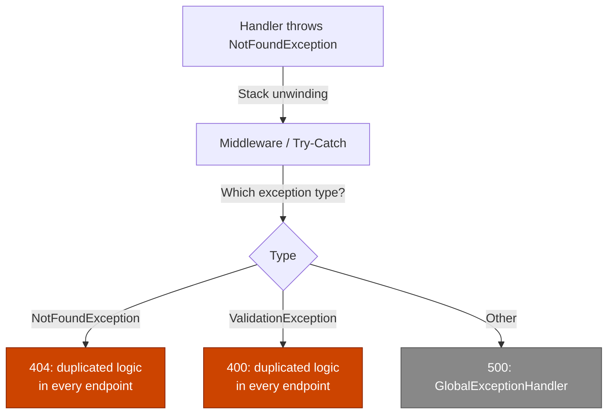
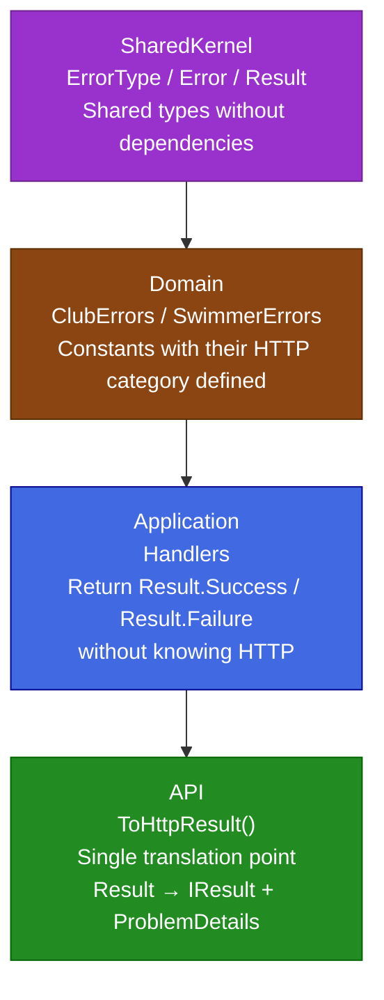
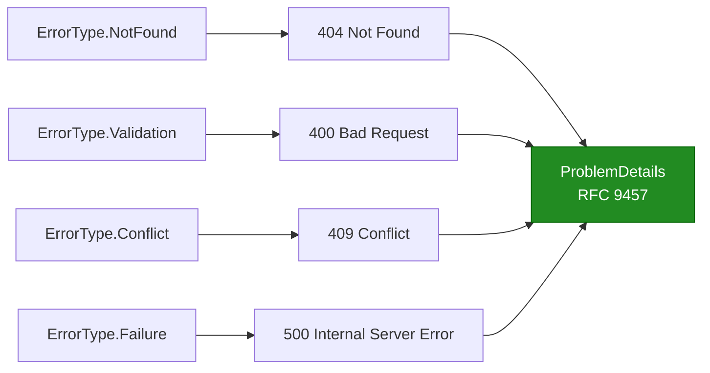
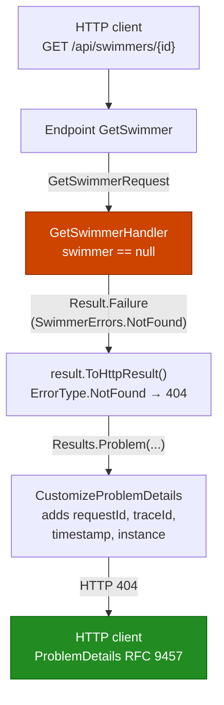
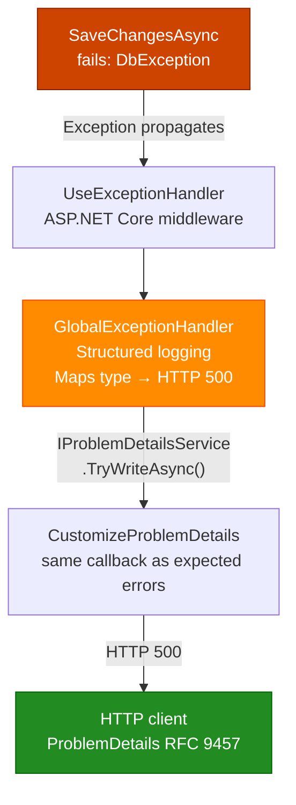
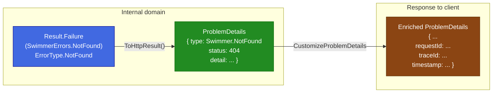

# The Result Pattern in ASP.NET Core: Errors as First-Class Citizens

## Introduction

Every application has two kinds of situations that are not the "happy path": things that go wrong in an expected way and things that go wrong in an unexpected way. A user requests a swimmer that does not exist: expected. The database goes down unexpectedly: unexpected.

The problem is that in most ASP.NET Core projects, both situations are handled using the same mechanism: exceptions. That creates friction that accumulates over time.

In this article, we will explore the Result Pattern: a technique that turns expected errors into an explicit part of the contract of each operation. Instead of throwing an exception when a resource is not found, the handler returns a Result that clearly says: "this operation can fail, and when it does, here is the error". Exceptions remain reserved for what they should cover: genuinely unexpected failures.

It is worth mentioning that the .NET ecosystem already has mature libraries that implement this pattern: [FluentResults](https://github.com/altmann/FluentResults), [ErrorOr](https://github.com/amantinband/error-or), [Ardalis.Result](https://github.com/ardalis/Result), [CSharpFunctionalExtensions](https://github.com/vkhorikov/CSharpFunctionalExtensions), and [LanguageExt](https://github.com/louthy/language-ext). All of them are technically solid and widely used in production.

This article implements the pattern from scratch for a specific use-case reason: we only need three types (`ErrorType`, `Error`, `Result<T>`) with one concrete purpose (mapping domain errors to HTTP codes), without the extra features that these libraries offer (chained validation, full Railway-Oriented Programming, advanced functional transformations). This removes external dependencies (~100 lines versus a NuGet package), gives the team full transparency over every line of code, enables direct integration with `IResult` and `ProblemDetails` without adapters, and keeps full control over evolution (adding `ErrorType.Unauthorized` does not require waiting for an external pull request). If the project needs handling multiple errors at once or complex chained validations, the libraries listed above are the better choice.

To illustrate the full implementation, we will use SwimTracker, a REST API for managing swimming clubs and swimmers:

- Architecture:
  - `Domain`: Business entities (Club, Swimmer), domain errors
  - `SharedKernel`: Shared types across layers (Result, Error, ErrorType)
  - `Application`: Use cases, handlers, validators
  - `API`: Presentation layer (Endpoints, HTTP extensions)

- Patterns implemented:
  - `REPR Pattern`: Individual endpoints instead of monolithic controllers
  - `Problem Details` (RFC 9457): Standardized error responses
  - `Result Pattern`: Explicit error handling between layers ← topic of this article

- Technology: PostgreSQL with Entity Framework Core

---

## The Problem with Exceptions for Control Flow

Let us think about a typical endpoint that looks up a swimmer by ID. The most common implementation looks like this:

```csharp
// GetSwimmerHandler.cs - exception-based approach
public async Task<GetSwimmerResponse> HandleAsync(GetSwimmerRequest request,
    CancellationToken cancellationToken)
{
    var swimmer = await _swimmerRepository.GetByIdAsync(request.Id, cancellationToken);

    if (swimmer is null)
        throw new NotFoundException("The specified swimmer was not found.");

    return new GetSwimmerResponse(swimmer.Id, swimmer.FirstName, /* ... */);
}
```

```csharp
// GetSwimmer.cs - the endpoint catches the exception
private async Task<IResult> HandleAsync(Guid id, /* ... */)
{
    try
    {
        var request = new GetSwimmerRequest(id);
        var response = await _handler.HandleAsync(request, cancellationToken);
        return Results.Ok(response);
    }
    catch (NotFoundException ex)
    {
        return Results.NotFound(new { error = ex.Message });
    }
}
```

This code works, but it carries several problems that become obvious as the application grows:

**Exceptions lie about the contract.** The signature `Task<GetSwimmerResponse>` promises that the operation always returns a response. The fact that it can "fail normally" (the swimmer does not exist) is hidden. The caller does not know it must handle that scenario until it reads the implementation or documentation.

**Exceptions break the flow of reading.** The `try/catch` interrupts the narrative of the code. The happy path and error handling are intertwined instead of being separated cleanly.

**Exceptions do not scale well.** When a handler has multiple expected failure points (validation, entity not found, state conflict), the endpoint needs to catch each exception type and decide the corresponding HTTP code. This duplicates logic in every endpoint.

**Exceptions are expensive.** Creating and catching exceptions involves capturing the stack trace, which is relatively costly. For code paths that run thousands of times, expected errors should not generate that overhead.



---

## What Is the Result Pattern?

The Result Pattern treats failure as a value, not as an interruption of the flow. Instead of throwing an exception when something goes wrong in an expected way, the operation returns a `Result` object that can represent both success and failure.

```
Successful operation  → Result.Success(value)
Failed operation      → Result.Failure(error)
```

The fundamental difference is that failure becomes part of the return type. It is no longer hidden behind a `throw`, but explicitly declared in the method signature.

```csharp
// Before: the failure is hidden
Task<GetSwimmerResponse> HandleAsync(GetSwimmerRequest request, ...);

// After: the failure is visible in the contract
Task<Result<GetSwimmerResponse>> HandleAsync(GetSwimmerRequest request, ...);
```

The caller (the endpoint) knows from the method declaration that the operation can fail and is obliged to decide what to do in that case. It cannot ignore it silently.


### The Responsibility Split It Enables

The Result Pattern is not just an error-handling technique; it is a design decision that establishes clear contracts between layers:

| Layer | Responsibility |
|------|----------------|
| `Domain` | Defines which errors exist and what they mean |
| `Application` | Expresses business logic, returns `Result<T>` |
| `API` | Translates `Result<T>` to an HTTP response |

No layer crosses its boundary: the application layer does not know `StatusCodes.Status404NotFound`. The presentation layer does not reproduce business logic. The boundary is clear and verifiable.

---

## Solution Architecture

Before implementing it, let us visualize the complete system. There are four pieces built on top of each other:



Each layer has a unique and bounded responsibility. Information flows upward; dependencies flow downward.

---

## Implementation Step by Step

### Step 1: `ErrorType`: The Category of Each Error, Defined in the Domain

The first problem to solve is: who decides that "swimmer not found" is an error 404 and not a 400?

If that decision lives in the endpoint, it must be repeated in every endpoint that uses that error. If the category changes tomorrow, all usages must be searched and updated. That is fragile.

The solution is that the error itself declares which category it belongs to. To do that, we create an enum that maps error types to HTTP categories:

Create `src/SwimTracker.SharedKernel/ErrorType.cs`:

```csharp
namespace SwimTracker.SharedKernel;

public enum ErrorType
{
    Failure    = 0,  // Unexpected errors    → HTTP 500
    Validation = 1,  // Invalid data         → HTTP 400
    NotFound   = 2,  // Resource does not exist → HTTP 404
    Conflict   = 3   // Inconsistent state   → HTTP 409
}
```

Four categories cover the vast majority of business errors. If a new category is needed in the future, it is added here and automatically propagates throughout the system.

> Why not use `StatusCodes` directly? The domain should not know the HTTP protocol. `ErrorType.NotFound` is a domain concept: something does not exist. Translating that to 404 is a presentation-layer decision. The enum acts as a bridge without creating direct coupling.

### Step 2: `Error`: The Identity of the Failure

Each error needs three pieces of data to be useful: a unique identifier, a readable description, and its error category. The `Error` record encapsulates exactly that:

Create `src/SwimTracker.SharedKernel/Error.cs`:

```csharp
namespace SwimTracker.SharedKernel;

public record Error(string Code, string Description, ErrorType Type)
{
    public static readonly Error None = new(string.Empty, string.Empty, ErrorType.Failure);
    public static readonly Error NullValue = new(
        "General.Null",
        "Null value was provided",
        ErrorType.Failure);
}
```

It uses a `record` for three concrete reasons:
- Immutability: errors do not change once created
- Value-based comparison: `error == Error.None` works without overriding `Equals`
- Concise syntax: the primary constructor reduces repetitive code

#### Naming pattern for `Code`

The `Code` field is the identifier that API clients will use to process errors programmatically. The recommended pattern is `Domain.ErrorType`:

```
"Swimmer.NotFound"          ← domain + type
"Club.InvalidEmail"         ← domain + field + problem
"Swimmer.ValidationFailed"  ← domain + category
```

This pattern allows clients to filter by domain or by type without relying exclusively on the HTTP code.

### Step 3: `Result` and `Result<T>`: The Container for the Outcome

The heart of the pattern. `Result` encapsulates whether an operation was successful or not; `Result<TValue>` adds the value in case of success.

Create `src/SwimTracker.SharedKernel/Result.cs`:

```csharp
using System.Diagnostics.CodeAnalysis;

namespace SwimTracker.SharedKernel;

public class Result
{
    public Result(bool isSuccess, Error error)
    {
        // Invariant: success without error, or failure with an error. Never any other combination.
        if (isSuccess && error != Error.None ||
            !isSuccess && error == Error.None)
        {
            throw new ArgumentException("Invalid error", nameof(error));
        }
        IsSuccess = isSuccess;
        Error = error;
    }

    public bool IsSuccess { get; }
    public bool IsFailure => !IsSuccess;
    public Error Error { get; }

    public static Result Success() => new(true, Error.None);
    public static Result<TValue> Success<TValue>(TValue value) => new(value, true, Error.None);
    public static Result Failure(Error error) => new(false, error);
    public static Result<TValue> Failure<TValue>(Error error) => new(default, false, error);

    // Implicit conversion: allows returning an Error directly where a Result is expected
    public static implicit operator Result(Error error) => Failure(error);

    // Match: the caller declares what to do in each case instead of inspecting IsSuccess
    public TOut Match<TOut>(Func<TOut> onSuccess, Func<Error, TOut> onFailure)
        => IsSuccess ? onSuccess() : onFailure(Error);
}

public class Result<TValue> : Result
{
    private readonly TValue? _value;

    public Result(TValue? value, bool isSuccess, Error error)
        : base(isSuccess, error) => _value = value;

    [NotNull]
    public TValue Value => IsSuccess
        ? _value!
        : throw new InvalidOperationException("The value of a failure result can't be accessed.");

    // Implicit conversion from the value
    public static implicit operator Result<TValue>(TValue? value) =>
        value is not null ? Success(value) : Failure<TValue>(Error.NullValue);

    // Match for Result<T>: provides the typed value to the success delegate
    public TOut Match<TOut>(Func<TValue, TOut> onSuccess, Func<Error, TOut> onFailure)
        => IsSuccess ? onSuccess(Value) : onFailure(Error);
}
```

#### The constructor invariant

The validation in the constructor guarantees that a `Result` is always in a coherent state: either it is successful with `Error.None`, or it is failed with a real error. There is no ambiguous intermediate state. This contract is enforced at construction time, not at usage time.

#### Why `Match` instead of `if (result.IsSuccess)`

`Match` is a small decision with a significant design impact:

```csharp
// Without Match - manual branching, the failure case might be forgotten
if (result.IsSuccess)
    return Results.Ok(result.Value);
// ← what happens if there is no else?

// With Match - both cases are mandatory, fluent reading
return result.Match(
    value => Results.Ok(value),
    error => ToProblem(error));
```

`Match` forces the caller to handle both cases explicitly. There is no way to forget the failure case because the method signature will not compile if a delegate is missing.

#### Why there are two overloads of `Match`

The `Result` overload uses `Func<TOut>` for success (there is no value to deliver). The `Result<TValue>` overload uses `Func<TValue, TOut>` (it delivers the value to the delegate). They have different signatures and both are necessary.

#### The implicit conversion

The `implicit operator Result(Error error)` operator allows returning an error directly in a handler whose return type is `Result`:

```csharp
// Without implicit conversion - verbose
return Result.Failure<GetSwimmerResponse>(SwimmerErrors.NotFound);

// With implicit conversion - the compiler performs the conversion automatically - syntactic sugar
return SwimmerErrors.NotFound;
```

### Step 4: Domain Error Constants

With `ErrorType` and `Error` available, the `Domain` layer defines the constants that name each possible failure. These are the system's source of truth for errors: the only place where the code, description, and category for each failure are decided.

#### `ClubErrors.cs`

```csharp
using SwimTracker.SharedKernel;

namespace SwimTracker.Domain;

public static class ClubErrors
{
    public static readonly Error NotFound =
        new("Club.NotFound", "The specified club was not found.", ErrorType.NotFound);
    public static readonly Error InvalidName =
        new("Club.InvalidName", "Club name is required.", ErrorType.Validation);
    public static readonly Error InvalidCountryCode =
        new("Club.InvalidCountryCode", "Country code is required.", ErrorType.Validation);
    public static readonly Error InvalidCity =
        new("Club.InvalidCity", "City is required.", ErrorType.Validation);
    public static readonly Error InvalidEmail =
        new("Club.InvalidEmail", "Email is required.", ErrorType.Validation);
}
```

#### `SwimErrors.cs`: constants and a factory method

```csharp
using SwimTracker.SharedKernel;

namespace SwimTracker.Domain;

public static class SwimmerErrors
{
    public static readonly Error NotFound =
        new("Swimmer.NotFound", "The specified swimmer was not found.", ErrorType.NotFound);
    public static readonly Error ClubNotFound =
        new("Swimmer.Club.NotFound", "The specified club was not found.", ErrorType.NotFound);
    public static readonly Error FirstNameRequired =
        new("Swimmer.FirstNameRequired", "First name is required.", ErrorType.Validation);
    public static readonly Error LastNameRequired =
        new("Swimmer.LastNameRequired", "Last name is required.", ErrorType.Validation);
    public static readonly Error InvalidDateOfBirth =
        new("Swimmer.InvalidDateOfBirth", "Date of birth cannot be in the future.", ErrorType.Validation);
    public static readonly Error GenderRequired =
        new("Swimmer.GenderRequired", "Gender is required.", ErrorType.Validation);
    public static readonly Error NationalityRequired =
        new("Swimmer.NationalityRequired", "Nationality is required.", ErrorType.Validation);
    public static readonly Error InvalidEmail =
        new("Swimmer.InvalidEmail", "Email is required.", ErrorType.Validation);
    public static readonly Error InvalidPhone =
        new("Swimmer.InvalidPhone", "Phone number is invalid.", ErrorType.Validation);
    public static readonly Error CreationFailed =
        new("Swimmer.CreationFailed", "Failed to create swimmer.", ErrorType.Failure);
    public static readonly Error OperationCancelled =
        new("Swimmer.OperationCancelled", "The operation was canceled.", ErrorType.Failure);

    // Factory method: the description is dynamic (varies by call), so it cannot be a constant
    public static Error ValidationFailed(string details) =>
        new("Swimmer.ValidationFailed", details, ErrorType.Validation);
}
```

**Constant vs. factory method**: the difference is whether the description is fixed or varies. `NotFound` always says the same thing; it is a `static readonly` constant. `ValidationFailed` includes the list of validation errors concatenated, which changes on each call; it needs a method.

### Step 5: Handlers: Business Logic Without Knowing HTTP

With the base pieces in place, handlers express business logic by returning `Result<T>` instead of throwing exceptions for expected errors. The method signature now makes it visible that the operation can fail.

#### `GetSwimmerHandler.cs`: a single expected failure point

```csharp
public class GetSwimmerHandler : IRequestHandler<GetSwimmerRequest, GetSwimmerResponse>
{
    private readonly ISwimmerRepository _swimmerRepository;

    public GetSwimmerHandler(ISwimmerRepository swimmerRepository)
        => _swimmerRepository = swimmerRepository;

    public async Task<Result<GetSwimmerResponse>> HandleAsync(
        GetSwimmerRequest request, CancellationToken cancellationToken)
    {
        var swimmer = await _swimmerRepository.GetByIdAsync(request.Id, cancellationToken);

        if (swimmer is null)
            return Result.Failure<GetSwimmerResponse>(SwimmerErrors.NotFound);

        return Result.Success(new GetSwimmerResponse(
            swimmer.Id, swimmer.ClubId, swimmer.FirstName,
            swimmer.LastName, swimmer.DateOfBirth, /* ... */));
    }
}
```

There is no `try/catch`. No `StatusCodes`. The operation clearly says: "I can fail with `SwimmerErrors.NotFound`". Anything else that goes wrong (database failure, timeout) will propagate as an exception to the `GlobalExceptionHandler`.

#### `CreateSwimmerHandler.cs`: multiple expected failure points

```csharp
public class CreateSwimmerHandler : IRequestHandler<CreateSwimmerRequest, CreateSwimmerResponse>
{
    private readonly IClubRepository _clubRepository;
    private readonly ISwimmerRepository _swimmerRepository;
    private readonly IUnitOfWork _unitOfWork;
    private readonly IValidator<CreateSwimmerRequest> _validator;

    public async Task<Result<CreateSwimmerResponse>> HandleAsync(
        CreateSwimmerRequest request, CancellationToken cancellationToken)
    {
        // Expected failure #1: input validation
        var validationErrors = _validator.ValidateRequest(request);
        if (validationErrors.Any())
        {
            return Result.Failure<CreateSwimmerResponse>(
                SwimmerErrors.ValidationFailed(string.Join("; ", validationErrors)));
        }

        // Expected failure #2: the referenced club does not exist
        var club = await _clubRepository.GetByIdAsync(request.ClubId, cancellationToken);
        if (club is null)
            return Result.Failure<CreateSwimmerResponse>(ClubErrors.NotFound);

        var swimmer = Swimmer.Create(request.ClubId, request.FirstName, /* ... */);
        _swimmerRepository.Add(swimmer);

        // Unexpected failure: let it propagate - the GlobalExceptionHandler will catch it
        await _unitOfWork.SaveChangesAsync(cancellationToken);

        return Result.Success(new CreateSwimmerResponse(swimmer.ClubId, swimmer.FirstName, /* ... */));
    }
}
```

**The golden rule**: expected business errors are `Result.Failure`. Infrastructure failures that cannot be handled here are left to propagate as exceptions. This distinction is the key to the mental model.

#### `CreateClubHandler.cs`: a handler that returns `Result` without a value

When an operation does not need to return data (only confirm success or report failure), use `Result` instead of `Result<T>`:

```csharp
public async Task<Result> HandleAsync(CreateClubRequest request, CancellationToken cancellationToken)
{
    if (string.IsNullOrWhiteSpace(request.Name))
        return Result.Failure(ClubErrors.InvalidName);

    if (string.IsNullOrWhiteSpace(request.CountryCode))
        return Result.Failure(ClubErrors.InvalidCountryCode);

    if (string.IsNullOrWhiteSpace(request.City))
        return Result.Failure(ClubErrors.InvalidCity);

    if (string.IsNullOrWhiteSpace(request.Email))
        return Result.Failure(ClubErrors.InvalidEmail);

    var club = Club.Create(request.Name, request.Acronym,
        request.CountryCode, request.City, request.Email);

    _clubRepository.Add(club);
    await _unitOfWork.SaveChangesAsync(cancellationToken);

    return Result.Success();
}
```

### Step 6: `ToHttpResult()`: The Only Translation Point

This is the component that connects the Result Pattern with Problem Details and HTTP. The purpose of `ToHttpResult()` is singular: translate a `Result` (which lives in the business domain) into an `IResult` (which lives in the HTTP domain).

Create `src/SwimTracker.Api.ResultPattern/Extensions/ResultExtensions.cs`:

```csharp
using Microsoft.AspNetCore.Mvc;
using SwimTracker.SharedKernel;

namespace SwimTracker.Api.ResultPattern.Extensions;

public static class ResultExtensions
{
    /// <summary>
    /// Converts Result<T> → IResult.
    /// Success → 200 OK with the serialized value.
    /// Failure → Problem Details with the HTTP code derived from ErrorType.
    /// </summary>
    public static IResult ToHttpResult<T>(this Result<T> result) =>
        result.Match(
            value => Results.Ok(value),
            error => ToProblem(error));

    /// <summary>
    /// Converts Result (without a value) → IResult.
    /// Success → 204 No Content.
    /// Failure → Problem Details with the HTTP code derived from ErrorType.
    /// </summary>
    public static IResult ToHttpResult(this Result result) =>
        result.Match(
            () => Results.NoContent(),
            error => ToProblem(error));

    /// <summary>
    /// Converts an Error directly into an IResult of Problem Details.
    /// Useful when success is not a generic 200 OK (for example, 201 Created).
    /// </summary>
    public static IResult ToHttpProblem(this Error error) => ToProblem(error);

    private static IResult ToProblem(Error error)
    {
        var status = error.Type switch
        {
            ErrorType.NotFound   => StatusCodes.Status404NotFound,
            ErrorType.Validation => StatusCodes.Status400BadRequest,
            ErrorType.Conflict   => StatusCodes.Status409Conflict,
            _                    => StatusCodes.Status500InternalServerError
        };

        return Results.Problem(new ProblemDetails
        {
            Type   = error.Code,
            Detail = error.Description,
            Status = status
        });
    }
}
```

This single method is the only place in the entire application where `ErrorType` is converted into an HTTP code. If it is decided tomorrow that `ErrorType.Conflict` should return 422 instead of 409, the change happens in one place and propagates to all endpoints automatically.



**Note about traceability properties**: `ToProblem` only assigns `Type`, `Detail`, and `Status`. The `requestId`, `traceId`, `timestamp`, and `instance` properties are added automatically by the `CustomizeProblemDetails` callback configured in `Program.cs`. This separation ensures that all error responses (regardless of origin) have the same traceability properties, without duplicating code in any endpoint.

### Step 7: Endpoints: The Result of All the Work

With the six pieces above in place, endpoints reach their most concise expression. Presentation work is reduced to its essence: invoke the handler and translate the result.

#### GET endpoints: one line of error handling

```csharp
// GetSwimmer.cs
private async Task<IResult> HandleAsync(
    Guid id,
    IRequestHandler<GetSwimmerRequest, GetSwimmerResponse> requestHandler,
    CancellationToken cancellationToken)
{
    var result = await requestHandler.HandleAsync(new GetSwimmerRequest(id), cancellationToken);
    return result.ToHttpResult();
}
```

```csharp
// GetSwimmers.cs
private async Task<IResult> HandleAsync(
    IHandler<List<GetSwimmersResponse>> requestHandler,
    CancellationToken cancellationToken)
{
    var result = await requestHandler.HandleAsync(cancellationToken);
    return result.ToHttpResult();
}
```

#### The special case: `CreateClub` with `201 Created`

`ToHttpResult()` returns `200 OK` on success by design. When an endpoint needs a different response code, use `Match` directly and `ToHttpProblem()` for the failure case:

```csharp
// CreateClub.cs - returns 201 Created on success
private async Task<IResult> HandleAsync(
    [FromBody] CreateClubRequest request,
    IRequestHandler<CreateClubRequest> requestHandler,
    CancellationToken cancellationToken)
{
    var result = await requestHandler.HandleAsync(request, cancellationToken);
    return result.Match(
        () => Results.Created($"api/clubs/{request.Name}", request),
        error => error.ToHttpProblem());
}
```

`ToHttpProblem()` applies the same `ErrorType → HTTP` mapping internally. The translation logic is not duplicated.

#### Comparison before and after

The before with exceptions, hardcoded status codes, and duplicated structure in each endpoint:

```csharp
// BEFORE - presentation logic mixed with hardcoded decisions
private async Task<IResult> HandleAsync(Guid id, /* ... */)
{
    try
    {
        var request = new GetSwimmerRequest(id);
        var response = await _handler.HandleAsync(request, cancellationToken);
        return Results.Ok(response);
    }
    catch (NotFoundException ex)
    {
        return Results.Problem(new ProblemDetails
        {
            Title  = "Swimmer not found",
            Detail = ex.Message,
            Status = StatusCodes.Status404NotFound   // ← hardcoded here
        });
    }
}
```

The after:

```csharp
// AFTER - 2 lines, decision centralized in ToHttpResult()
private async Task<IResult> HandleAsync(Guid id, /* ... */)
{
    var result = await requestHandler.HandleAsync(new GetSwimmerRequest(id), cancellationToken);
    return result.ToHttpResult();
}
```

### Step 8: Integrating Everything in Program.cs

`Program.cs` brings the Result Pattern together with Problem Details. The `CustomizeProblemDetails` callback operates over every Problem Details response: the ones generated by `ToHttpResult()` from endpoints and the ones generated by the `GlobalExceptionHandler` for unexpected exceptions.

```csharp
using Microsoft.AspNetCore.Http.Features;
using SwimTracker.Api.ResultPattern.Exceptions;
using SwimTracker.Api.ResultPattern.Extensions;
using SwimTracker.Application;
using SwimTracker.Infrastructure;

var builder = WebApplication.CreateBuilder(args);

// Problem Details with traceability properties for ALL error responses
builder.Services.AddProblemDetails(options =>
{
    options.CustomizeProblemDetails = context =>
    {
        var httpContext = context.HttpContext;
        var activity = httpContext.Features.Get<IHttpActivityFeature>()?.Activity;

        // RFC 9457 standard property: which request originated the problem
        context.ProblemDetails.Instance ??=
            $"{httpContext.Request.Method} {httpContext.Request.Path}";

        // Traceability properties - diagnosis in production
        context.ProblemDetails.Extensions["requestId"] = httpContext.TraceIdentifier;
        context.ProblemDetails.Extensions["traceId"]   = activity?.TraceId.ToString() ?? "N/A";
        context.ProblemDetails.Extensions["timestamp"] = DateTime.UtcNow.ToString("O");

        // Only in development: exception type for quick debugging
        if (builder.Environment.IsDevelopment() && context.Exception != null)
            context.ProblemDetails.Extensions["exceptionType"] =
                context.Exception.GetType().FullName;
    };
});

// Catches unexpected exceptions and converts them to Problem Details
builder.Services.AddExceptionHandler<GlobalExceptionHandler>();

builder.Services.AddEndpointsApiExplorer();
builder.Services.AddSwaggerGen();
builder.Services.AddApplication();
builder.Services.AddInfrastructure(builder.Configuration);
builder.Services.AddEndpoints();

var app = builder.Build();

if (app.Environment.IsDevelopment())
{
    app.UseSwagger();
    app.UseSwaggerUI();
}

app.UseHttpsRedirection();
app.MapEndpoints();        // registers routes for all IEndpoint
app.UseExceptionHandler(); // catches unhandled exceptions

app.Run();
```

---

## Full Flow: Expected and Unexpected Errors

With everything implemented, the system handles the two types of failure through separate and well-defined paths.

### Expected Error Flow

A swimmer not found follows this path without throwing any exception:



**Generated response**:
```json
{
  "type": "Swimmer.NotFound",
  "detail": "The specified swimmer was not found.",
  "status": 404,
  "instance": "GET /api/swimmers/00000000-0000-0000-0000-000000000099",
  "requestId": "0HN5K2L3R1A4:00000001",
  "traceId": "4bf92f3577b34da6a3ce929d0e0e4736",
  "timestamp": "2026-05-20T14:22:31.1234567Z"
}
```

### Unexpected Error Flow

A database failure follows the exception path:



**Response in production**: without internal details:
```json
{
  "type": "Microsoft.EntityFrameworkCore.DbUpdateException",
  "title": "An unexpected error occurred.",
  "detail": "An error occurred while processing your request.",
  "status": 500,
  "instance": "POST /api/swimmers",
  "requestId": "0HN5K2L3R1A4:00000002",
  "traceId": "4bf92f3577b34da6a3ce929d0e0e4736",
  "timestamp": "2026-05-20T14:22:31.1234567Z"
}
```

**Response in development**: with `exceptionType` for debugging:
```json
{
  "type": "Microsoft.EntityFrameworkCore.DbUpdateException",
  "title": "An unexpected error occurred.",
  "detail": "Connection to database failed.",
  "status": 500,
  "instance": "POST /api/swimmers",
  "requestId": "0HN5K2L3R1A4:00000002",
  "traceId": "4bf92f3577b34da6a3ce929d0e0e4736",
  "timestamp": "2026-05-20T14:22:31.1234567Z",
  "exceptionType": "Microsoft.EntityFrameworkCore.DbUpdateException"
}
```

---

## The Synergy with Problem Details

The Result Pattern and Problem Details solve different problems and reinforce each other. They are not competitors: they are complementary.

**Problem Details** solves how to present errors to the external client: standardized JSON according to RFC 9457, traceability, consistency across all endpoints.

**Result Pattern** solves how to structure errors internally: explicit contracts, clear separation of responsibilities, distinction between expected and unexpected errors.



The full responsibility matrix of the error system: no component carries more than one concern, and none is duplicated:

| Responsibility | Component |
|----------------|------------|
| Define which errors exist | `ClubErrors`, `SwimmerErrors` (Domain) |
| Declare which HTTP code corresponds to the error | `ErrorType` in each constant (Domain) |
| Communicate the failure across layers | `Result.Failure(error)` (SharedKernel) |
| Translate failure into an HTTP response | `ToHttpResult()` (API) |
| Standard response format | `ProblemDetails` RFC 9457 (ASP.NET Core) |
| Enrich with traceability | `CustomizeProblemDetails` (Program.cs) |
| Handle unexpected exceptions | `GlobalExceptionHandler` (API) |

---

## Final Project State

```
SwimTracker.SharedKernel/
├── ErrorType.cs     ← Enum: Failure | Validation | NotFound | Conflict
├── Error.cs         ← Record: Code + Description + Type
└── Result.cs        ← Result and Result<T> with Match()

SwimTracker.Domain/
├── ClubErrors.cs    ← Constants with ErrorType declared
└── SwimErrors.cs    ← Constants + factory method ValidationFailed(string)

SwimTracker.Application/
└── (handlers)       ← Return Result<T>, do not know HTTP

SwimTracker.Api.ResultPattern/
├── Program.cs                     - AddProblemDetails + CustomizeProblemDetails
├── Exceptions/
│   └── GlobalExceptionHandler.cs  ← Unexpected exceptions → Problem Details
├── Extensions/
│   ├── EndpointExtensions.cs      ← Automatic registration of IEndpoint
│   └── ResultExtensions.cs        ← ToHttpResult() and ToHttpProblem()
└── Endpoints/
    ├── Clubs/
    │   ├── GetClubs.cs             ← result.ToHttpResult()
    │   ├── GetClub.cs              ← result.ToHttpResult()
    │   └── CreateClub.cs          ← result.Match(201 Created, ToHttpProblem)
    └── Swimmers/
        ├── GetSwimmers.cs          ← result.ToHttpResult()
        ├── GetSwimmer.cs           ← result.ToHttpResult()
        └── CreateSwimmer.cs        ← result.ToHttpResult()
```

### Verification

```bash
# Start the database
docker compose up

# Run the application
dotnet run --project .\src\SwimTracker.Api.ResultPattern\SwimTracker.Api.ResultPattern.csproj

# Verify in Swagger (http://localhost:5000/swagger):
GET    /api/clubs
GET    /api/clubs/{id}
POST   /api/clubs
GET    /api/swimmers
GET    /api/swimmers/{id}
POST   /api/swimmers
```

---

## Best Practices

### 1. Reserve exceptions for genuinely unexpected failures

Exceptions have their place: infrastructure failures, timeouts, situations that the code cannot anticipate or handle. Business errors (validation failure, resource not found, state conflict) are part of the domain and deserve to be treated as such.

```csharp
// OK: Expected business error → Result
if (swimmer is null)
    return Result.Failure<GetSwimmerResponse>(SwimmerErrors.NotFound);

// OK: Unexpected failure → exception (it propagates to the GlobalExceptionHandler)
await _unitOfWork.SaveChangesAsync(cancellationToken);
```

### 2. Do not access `.Value` without verifying the state

`Result<T>.Value` throws `InvalidOperationException` on failure. Always use `Match` or verify `IsSuccess` before accessing the value:

```csharp
// NO: Risky
var data = result.Value;

// OK: Safe with Match: the compiler requires both cases
return result.Match(
    value => Results.Ok(value),
    error => error.ToHttpProblem());
```

### 3. Define errors in the domain, not in the handlers

An error created inline in the handler is an opportunity for inconsistency. Constants in the domain guarantee that the same error always has the same code, description, and `ErrorType`:

```csharp
// NO: Inline - unregistered, unreusable, no declared type
return Result.Failure(new Error("Swimmer.NotFound", "Not found"));

// OK: Domain constant - registered, reusable, with declared ErrorType
return Result.Failure<GetSwimmerResponse>(SwimmerErrors.NotFound);
```

### 4. Use factory methods for errors with dynamic descriptions

When the error message varies (such as the list of validation errors), a factory method is preferable to a constant:

```csharp
// In SwimmerErrors - factory method for dynamic message
public static Error ValidationFailed(string details) =>
    new("Swimmer.ValidationFailed", details, ErrorType.Validation);

// In the handler - usage
return Result.Failure<CreateSwimmerResponse>(
    SwimmerErrors.ValidationFailed(string.Join("; ", validationErrors)));
```

### 5. Do not mix `ToHttpResult()` with additional endpoint logic

`ToHttpResult()` is the translation point. If the endpoint needs extra logic before responding (for example, building a URL for `Location`), use `Match` directly and let `ToHttpProblem()` handle the failure:

```csharp
// OK: When success is not a generic 200 OK
return result.Match(
    () => Results.Created($"api/clubs/{request.Name}", request),
    error => error.ToHttpProblem());
```

---

## Conclusions

The Result Pattern transforms the way failures are modeled in an ASP.NET Core application. Instead of treating expected errors as exceptional interruptions of the flow, it turns them into first-class citizens of the return type: visible, nameable, with their error category explicit.

The system created by combining `ErrorType`, `Error`, `Result<T>`, domain constants, and `ToHttpResult()` has properties that are noticed in everyday development:

**Honest contracts**: the signature `Task<Result<GetSwimmerResponse>>` tells the truth. The caller knows, without reading the implementation, that the operation can fail and in what form.

**Localized changes**: if the meaning of `SwimmerErrors.NotFound` changes, the modification lives in the domain constant and propagates automatically. There is no global search for hardcoded status codes.

**Endpoints without noise**: `return result.ToHttpResult()` is the totality of error handling in most endpoints. The rest is pure presentation logic.

**Direct testability**: handlers return `Result<T>`, a domain type with no HTTP dependencies. Unit tests verify the result directly, without needing to initialize the ASP.NET Core pipeline.

**End-to-end consistency**: all error responses (whether from a handler, an infrastructure exception, or framework validation) produce RFC 9457 Problem Details with the same traceability properties. The client always knows what to expect.

The real power of the pattern is not in any single piece, but in the coherence of the whole: each component has a clear responsibility, no responsibility is duplicated, and the error flow is as explicit and predictable as the successful flow.

---

## Additional Resources

- [RFC 9457: Problem Details for HTTP APIs](https://www.rfc-editor.org/rfc/rfc9457)
- [Railway-Oriented Programming (Scott Wlaschin)](https://fsharpforfunandprofit.com/rop/)
- [Functional Error Handling in C#: Vladimir Khorikov](https://enterprisecraftsmanship.com/posts/functional-c-handling-failures-input-errors/)
- [Result Pattern in C#: Milan Jovanović](https://www.milanjovanovic.tech/blog/functional-error-handling-in-dotnet-with-the-result-pattern)
- [Minimal APIs in ASP.NET Core: Official documentation](https://learn.microsoft.com/aspnet/core/fundamentals/minimal-apis)
- [IExceptionHandler in ASP.NET Core](https://learn.microsoft.com/aspnet/core/fundamentals/error-handling)
- [Clean Architecture (Robert C. Martin)](https://blog.cleancoder.com/uncle-bob/2012/08/13/the-clean-architecture.html)
