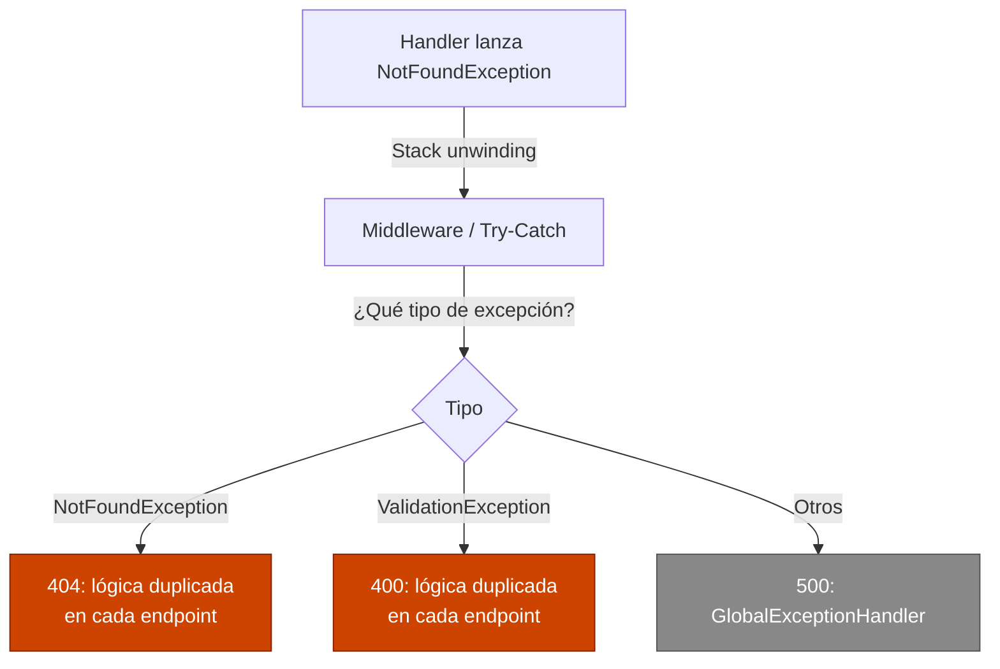
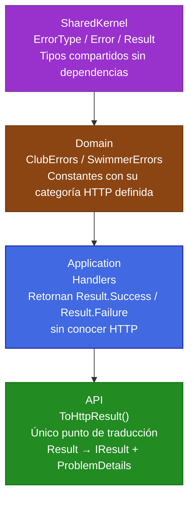
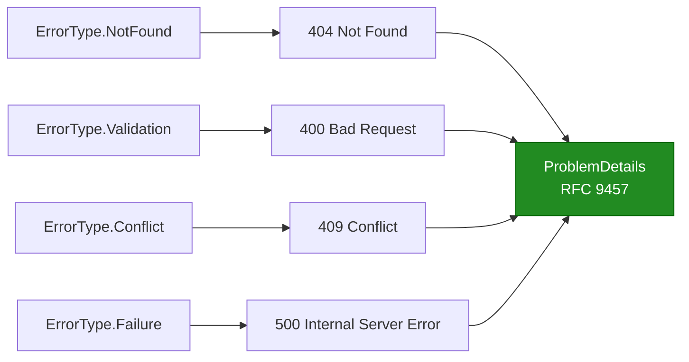
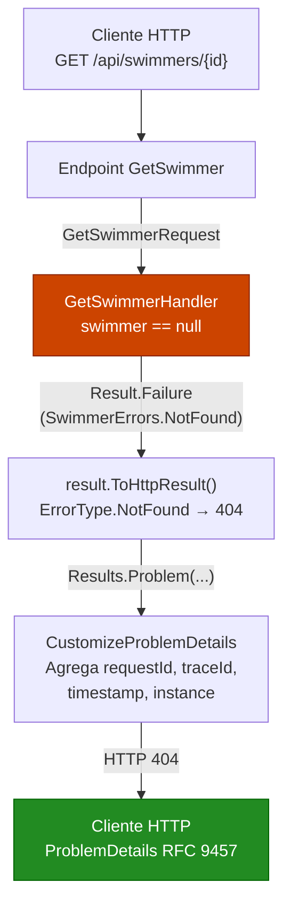
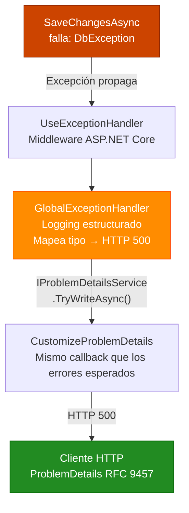
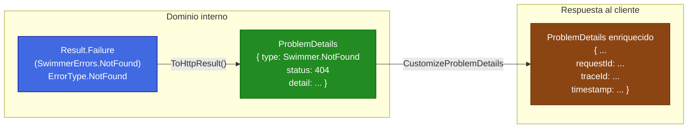

# El Patrón Result en ASP.NET Core: Errores como Ciudadanos de Primera Clase

## Introducción

Toda aplicación tiene dos tipos de situaciones que no son el "Happy path": cosas que **salen mal de forma esperada** y cosas que **salen mal de forma inesperadas**. Un usuario solicita un nadador que no existe: esperado. La base de datos cae sin aviso: inesperado.

El problema es que en la mayoría de los proyectos ASP.NET Core ambas situaciones se manejan con el mismo mecanismo: **excepciones**. Y eso genera fricciones que se acumulan con el tiempo.

En este artículo veremos el **Patrón Result**: una técnica que convierte los errores esperados en parte explícita del contrato de cada operación. En lugar de lanzar una excepción cuando un recurso no se encuentra, el handler devuelve un `Result` que dice claramente: *"esta operación puede fallar, y cuando falla, aquí está el error"*. Las excepciones quedan reservadas para lo que siempre debieron cubrir: fallos genuinamente inesperados.

Vale la pena mencionar que el ecosistema .NET ya cuenta con librerías maduras que implementan este patrón: [FluentResults](https://github.com/altmann/FluentResults) (enfocada exclusivamente en Result Pattern con API fluida), [ErrorOr](https://github.com/amantinband/error-or) (minimalista con discriminated unions), [Ardalis.Result](https://github.com/ardalis/Result) (orientada a Clean Architecture), [CSharpFunctionalExtensions](https://github.com/vkhorikov/CSharpFunctionalExtensions) (tipos funcionales completos), y [LanguageExt](https://github.com/louthy/language-ext) (programación funcional exhaustiva). Todas son técnicamente sólidas y ampliamente usadas en producción.

Este artículo implementa el patrón desde cero por razones específicas al caso de uso: solo necesitamos tres tipos (`ErrorType`, `Error`, `Result<T>`) con una función concreta (mapear errores de dominio a códigos HTTP), sin las características adicionales que ofrecen las librerías (validación encadenada, Railway-Oriented Programming completo, transformaciones funcionales avanzadas). Esto elimina dependencias externas (~100 líneas vs. un paquete NuGet), da transparencia total al equipo sobre cada línea de código, permite integración directa con `IResult` y `ProblemDetails` sin adaptadores, y mantiene control completo de la evolución (agregar `ErrorType.Unauthorized` no requiere esperar un pull request externo). Si el proyecto requiere manejo de múltiples errores simultáneos o validaciones complejas encadenadas, las librerías mencionadas son la mejor opción.

Para ilustrar la implementación completa usaremos **SwimTracker**, una API REST para gestionar clubes de natación y nadadores:

- **Arquitectura**:
  - `Domain`: Entidades de negocio (Club, Swimmer), errores del dominio
  - `SharedKernel`: Tipos compartidos entre capas (Result, Error, ErrorType)
  - `Application`: Casos de uso, handlers, validadores
  - `API`: Capa de presentación (Endpoints, extensiones HTTP)

- **Patrones implementados**:
  - **REPR Pattern**: Endpoints individuales en lugar de controladores monolíticos
  - **Problem Details** (RFC 9457): Respuestas de error estandarizadas
  - **Result Pattern**: Manejo explícito de errores entre capas ← *tema de este artículo*

- **Tecnología**: PostgreSQL con Entity Framework Core

---

## El Problema con las Excepciones para Control de Flujo

Pensemos en un endpoint típico que busca un nadador por ID. La implementación más común luce así:

```csharp
// GetSwimmerHandler.cs - enfoque con excepciones
public async Task<GetSwimmerResponse> HandleAsync(GetSwimmerRequest request,
    CancellationToken cancellationToken)
{
    var swimmer = await _swimmerRepository.GetByIdAsync(request.Id, cancellationToken);

    if (swimmer is null)
        throw new NotFoundException("The specified swimmer was not found.");

    return new GetSwimmerResponse(swimmer.Id, swimmer.FirstName, /* ... */);
}
```

```csharp
// GetSwimmer.cs - el endpoint captura la excepción
private async Task<IResult> HandleAsync(Guid id, /* ... */)
{
    try
    {
        var request = new GetSwimmerRequest(id);
        var response = await _handler.HandleAsync(request, cancellationToken);
        return Results.Ok(response);
    }
    catch (NotFoundException ex)
    {
        return Results.NotFound(new { error = ex.Message });
    }
}
```

Este código funciona, pero arrastra varios problemas que se hacen evidentes a medida que la aplicación crece:

**Las excepciones mienten sobre el contrato.** La firma `Task<GetSwimmerResponse>` promete que la operación siempre devuelve una respuesta. El hecho de que pueda "fallar normalmente" (el nadador no existe) está oculto. El llamador no sabe que debe manejar esa situación hasta que lee la implementación o la documentación.

**Las excepciones rompen el flujo de lectura.** El `try/catch` interrumpe la narrativa del código. El camino feliz y el manejo de errores se entrelazan, en lugar de estar separados limpiamente.

**Las excepciones no escalan bien.** Cuando un handler tiene múltiples puntos de fallo esperados (validación, entidad no encontrada, conflicto de estado), el endpoint necesita capturar cada tipo de excepción y decidir el código HTTP correspondiente. Esto duplica lógica en cada endpoint.

**Las excepciones son costosas.** La creación y captura de excepciones implica capturar el stack trace, una operación relativamente cara. Para rutas de código que se ejecutan miles de veces, los errores esperados no deberían generar ese overhead.



---

## ¿Qué es el Patrón Result?

El Patrón Result trata el fallo como un valor, no como una interrupción del flujo. En lugar de lanzar una excepción cuando algo sale mal de forma esperada, la operación devuelve un objeto `Result` que puede representar tanto el éxito como el fallo.

```
Operación exitosa  → Result.Success(valor)
Operación fallida  → Result.Failure(error)
```

La diferencia fundamental: **el fallo es parte del tipo de retorno**. Ya no está oculto en un `throw`, sino declarado explícitamente en la firma del método.

```csharp
// Antes: el fallo está oculto
Task<GetSwimmerResponse> HandleAsync(GetSwimmerRequest request, ...);

// Después: el fallo es visible en el contrato
Task<Result<GetSwimmerResponse>> HandleAsync(GetSwimmerRequest request, ...);
```

El llamador (el endpoint) sabe desde la declaración del método que la operación puede fallar y **está obligado a decidir qué hacer en ese caso**. No puede ignorarlo silenciosamente.


### La División de Responsabilidades que Habilita

El Patrón Result no es solo una técnica de manejo de errores; es una decisión de diseño que establece contratos claros entre capas:

| Capa | Responsabilidad |
|------|----------------|
| `Domain` | Define qué errores existen y qué significan |
| `Application` | Expresa lógica de negocio, retorna `Result<T>` |
| `API` | Traduce `Result<T>` a respuesta HTTP |

Ninguna capa cruza su límite: la capa de aplicación **no conoce** `StatusCodes.Status404NotFound`. La capa de presentación **no reproduce** la lógica de negocio. La frontera es clara y verificable.

---

## Arquitectura de la Solución

Antes de implementar, visualicemos el sistema completo. Son cuatro piezas que se construyen una sobre la otra:



Cada capa tiene una responsabilidad única y acotada. La dirección de la información fluye hacia arriba; la dirección de las dependencias fluye hacia abajo.

---

## Implementación Paso a Paso

### Paso 1: `ErrorType`: La Categoría de Cada Error, Definida en el Dominio

El primer problema a resolver es: ¿quién decide que "nadador no encontrado" es un error 404 y no un 400?

Si esa decisión vive en el endpoint, hay que repetirla en cada endpoint que use ese error. Si mañana cambia la categoría del error, hay que buscar y actualizar todos los usos. Es frágil.

La solución es que **el error mismo declare a qué categoría pertenece**. Para eso creamos un enum que mapea tipos de error a categorías HTTP:

Crear `src/SwimTracker.SharedKernel/ErrorType.cs`:

```csharp
namespace SwimTracker.SharedKernel;

public enum ErrorType
{
    Failure    = 0,  // Errores inesperados    → HTTP 500
    Validation = 1,  // Datos inválidos        → HTTP 400
    NotFound   = 2,  // Recurso no existe      → HTTP 404
    Conflict   = 3   // Estado inconsistente   → HTTP 409
}
```

Cuatro categorías cubren la inmensa mayoría de los errores de negocio. Si en el futuro se necesita una categoría nueva, se agrega aquí y automáticamente se propaga a todo el sistema.

> **Por qué no usar directamente `StatusCodes`**: el dominio no debería conocer el protocolo HTTP. `ErrorType.NotFound` es un concepto del dominio: que algo no existe. Que eso se traduzca a 404 es una decisión de la capa de presentación. El enum actúa como puente sin crear un acoplamiento directo.

### Paso 2: `Error`: La Identidad del Fallo

Cada error necesita tres datos para ser útil: un identificador único, una descripción legible, y su categoría de error. El record `Error` encapsula exactamente eso:

Crear `src/SwimTracker.SharedKernel/Error.cs`:

```csharp
namespace SwimTracker.SharedKernel;

public record Error(string Code, string Description, ErrorType Type)
{
    public static readonly Error None = new(string.Empty, string.Empty, ErrorType.Failure);
    public static readonly Error NullValue = new(
        "General.Null",
        "Null value was provided",
        ErrorType.Failure);
}
```

Se usa `record` por tres razones concretas:
- **Inmutabilidad**: los errores no cambian una vez creados
- **Comparación por valor**: `error == Error.None` funciona sin sobrecargar `Equals`
- **Sintaxis concisa**: el constructor primario reduce el código repetitivo

#### Patrón de nomenclatura para `Code`

El campo `Code` es el identificador que los clientes de la API usarán para procesar errores programáticamente. Se recomienda el patrón `Dominio.TipoDeError`:

```
"Swimmer.NotFound"          ← dominio + tipo
"Club.InvalidEmail"         ← dominio + campo + problema
"Swimmer.ValidationFailed"  ← dominio + categoría
```

Este patrón permite a los clientes filtrar por dominio o por tipo sin depender exclusivamente del código HTTP.

### Paso 3: `Result` y `Result<T>`: El Contenedor del Resultado

El corazón del patrón. `Result` encapsula si una operación fue exitosa o no; `Result<TValue>` añade el valor en caso de éxito.

Crear `src/SwimTracker.SharedKernel/Result.cs`:

```csharp
using System.Diagnostics.CodeAnalysis;

namespace SwimTracker.SharedKernel;

public class Result
{
    public Result(bool isSuccess, Error error)
    {
        // Invariante: éxito sin error, o fallo con error. Nunca otra combinación.
        if (isSuccess && error != Error.None ||
            !isSuccess && error == Error.None)
        {
            throw new ArgumentException("Invalid error", nameof(error));
        }
        IsSuccess = isSuccess;
        Error = error;
    }

    public bool IsSuccess { get; }
    public bool IsFailure => !IsSuccess;
    public Error Error { get; }

    public static Result Success() => new(true, Error.None);
    public static Result<TValue> Success<TValue>(TValue value) => new(value, true, Error.None);
    public static Result Failure(Error error) => new(false, error);
    public static Result<TValue> Failure<TValue>(Error error) => new(default, false, error);

    // Conversión implícita: permite retornar un Error directamente donde se espera un Result
    public static implicit operator Result(Error error) => Failure(error);

    // Match: el llamador declara qué hacer en cada caso en lugar de inspeccionar IsSuccess
    public TOut Match<TOut>(Func<TOut> onSuccess, Func<Error, TOut> onFailure)
        => IsSuccess ? onSuccess() : onFailure(Error);
}

public class Result<TValue> : Result
{
    private readonly TValue? _value;

    public Result(TValue? value, bool isSuccess, Error error)
        : base(isSuccess, error) => _value = value;

    [NotNull]
    public TValue Value => IsSuccess
        ? _value!
        : throw new InvalidOperationException("The value of a failure result can't be accessed.");

    // Conversión implícita desde el valor
    public static implicit operator Result<TValue>(TValue? value) =>
        value is not null ? Success(value) : Failure<TValue>(Error.NullValue);

    // Match para Result<T>: proporciona el valor tipado al delegate de éxito
    public TOut Match<TOut>(Func<TValue, TOut> onSuccess, Func<Error, TOut> onFailure)
        => IsSuccess ? onSuccess(Value) : onFailure(Error);
}
```

#### El invariante del constructor

La validación en el constructor garantiza que un `Result` siempre esté en un estado coherente: o es exitoso con `Error.None`, o es fallido con un error real. No existe un estado intermedio ambiguo. Este contrato se aplica en tiempo de construcción, no en tiempo de uso.

#### Por qué `Match` en lugar de `if (result.IsSuccess)`

`Match` es una pequeña decisión con un impacto de diseño significativo:

```csharp
// Sin Match - branching manual, puede olvidarse el caso de fallo
if (result.IsSuccess)
    return Results.Ok(result.Value);
// ← ¿qué pasa si no hay else?

// Con Match - ambos casos son obligatorios, lectura fluida
return result.Match(
    value => Results.Ok(value),
    error => ToProblem(error));
```

`Match` obliga al llamador a manejar **ambos casos** explícitamente. No hay forma de olvidar el caso de fallo porque la firma del método no compila si falta un delegate.

#### Por qué existen dos sobrecargas de `Match`

La de `Result` usa `Func<TOut>` en éxito (no hay valor que entregar). La de `Result<TValue>` usa `Func<TValue, TOut>` (entrega el valor al delegate). Son firmas distintas que no se pueden unificar; ambas son necesarias.

#### La conversión implícita

El operador `implicit operator Result(Error error)` permite retornar un error directamente en un handler cuyo tipo de retorno es `Result`:

```csharp
// Sin conversión implícita - verboso
return Result.Failure<GetSwimmerResponse>(SwimmerErrors.NotFound);

// Con conversión implícita - el compilador hace la conversión automáticamente - syntactic sugar
return SwimmerErrors.NotFound;
```

### Paso 4: Constantes de Error en el Dominio

Con `ErrorType` y `Error` disponibles, la capa `Domain` define las constantes que nombran cada fallo posible. Estas son las **fuentes de verdad** del sistema de errores: el único lugar donde se decide qué código, qué descripción y qué categoría tiene cada fallo.

#### `ClubErrors.cs`

```csharp
using SwimTracker.SharedKernel;

namespace SwimTracker.Domain;

public static class ClubErrors
{
    public static readonly Error NotFound =
        new("Club.NotFound", "The specified club was not found.", ErrorType.NotFound);
    public static readonly Error InvalidName =
        new("Club.InvalidName", "Club name is required.", ErrorType.Validation);
    public static readonly Error InvalidCountryCode =
        new("Club.InvalidCountryCode", "Country code is required.", ErrorType.Validation);
    public static readonly Error InvalidCity =
        new("Club.InvalidCity", "City is required.", ErrorType.Validation);
    public static readonly Error InvalidEmail =
        new("Club.InvalidEmail", "Email is required.", ErrorType.Validation);
}
```

#### `SwimErrors.cs`: constantes y factory method

```csharp
using SwimTracker.SharedKernel;

namespace SwimTracker.Domain;

public static class SwimmerErrors
{
    public static readonly Error NotFound =
        new("Swimmer.NotFound", "The specified swimmer was not found.", ErrorType.NotFound);
    public static readonly Error ClubNotFound =
        new("Swimmer.Club.NotFound", "The specified club was not found.", ErrorType.NotFound);
    public static readonly Error FirstNameRequired =
        new("Swimmer.FirstNameRequired", "First name is required.", ErrorType.Validation);
    public static readonly Error LastNameRequired =
        new("Swimmer.LastNameRequired", "Last name is required.", ErrorType.Validation);
    public static readonly Error InvalidDateOfBirth =
        new("Swimmer.InvalidDateOfBirth", "Date of birth cannot be in the future.", ErrorType.Validation);
    public static readonly Error GenderRequired =
        new("Swimmer.GenderRequired", "Gender is required.", ErrorType.Validation);
    public static readonly Error NationalityRequired =
        new("Swimmer.NationalityRequired", "Nationality is required.", ErrorType.Validation);
    public static readonly Error InvalidEmail =
        new("Swimmer.InvalidEmail", "Email is required.", ErrorType.Validation);
    public static readonly Error InvalidPhone =
        new("Swimmer.InvalidPhone", "Phone number is invalid.", ErrorType.Validation);
    public static readonly Error CreationFailed =
        new("Swimmer.CreationFailed", "Failed to create swimmer.", ErrorType.Failure);
    public static readonly Error OperationCancelled =
        new("Swimmer.OperationCancelled", "The operation was canceled.", ErrorType.Failure);

    // Factory method: la descripción es dinámica (varía por llamada), no puede ser constante
    public static Error ValidationFailed(string details) =>
        new("Swimmer.ValidationFailed", details, ErrorType.Validation);
}
```

**Constante vs. factory method**: la diferencia está en si la descripción es fija o varía. `NotFound` siempre dice lo mismo; es una constante `static readonly`. `ValidationFailed` incluye la lista de errores de validación concatenados, que cambia en cada llamada; necesita un método.

### Paso 5: Handlers: Lógica de Negocio sin Conocer HTTP

Con las piezas base en su lugar, los handlers expresan la lógica de negocio devolviendo `Result<T>` en lugar de lanzar excepciones para los errores esperados. La firma del método ahora hace visible que la operación puede fallar.

#### `GetSwimmerHandler.cs`: un único punto de fallo esperado

```csharp
public class GetSwimmerHandler : IRequestHandler<GetSwimmerRequest, GetSwimmerResponse>
{
    private readonly ISwimmerRepository _swimmerRepository;

    public GetSwimmerHandler(ISwimmerRepository swimmerRepository)
        => _swimmerRepository = swimmerRepository;

    public async Task<Result<GetSwimmerResponse>> HandleAsync(
        GetSwimmerRequest request, CancellationToken cancellationToken)
    {
        var swimmer = await _swimmerRepository.GetByIdAsync(request.Id, cancellationToken);

        if (swimmer is null)
            return Result.Failure<GetSwimmerResponse>(SwimmerErrors.NotFound);

        return Result.Success(new GetSwimmerResponse(
            swimmer.Id, swimmer.ClubId, swimmer.FirstName,
            swimmer.LastName, swimmer.DateOfBirth, /* ... */));
    }
}
```

No hay `try/catch`. No hay `StatusCodes`. La operación dice claramente: "puedo fallar con `SwimmerErrors.NotFound`". Todo lo demás que salga mal (fallo de base de datos, timeout) se propagará como excepción hacia el `GlobalExceptionHandler`.

#### `CreateSwimmerHandler.cs`: múltiples puntos de fallo esperados

```csharp
public class CreateSwimmerHandler : IRequestHandler<CreateSwimmerRequest, CreateSwimmerResponse>
{
    private readonly IClubRepository _clubRepository;
    private readonly ISwimmerRepository _swimmerRepository;
    private readonly IUnitOfWork _unitOfWork;
    private readonly IValidator<CreateSwimmerRequest> _validator;

    public async Task<Result<CreateSwimmerResponse>> HandleAsync(
        CreateSwimmerRequest request, CancellationToken cancellationToken)
    {
        // Fallo esperado #1: validación de entrada
        var validationErrors = _validator.ValidateRequest(request);
        if (validationErrors.Any())
        {
            return Result.Failure<CreateSwimmerResponse>(
                SwimmerErrors.ValidationFailed(string.Join("; ", validationErrors)));
        }

        // Fallo esperado #2: el club referenciado no existe
        var club = await _clubRepository.GetByIdAsync(request.ClubId, cancellationToken);
        if (club is null)
            return Result.Failure<CreateSwimmerResponse>(ClubErrors.NotFound);

        var swimmer = Swimmer.Create(request.ClubId, request.FirstName, /* ... */);
        _swimmerRepository.Add(swimmer);

        // Fallo inesperado: se deja propagar - el GlobalExceptionHandler lo captura
        await _unitOfWork.SaveChangesAsync(cancellationToken);

        return Result.Success(new CreateSwimmerResponse(swimmer.ClubId, swimmer.FirstName, /* ... */));
    }
}
```

**La regla de oro**: los errores de negocio anticipados son `Result.Failure`. Los fallos de infraestructura que no se pueden manejar aquí se dejan propagar como excepciones. Esta distinción es la clave del modelo mental.

#### `CreateClubHandler.cs`: handler que retorna `Result` sin valor

Cuando una operación no necesita devolver datos (solo confirmar éxito o informar el fallo) se usa `Result` en lugar de `Result<T>`:

```csharp
public async Task<Result> HandleAsync(CreateClubRequest request, CancellationToken cancellationToken)
{
    if (string.IsNullOrWhiteSpace(request.Name))
        return Result.Failure(ClubErrors.InvalidName);

    if (string.IsNullOrWhiteSpace(request.CountryCode))
        return Result.Failure(ClubErrors.InvalidCountryCode);

    if (string.IsNullOrWhiteSpace(request.City))
        return Result.Failure(ClubErrors.InvalidCity);

    if (string.IsNullOrWhiteSpace(request.Email))
        return Result.Failure(ClubErrors.InvalidEmail);

    var club = Club.Create(request.Name, request.Acronym,
        request.CountryCode, request.City, request.Email);

    _clubRepository.Add(club);
    await _unitOfWork.SaveChangesAsync(cancellationToken);

    return Result.Success();
}
```

### Paso 6: `ToHttpResult()`: El Único Punto de Traducción

Este es el componente que conecta el Patrón Result con Problem Details y con HTTP. La función de `ToHttpResult()` es una sola: traducir un `Result` (que vive en el dominio del negocio) a un `IResult` (que vive en el dominio HTTP).

Crear `src/SwimTracker.Api.ResultPattern/Extensions/ResultExtensions.cs`:

```csharp
using Microsoft.AspNetCore.Mvc;
using SwimTracker.SharedKernel;

namespace SwimTracker.Api.ResultPattern.Extensions;

public static class ResultExtensions
{
    /// <summary>
    /// Convierte Result<T> → IResult.
    /// Éxito   → 200 OK con el valor serializado.
    /// Fallo   → Problem Details con el código HTTP derivado del ErrorType.
    /// </summary>
    public static IResult ToHttpResult<T>(this Result<T> result) =>
        result.Match(
            value => Results.Ok(value),
            error => ToProblem(error));

    /// <summary>
    /// Convierte Result (sin valor) → IResult.
    /// Éxito   → 204 No Content.
    /// Fallo   → Problem Details con el código HTTP derivado del ErrorType.
    /// </summary>
    public static IResult ToHttpResult(this Result result) =>
        result.Match(
            () => Results.NoContent(),
            error => ToProblem(error));

    /// <summary>
    /// Convierte un Error directamente en un IResult de Problem Details.
    /// Útil cuando el éxito no es un 200 OK genérico (ej. 201 Created).
    /// </summary>
    public static IResult ToHttpProblem(this Error error) => ToProblem(error);

    private static IResult ToProblem(Error error)
    {
        var status = error.Type switch
        {
            ErrorType.NotFound   => StatusCodes.Status404NotFound,
            ErrorType.Validation => StatusCodes.Status400BadRequest,
            ErrorType.Conflict   => StatusCodes.Status409Conflict,
            _                    => StatusCodes.Status500InternalServerError
        };

        return Results.Problem(new ProblemDetails
        {
            Type   = error.Code,
            Detail = error.Description,
            Status = status
        });
    }
}
```

Este único método es el único lugar en toda la aplicación donde `ErrorType` se convierte en un código HTTP. Si mañana se decide que `ErrorType.Conflict` debe retornar 422 en lugar de 409, se cambia en un punto y el cambio se propaga a todos los endpoints automáticamente.



**Nota sobre las propiedades de trazabilidad**: `ToProblem` solo asigna `Type`, `Detail` y `Status`. Las propiedades `requestId`, `traceId`, `timestamp` e `instance` las añade automáticamente el callback `CustomizeProblemDetails` configurado en `Program.cs`. Esta separación garantiza que **todas** las respuestas de error (sin importar su origen) tengan las mismas propiedades de trazabilidad, sin duplicar código en ningún endpoint.

### Paso 7: Endpoints: El Resultado de Todo el Trabajo

Con las seis piezas anteriores en su lugar, los endpoints alcanzan su expresión más concisa. El trabajo de presentación queda reducido a su esencia: invocar el handler y traducir el resultado.

#### Endpoints GET: una línea de manejo de errores

```csharp
// GetSwimmer.cs
private async Task<IResult> HandleAsync(
    Guid id,
    IRequestHandler<GetSwimmerRequest, GetSwimmerResponse> requestHandler,
    CancellationToken cancellationToken)
{
    var result = await requestHandler.HandleAsync(new GetSwimmerRequest(id), cancellationToken);
    return result.ToHttpResult();
}
```

```csharp
// GetSwimmers.cs
private async Task<IResult> HandleAsync(
    IHandler<List<GetSwimmersResponse>> requestHandler,
    CancellationToken cancellationToken)
{
    var result = await requestHandler.HandleAsync(cancellationToken);
    return result.ToHttpResult();
}
```

#### El caso especial: `CreateClub` con `201 Created`

`ToHttpResult()` retorna `200 OK` en éxito por diseño. Cuando un endpoint necesita un código de respuesta diferente, se usa `Match` directamente y `ToHttpProblem()` para el caso de fallo:

```csharp
// CreateClub.cs - retorna 201 Created en éxito
private async Task<IResult> HandleAsync(
    [FromBody] CreateClubRequest request,
    IRequestHandler<CreateClubRequest> requestHandler,
    CancellationToken cancellationToken)
{
    var result = await requestHandler.HandleAsync(request, cancellationToken);
    return result.Match(
        () => Results.Created($"api/clubs/{request.Name}", request),
        error => error.ToHttpProblem());
}
```

`ToHttpProblem()` aplica el mismo mapeo `ErrorType → HTTP` internamente. La lógica de traducción no se duplica.

#### Comparación antes/después

El antes con excepciones, hardcoding de status codes y estructura duplicada en cada endpoint:

```csharp
// ANTES - lógica de presentación mezclada con decisiones hardcodeadas
private async Task<IResult> HandleAsync(Guid id, /* ... */)
{
    try
    {
        var request = new GetSwimmerRequest(id);
        var response = await _handler.HandleAsync(request, cancellationToken);
        return Results.Ok(response);
    }
    catch (NotFoundException ex)
    {
        return Results.Problem(new ProblemDetails
        {
            Title  = "Swimmer not found",
            Detail = ex.Message,
            Status = StatusCodes.Status404NotFound   // ← hardcodeado aquí
        });
    }
}
```

El después:

```csharp
// DESPUÉS - 2 líneas, decisión centralizada en ToHttpResult()
private async Task<IResult> HandleAsync(Guid id, /* ... */)
{
    var result = await requestHandler.HandleAsync(new GetSwimmerRequest(id), cancellationToken);
    return result.ToHttpResult();
}
```

### Paso 8: Integrando Todo en Program.cs

El `Program.cs` reúne el Patrón Result con Problem Details. El callback `CustomizeProblemDetails` opera sobre **toda** respuesta Problem Details: las generadas por `ToHttpResult()` desde los endpoints *y* las generadas por el `GlobalExceptionHandler` para excepciones inesperadas.

```csharp
using Microsoft.AspNetCore.Http.Features;
using SwimTracker.Api.ResultPattern.Exceptions;
using SwimTracker.Api.ResultPattern.Extensions;
using SwimTracker.Application;
using SwimTracker.Infrastructure;

var builder = WebApplication.CreateBuilder(args);

// Problem Details con propiedades de trazabilidad para TODAS las respuestas de error
builder.Services.AddProblemDetails(options =>
{
    options.CustomizeProblemDetails = context =>
    {
        var httpContext = context.HttpContext;
        var activity = httpContext.Features.Get<IHttpActivityFeature>()?.Activity;

        // Propiedad estándar RFC 9457: qué solicitud originó el problema
        context.ProblemDetails.Instance ??=
            $"{httpContext.Request.Method} {httpContext.Request.Path}";

        // Propiedades de trazabilidad - diagnóstico en producción
        context.ProblemDetails.Extensions["requestId"] = httpContext.TraceIdentifier;
        context.ProblemDetails.Extensions["traceId"]   = activity?.TraceId.ToString() ?? "N/A";
        context.ProblemDetails.Extensions["timestamp"] = DateTime.UtcNow.ToString("O");

        // Solo en desarrollo: tipo de excepción para debugging rápido
        if (builder.Environment.IsDevelopment() && context.Exception != null)
            context.ProblemDetails.Extensions["exceptionType"] =
                context.Exception.GetType().FullName;
    };
});

// Captura excepciones inesperadas y las convierte en Problem Details
builder.Services.AddExceptionHandler<GlobalExceptionHandler>();

builder.Services.AddEndpointsApiExplorer();
builder.Services.AddSwaggerGen();
builder.Services.AddApplication();
builder.Services.AddInfrastructure(builder.Configuration);
builder.Services.AddEndpoints();

var app = builder.Build();

if (app.Environment.IsDevelopment())
{
    app.UseSwagger();
    app.UseSwaggerUI();
}

app.UseHttpsRedirection();
app.MapEndpoints();        // registra rutas de todos los IEndpoint
app.UseExceptionHandler(); // captura excepciones no controladas

app.Run();
```

---

## Flujo Completo: Errores Esperados e Inesperados

Con todo implementado, el sistema maneja los dos tipos de fallo por caminos separados y bien definidos.

### Flujo de Error Esperado

Un nadador no encontrado recorre este camino sin lanzar ninguna excepción:



**Respuesta generada**:
```json
{
  "type": "Swimmer.NotFound",
  "detail": "The specified swimmer was not found.",
  "status": 404,
  "instance": "GET /api/swimmers/00000000-0000-0000-0000-000000000099",
  "requestId": "0HN5K2L3R1A4:00000001",
  "traceId": "4bf92f3577b34da6a3ce929d0e0e4736",
  "timestamp": "2026-05-20T14:22:31.1234567Z"
}
```

### Flujo de Error Inesperado

Una falla en la base de datos toma el camino de excepción:



**Respuesta en producción**: sin detalles internos:
```json
{
  "type": "Microsoft.EntityFrameworkCore.DbUpdateException",
  "title": "An unexpected error occurred.",
  "detail": "An error occurred while processing your request.",
  "status": 500,
  "instance": "POST /api/swimmers",
  "requestId": "0HN5K2L3R1A4:00000002",
  "traceId": "4bf92f3577b34da6a3ce929d0e0e4736",
  "timestamp": "2026-05-20T14:22:31.1234567Z"
}
```

**Respuesta en desarrollo**: con `exceptionType` para debugging:
```json
{
  "type": "Microsoft.EntityFrameworkCore.DbUpdateException",
  "title": "An unexpected error occurred.",
  "detail": "Connection to database failed.",
  "status": 500,
  "instance": "POST /api/swimmers",
  "requestId": "0HN5K2L3R1A4:00000002",
  "traceId": "4bf92f3577b34da6a3ce929d0e0e4736",
  "timestamp": "2026-05-20T14:22:31.1234567Z",
  "exceptionType": "Microsoft.EntityFrameworkCore.DbUpdateException"
}
```

---

## La Sinergia con Problem Details

El Patrón Result y Problem Details resuelven problemas distintos y se potencian mutuamente. No son competidores: son complementarios.

**Problem Details** resuelve cómo **presentar** los errores al cliente externo: formato JSON estandarizado según RFC 9457, trazabilidad, consistencia entre todos los endpoints.

**Result Pattern** resuelve cómo **estructurar** los errores internamente: contratos explícitos, separación de responsabilidades, distinción entre errores esperados e inesperados.



La tabla completa de responsabilidades del sistema de errores: ningún componente lleva más de una, ninguna está duplicada:

| Responsabilidad | Componente |
|----------------|------------|
| Definir qué errores existen | `ClubErrors`, `SwimmerErrors` (Domain) |
| Declarar qué código HTTP le corresponde al error | `ErrorType` en cada constante (Domain) |
| Comunicar el fallo entre capas | `Result.Failure(error)` (SharedKernel) |
| Traducir fallo a respuesta HTTP | `ToHttpResult()` (API) |
| Formato estándar de la respuesta | `ProblemDetails` RFC 9457 (ASP.NET Core) |
| Enriquecer con trazabilidad | `CustomizeProblemDetails` (Program.cs) |
| Manejar excepciones inesperadas | `GlobalExceptionHandler` (API) |

---

## Estado Final del Proyecto

```
SwimTracker.SharedKernel/
├── ErrorType.cs     ← Enum: Failure | Validation | NotFound | Conflict
├── Error.cs         ← Record: Code + Description + Type
└── Result.cs        ← Result y Result<T> con Match()

SwimTracker.Domain/
├── ClubErrors.cs    ← Constantes con ErrorType declarado
└── SwimErrors.cs    ← Constantes + factory method ValidationFailed(string)

SwimTracker.Application/
└── (handlers)       ← Retornan Result<T>, no conocen HTTP

SwimTracker.Api.ResultPattern/
├── Program.cs                     - AddProblemDetails + CustomizeProblemDetails
├── Exceptions/
│   └── GlobalExceptionHandler.cs  ← Excepciones inesperadas → Problem Details
├── Extensions/
│   ├── EndpointExtensions.cs      ← Registro automático de IEndpoint
│   └── ResultExtensions.cs        ← ToHttpResult() y ToHttpProblem()
└── Endpoints/
    ├── Clubs/
    │   ├── GetClubs.cs             ← result.ToHttpResult()
    │   ├── GetClub.cs              ← result.ToHttpResult()
    │   └── CreateClub.cs          ← result.Match(201 Created, ToHttpProblem)
    └── Swimmers/
        ├── GetSwimmers.cs          ← result.ToHttpResult()
        ├── GetSwimmer.cs           ← result.ToHttpResult()
        └── CreateSwimmer.cs        ← result.ToHttpResult()
```

### Verificación

```bash
# Iniciar la base de datos
docker compose up

# Ejecutar la aplicación
dotnet run --project .\src\SwimTracker.Api.ResultPattern\SwimTracker.Api.ResultPattern.csproj

# Verificar en Swagger (http://localhost:5000/swagger):
GET    /api/clubs
GET    /api/clubs/{id}
POST   /api/clubs
GET    /api/swimmers
GET    /api/swimmers/{id}
POST   /api/swimmers
```

---

## Mejores Prácticas

### 1. Reservar excepciones para fallos genuinamente inesperados

Las excepciones tienen su lugar: fallos de infraestructura, timeouts, situaciones que el código no puede anticipar ni manejar. Los errores de negocio (validación fallida, recurso no encontrado, conflicto de estado) son parte del dominio y merecen ser tratados como tales.

```csharp
// OK: Error de negocio esperado → Result
if (swimmer is null)
    return Result.Failure<GetSwimmerResponse>(SwimmerErrors.NotFound);

// OK: Fallo inesperado → excepción (se propaga al GlobalExceptionHandler)
await _unitOfWork.SaveChangesAsync(cancellationToken);
```

### 2. No acceder a `.Value` sin verificar el estado

`Result<T>.Value` lanza `InvalidOperationException` en caso de fallo. Usar siempre `Match` o verificar `IsSuccess` antes de acceder al valor:

```csharp
// NO: Peligroso
var data = result.Value;

// OK: Seguro con Match: el compilador exige ambos casos
return result.Match(
    value => Results.Ok(value),
    error => error.ToHttpProblem());
```

### 3. Definir los errores en el dominio, no en los handlers

Un error construido inline en el handler es una oportunidad de inconsistencia. Las constantes en el dominio garantizan que el mismo error siempre tenga el mismo código, descripción y `ErrorType`:

```csharp
// NO: Inline - sin registro, sin reutilización, sin tipo declarado
return Result.Failure(new Error("Swimmer.NotFound", "Not found"));

// OK: Constante de dominio - registrada, reutilizable, con ErrorType declarado
return Result.Failure<GetSwimmerResponse>(SwimmerErrors.NotFound);
```

### 4. Usar factory methods para errores con descripción dinámica

Cuando el mensaje de error varía (como la lista de errores de validación), un factory method es preferible a una constante:

```csharp
// En SwimmerErrors - factory method para mensaje dinámico
public static Error ValidationFailed(string details) =>
    new("Swimmer.ValidationFailed", details, ErrorType.Validation);

// En el handler - uso
return Result.Failure<CreateSwimmerResponse>(
    SwimmerErrors.ValidationFailed(string.Join("; ", validationErrors)));
```

### 5. No mezclar `ToHttpResult()` con lógica adicional en el endpoint

`ToHttpResult()` es el punto de traducción. Si el endpoint necesita lógica adicional antes de responder (como construir una URL para `Location`), usar `Match` directamente y dejar que `ToHttpProblem()` maneje el fallo:

```csharp
// OK: Cuando el éxito no es un 200 OK genérico
return result.Match(
    () => Results.Created($"api/clubs/{request.Name}", request),
    error => error.ToHttpProblem());
```

---

## Conclusiones

El Patrón Result transforma la forma en que se modelan los fallos en una aplicación ASP.NET Core. En lugar de tratar los errores esperados como interrupciones excepcionales del flujo, los convierte en **ciudadanos de primera clase del tipo de retorno**: visibles, nombrables, con su categoría de error explícita.

El sistema que resulta de combinar `ErrorType`, `Error`, `Result<T>`, las constantes de dominio y `ToHttpResult()` tiene propiedades que se perciben en el día a día del desarrollo:

**Contratos honestos**: la firma `Task<Result<GetSwimmerResponse>>` dice la verdad. El llamador sabe sin leer la implementación que la operación puede fallar y de qué forma.

**Cambios localizados**: si el significado de `SwimmerErrors.NotFound` cambia, la modificación vive en la constante del dominio y se propaga automáticamente. No hay búsqueda global de status codes hardcodeados.

**Endpoints sin ruido**: `return result.ToHttpResult()` es la totalidad del manejo de errores en la mayoría de los endpoints. El resto es lógica de presentación pura.

**Testabilidad directa**: los handlers devuelven `Result<T>`, un tipo del dominio sin dependencias de HTTP. Los tests unitarios verifican el resultado directamente, sin necesidad de inicializar el pipeline de ASP.NET Core.

**Consistencia de extremo a extremo**: todas las respuestas de error (sean de un handler, de una excepción de infraestructura, o de una validación del framework) producen Problem Details RFC 9457 con las mismas propiedades de trazabilidad. El cliente siempre sabe qué esperar.

La verdadera potencia del patrón no está en ninguna pieza individual, sino en la coherencia del conjunto: cada componente tiene una responsabilidad clara, ninguna responsabilidad aparece duplicada, y el flujo de errores es tan explícito y predecible como el flujo exitoso.

---

## Recursos Adicionales

- [RFC 9457: Problem Details for HTTP APIs](https://www.rfc-editor.org/rfc/rfc9457)
- [Railway-Oriented Programming (Scott Wlaschin)](https://fsharpforfunandprofit.com/rop/)
- [Functional Error Handling in C#: Vladimir Khorikov](https://enterprisecraftsmanship.com/posts/functional-c-handling-failures-input-errors/)
- [Result Pattern en C#: Milan Jovanović](https://www.milanjovanovic.tech/blog/functional-error-handling-in-dotnet-with-the-result-pattern)
- [Minimal APIs en ASP.NET Core: Documentación oficial](https://learn.microsoft.com/aspnet/core/fundamentals/minimal-apis)
- [IExceptionHandler en ASP.NET Core](https://learn.microsoft.com/aspnet/core/fundamentals/error-handling)
- [Clean Architecture (Robert C. Martin)](https://blog.cleancoder.com/uncle-bob/2012/08/13/the-clean-architecture.html)
